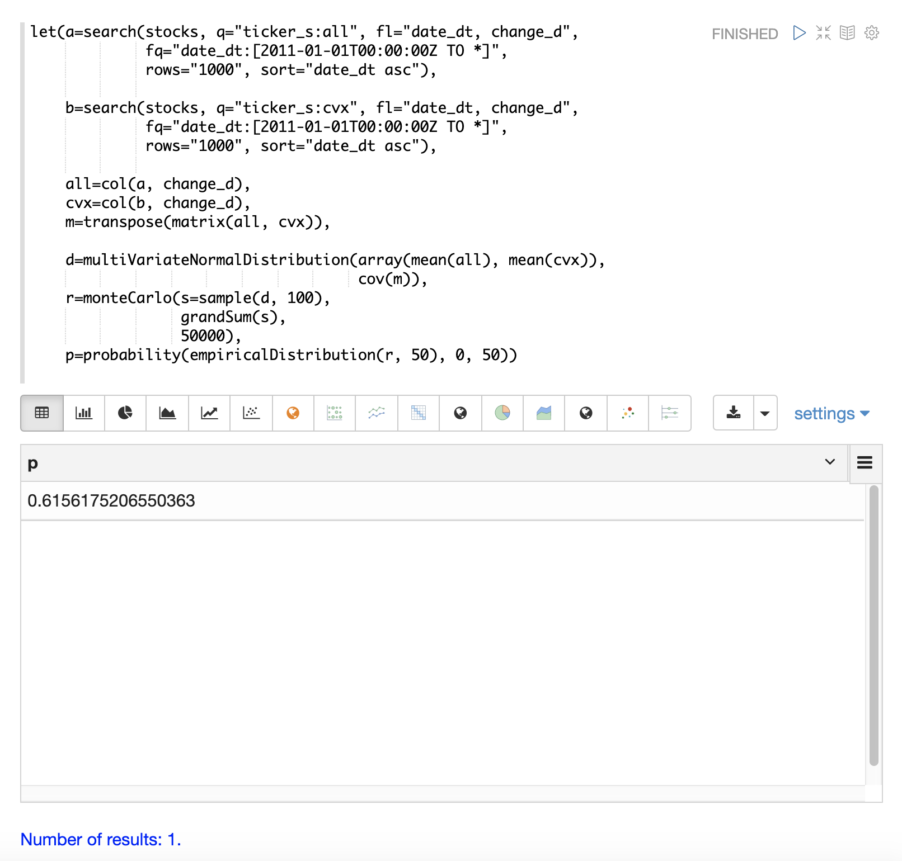

= Monte Carlo Simulations
// Licensed to the Apache Software Foundation (ASF) under one
// or more contributor license agreements.  See the NOTICE file
// distributed with this work for additional information
// regarding copyright ownership.  The ASF licenses this file
// to you under the Apache License, Version 2.0 (the
// "License"); you may not use this file except in compliance
// with the License.  You may obtain a copy of the License at
//
//   http://www.apache.org/licenses/LICENSE-2.0
//
// Unless required by applicable law or agreed to in writing,
// software distributed under the License is distributed on an
// "AS IS" BASIS, WITHOUT WARRANTIES OR CONDITIONS OF ANY
// KIND, either express or implied.  See the License for the
// specific language governing permissions and limitations
// under the License.

Monte Carlo simulations are commonly used to model the behavior of
stochastic (random) systems. This section of the user guide covers
the basics of performing Monte Carlo simulations with Math Expressions.

== A Random Walk

The stochastic system that will be studied below is daily stock returns
calculated as the opening price plus the closing price. These daily moves
are often described as a "random walk" because they cannot be predicted.

The first step in understanding a random walk is to visualize daily stock returns.
The example below shows the variable *change_d* which is the daily
change in stock price for 1000 days of the *cvx* stock ticker (Chevron).

image::images/math-expressions/randomwalk1.png[]

Notice that the time series of daily price changes randomly jumps above and
below zero. Some days the stock is up, some days its down, but the there
does not seem to be a noticeable pattern that could be used to predict
its movement. This is the first hint that the stock price is a random walk.

=== Auto Correlation

Autocorrelation measures the degree to which a signal is correlated with itself.
 Autocorrelation is used to determine
if a vector contains a signal or is purely random. Its useful to plot the
autocorrelation of the *change_d* vector
to confirm that it is indeed random.

In the example below the `conv` (convolution) function is used to autocorrelate
the *change_d* vector.
Notice that the `conv` function is simply "convolving" the *change_d* vector
with a reversed copy of itself.
This is the technique for performing autocorrelation using convolution.
The Signal Processing section
of the user guide covers both convolution and autocorrelation in detail.
In this section we'll just discuss the plot.

The plot shows the intensity of correlation that is calculated as the *change_d* vector is slid across
itself by the `conv` function.
Notice in the plot there is long period of low intensity correlation that appears
to be random. Then in the center a peak of high intensity correlation where the vectors
are directly lined up.
This is followed by another long period of low intensity correlation.

This is the autocorrelation plot of pure noise. The daily stock changes appear
to be a random.

image::images/math-expressions/randomwalk2.png[]

=== Visualizing the Distribution

The daily chane in stock prices cannot be predicted, but it can be modeled with a probability distribution.
To model the time series we'll start by visualizing the distribution of the *change_d* vector. In the example
below the `change_d` vector is plotted using the `empiricalDistribution` function to create an 11 bin
histogram of the data. Notice that the distribution appears to be normally distributed. Daily stock price
changes do tend to be normally distributed although *cvx* was chosen specifically
for this example because of this characteristic.

image::images/math-expressions/randomwalk3.png[]

=== Fitting the Distribution

The `ks` Test can be used to determine if the distribution of a vector of data fits a
reference distribution.
In the example below the `ks` test is performed with a *normal distribution* with the *mean*
and *standard deviation* of the *change_d* vector as the reference distribution. The `ks` test is
checking the reference distribution against the *change_d* vector itself to see if it
fits a normal distribution.

Notice in the example below the `ks` test reports a p-value of .16278. A p-value of .05 or less is typically
used to invalidate the null hypothesis of the test which is that the vector could have been
drawn from the reference distribution.

image::images/math-expressions/randomwalk4.png[]

The `ks` test, which tends to be fairly sensitive, confirms the visualization which appeared normal. The
reference distribution from the *ks* test will therefor be used in the Monte Carlo simulations below.

=== Monte Carlo

Now that we have fit a distribution to the daily stock return data we can use the
`monteCarlo` function to run a simulation using the distribution.

The `monteCarlo` function runs a specified number of times. On each run it sets
a series of variables and runs one final function which returns a single numeric value. The
monteCarlo function collects the results of each run in a vector and returns it.
The final function being run usually has one or more variables that are drawn from probability
distributions on each run. The `sample` function is used to draw the samples.

The simulation's result array can then be treated as an empirical distribution to understand
the probabilities of the simulation results.

The example below uses the monteCarlo function to simulate the combined return
of 100 days of stock returns.

In the example a normalDistribution is created from the *mean* and *standard deviation*
of the *change_d* vector. The `monteCarlo` function then draws 100 samples from the
normal distribution to represent 100 days of stock returns and sets
the vector of samples
to the variable *d*.

The `add` function then calculates the total return
from the 100 day sample. The output of the final `add` function is collected by the
`monteCarlo` function. This is repeated
50000 times, with each run drawing a different set of samples from the normal distribution.

The result of the simulation is set to variable *s*, which contains
the total returns from the 50000 runs.

The `empiricalDistribution` function is then used to visualize the output of the simulation
as a 50 bin histogram. The distribution visualizes the probability of the different total
returns from 100 days of stock returns for ticker *cvx*.

image::images/math-expressions/randomwalk5.png[]

The `probability` function can then be used to calculate probability of a non-negative
return from 100 days of stock returns. The example below uses the `probability` function
to return the probability of a return between the range of 0 and 40 from the
 `empiricalDistribution` of the simulation.

image::images/math-expressions/randomwalk5.1.png[]

=== Random Walk

The `monteCarlo` function can also be used to visualize a random walk from the
`normalDistribution` representing the daily stock returns. A random walk is a time
series where each step is calculated by adding a random sample to the previous
step. This creates a time series where each value is dependant on the previous value,
which simulates the autocorrelation of stock prices.

In the example below the random walk is achieved by adding a random sample to the
variable *v* on each Monte Carlo iteration. The variable `v` is maintained between
iterations so each iteration uses the previous value of `v`. The `double` function
is the final function run which simply retuns the value of `v` as a double on each run.
The example interates 1000 times to create the random walk with 1000 steps.

image::images/math-expressions/randomwalk6.png[]

== Multivariate Normal Distribution

[0.12294442137237226, 0.13106056985285258],
[0.13106056985285258, 0.7409729840230235]

image::images/math-expressions/corrsim1.png[]

image::images/math-expressions/mnorm.png[]

image::images/math-expressions/corrsim2.png[]

image::images/math-expressions/mnorm2.png[]

