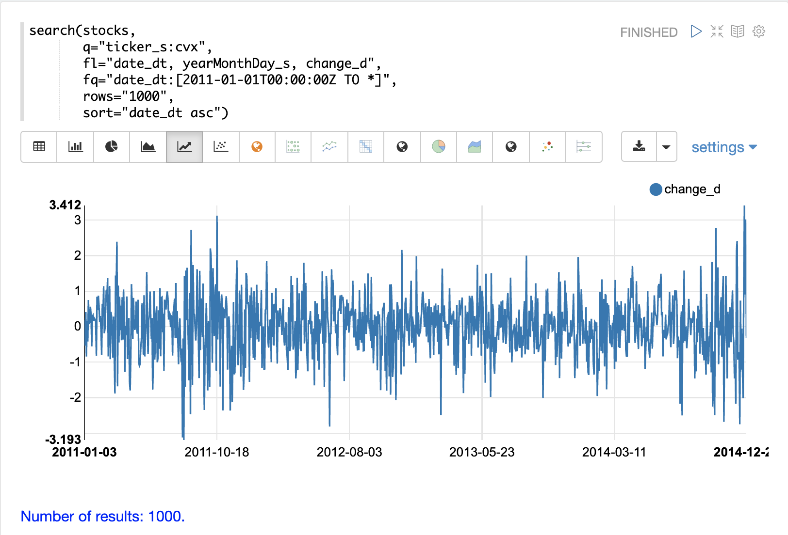
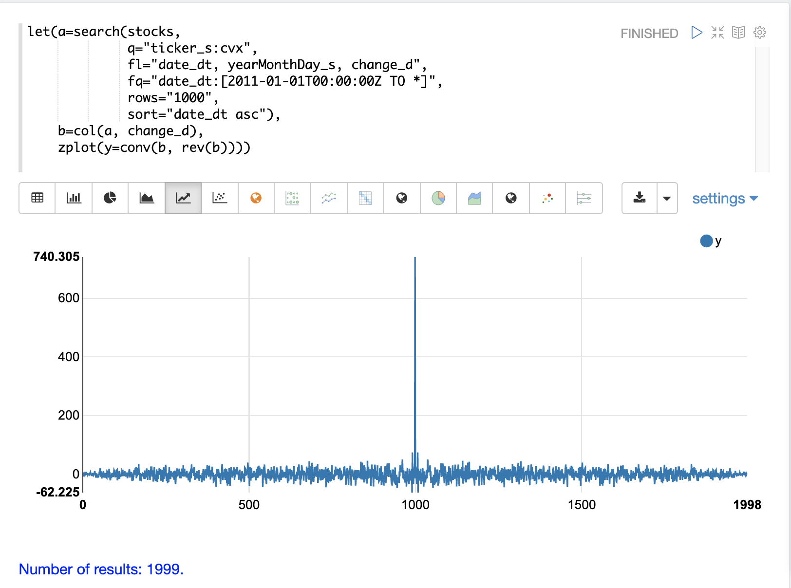
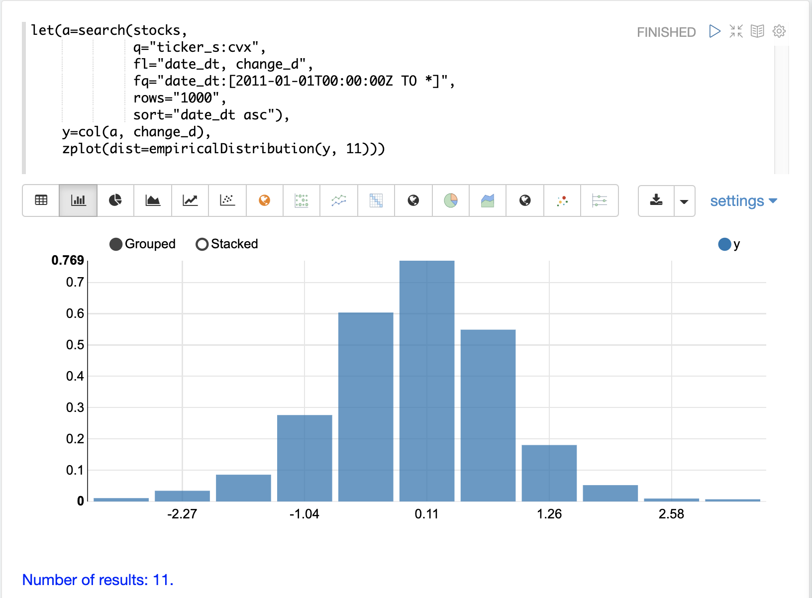
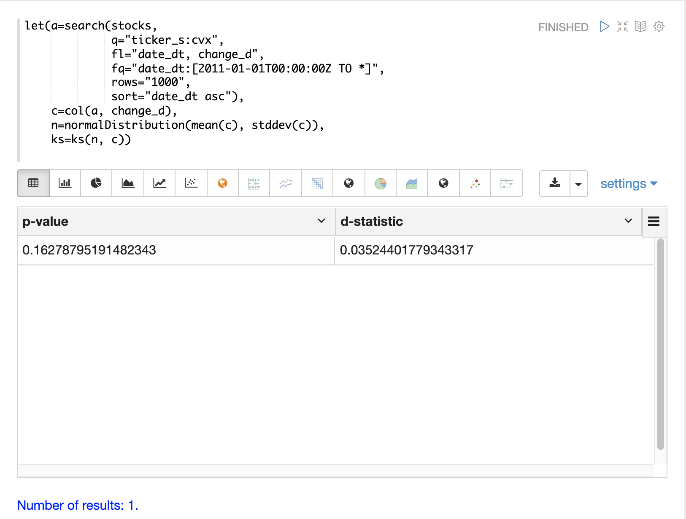
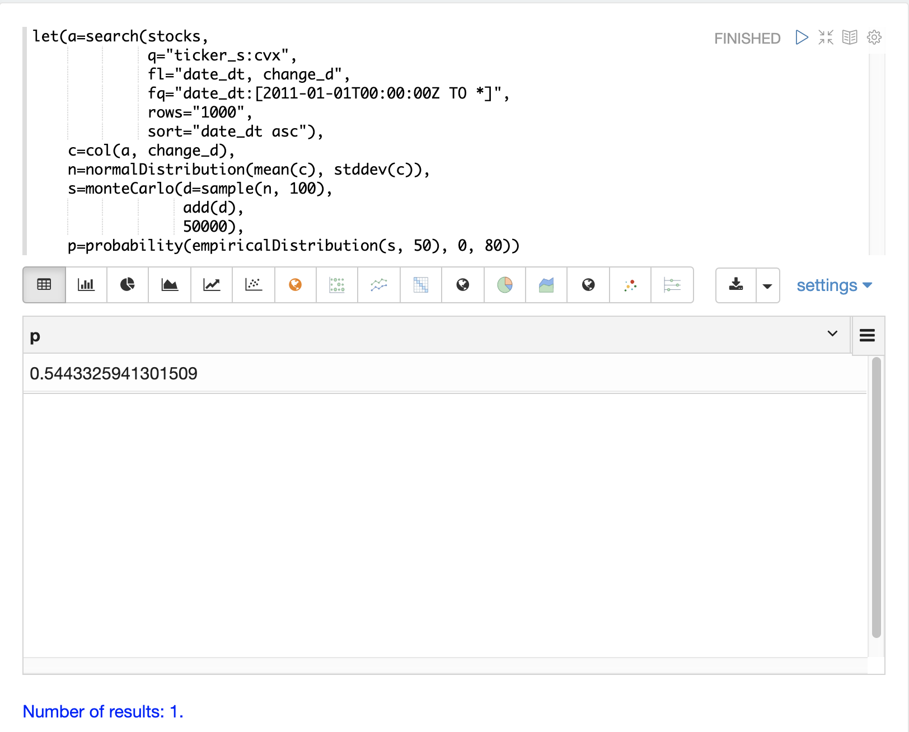
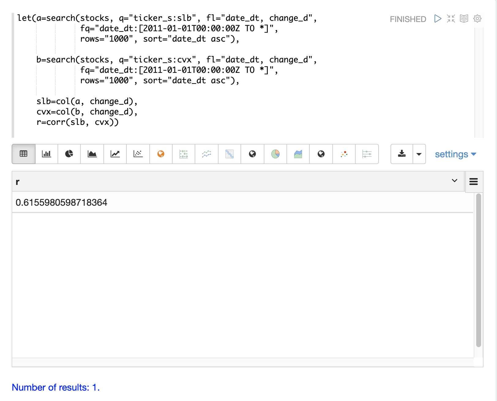
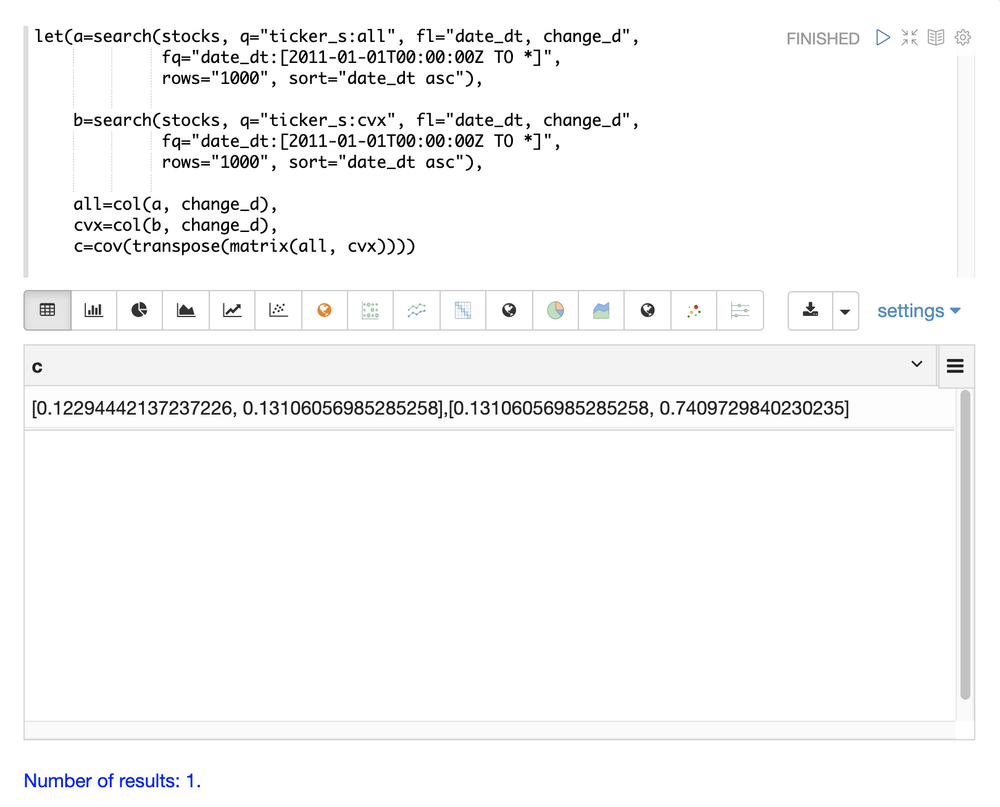
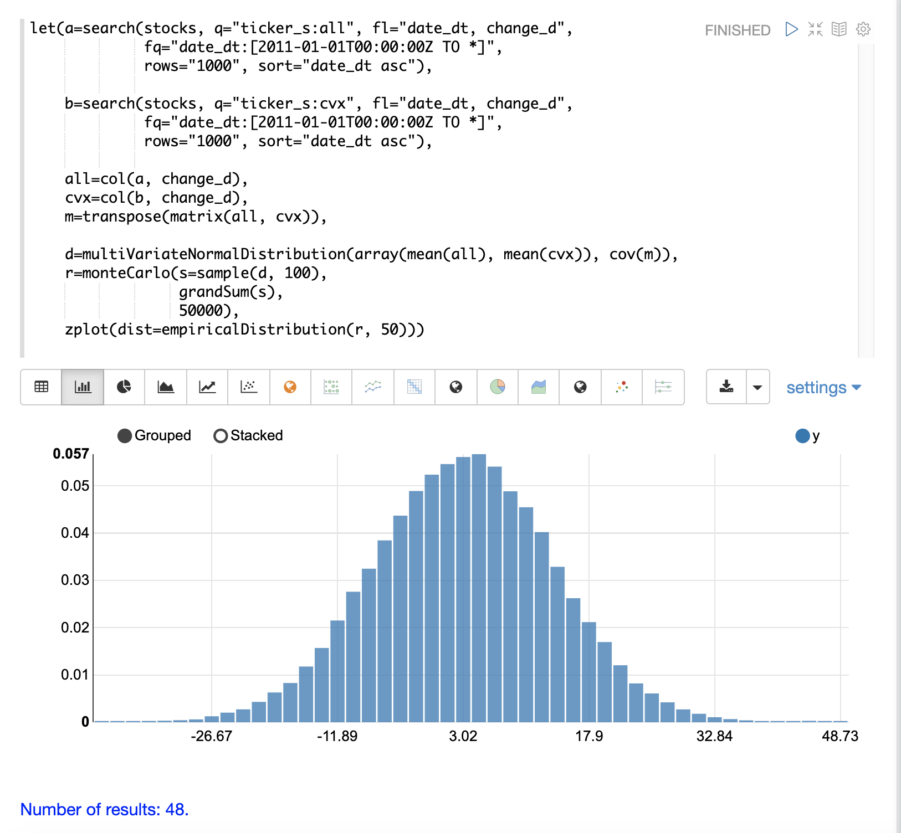
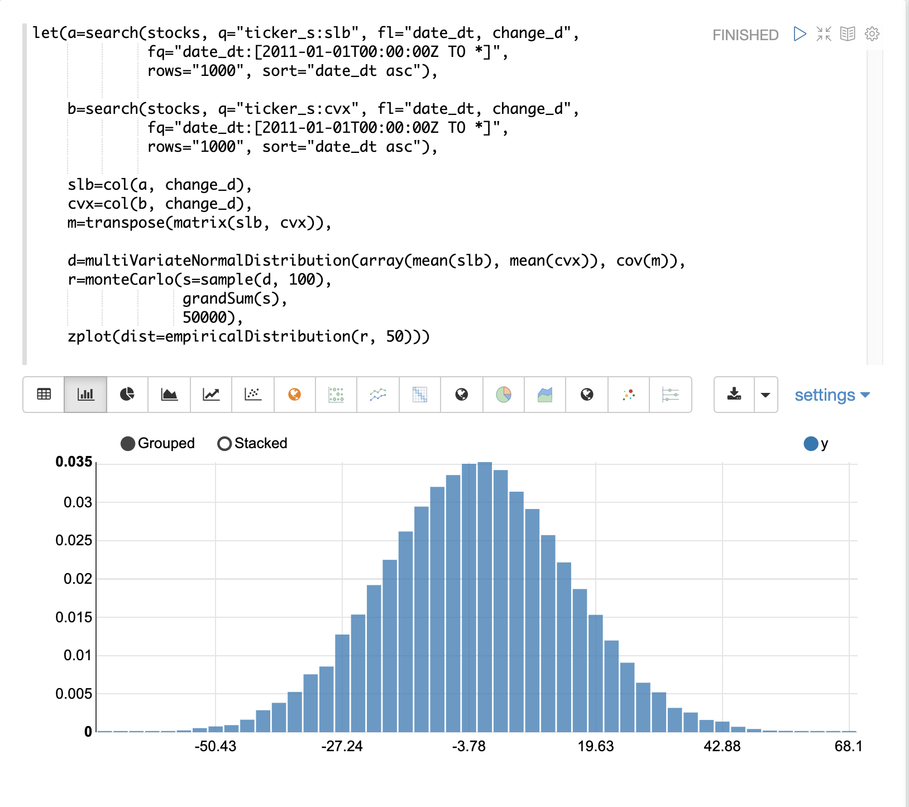

= Monte Carlo Simulations
// Licensed to the Apache Software Foundation (ASF) under one
// or more contributor license agreements.  See the NOTICE file
// distributed with this work for additional information
// regarding copyright ownership.  The ASF licenses this file
// to you under the Apache License, Version 2.0 (the
// "License"); you may not use this file except in compliance
// with the License.  You may obtain a copy of the License at
//
//   http://www.apache.org/licenses/LICENSE-2.0
//
// Unless required by applicable law or agreed to in writing,
// software distributed under the License is distributed on an
// "AS IS" BASIS, WITHOUT WARRANTIES OR CONDITIONS OF ANY
// KIND, either express or implied.  See the License for the
// specific language governing permissions and limitations
// under the License.

Monte Carlo simulations are commonly used to model the behavior of
stochastic (random) systems. This section of the user guide covers
the basics of performing Monte Carlo simulations with Math Expressions.

== Random Time Series

The daily movement of stock prices is often described as a "random walk".
But what does that really mean, and how is this different than a random time series?
The examples below will use Monte Carlo simulations to explore both "random walks"
and random time series.

A useful first step in understanding the difference is to visualize
daily stock returns, calculated as closing price minus opening price, as a time series.

The example below uses the `search` function to return 1000 days of daily stock
returns for the ticker *CVX* (Chevron). The `change_d` field, which is the
change in price for the day, is then plotted as a time series.

Notice that the time series of daily price changes moves randomly above and
below zero. Some days the stock is up, some days its down, but there
does not seem to be a noticeable pattern or any dependency between steps. This is a hint
that this is a *random time series*.

=== Autocorrelation

Autocorrelation measures the degree to which a signal is correlated with itself.
 Autocorrelation can be used to determine
if a vector contains a signal or if there is dependency between values in a time series. If there is no
signal and no dependency between values in the time series then the time series is random.

It's useful to plot the autocorrelation of the `change_d` vector to confirm that it is indeed random.

In the example below the search results are set to a variable and then the `change_d` field is vectorized and stored in variable `b`.
Then the `conv` (convolution) function is used to autocorrelate
the `change_d` vector.
Notice that the `conv` function is simply "convolving" the `change_d` vector
with a reversed copy of itself.
This is the technique for performing autocorrelation using convolution.
The <<dsp.adoc#,Signal Processing>> section
of the user guide covers both convolution and autocorrelation in detail.
In this section we'll just discuss the plot.

The plot shows the intensity of correlation that is calculated as the `change_d` vector is slid across itself by the `conv` function.
Notice in the plot there is long period of low intensity correlation that appears to be random.
Then in the center a peak of high intensity correlation where the vectors
are directly lined up.
This is followed by another long period of low intensity correlation.

This is the autocorrelation plot of pure noise.
The daily stock changes appear to be a random time series.

=== Visualizing the Distribution

The random daily changes in stock prices cannot be predicted, but they can be modeled with a probability distribution.
To model the time series we'll start by visualizing the distribution of the `change_d` vector.
In the example below the `change_d` vector is plotted using the `empiricalDistribution` function to create an 11 bin
histogram of the data.
Notice that the distribution appears to be normally distributed.
Daily stock price changes do tend to be normally distributed although *CVX* was chosen specifically for this example because of this characteristic.

=== Fitting the Distribution

The `ks` test can be used to determine if the distribution of a vector of data fits a reference distribution.
In the example below the `ks` test is performed with a *normal distribution* with the *mean* (`mean`) and *standard deviation* (`stddev`) of the `change_d` vector as the reference distribution.
The `ks` test is checking the reference distribution against the `change_d` vector itself to see if it fits a normal distribution.

Notice in the example below the `ks` test reports a p-value of .16278.
A p-value of .05 or less is typically used to invalidate the null hypothesis of the test which is that the vector could have been drawn from the reference distribution.

The `ks` test, which tends to be fairly sensitive, has confirmed the visualization which appeared to be normal.
Because of this the normal distribution with the *mean* and *standard deviation* of the `change_d` vector will be used to represent the daily stock returns for Chevron in the Monte Carlo simulations below.

=== Monte Carlo

Now that we have fit a distribution to the daily stock return data we can use the `monteCarlo` function to run a simulation using the distribution.

The `monteCarlo` function runs a specified number of times.
On each run it sets a series of variables and runs one final function which returns a single numeric value.
The `monteCarlo` function collects the results of each run in a vector and returns it.
The final function typically has one or more variables that are drawn from probability distributions on each run.
The `sample` function is used to draw the samples.

The simulation's result array can then be treated as an empirical distribution to understand the probabilities of the simulation results.

The example below uses the `monteCarlo` function to simulate a distribution for the total return of 100 days of stock returns.

In the example a `normalDistribution` is created from the *mean* and *standard deviation* of the `change_d` vector.
The `monteCarlo` function then draws 100 samples from the normal distribution to represent 100 days of stock returns and sets the vector of samples to the variable `d`.

The `add` function then calculates the total return
from the 100 day sample.
The output of the `add` function is collected by the `monteCarlo` function.
This is repeated 50000 times, with each run drawing a different set of samples from the normal distribution.

The result of the simulation is set to variable `s`, which contains
the total returns from the 50000 runs.

The `empiricalDistribution` function is then used to visualize the output of the simulation as a 50 bin histogram.
The distribution visualizes the probability of the different total
returns from 100 days of stock returns for ticker *CVX*.

image::images/math-expressions/randomwalk5.png[]

The `probability` and `cumulativeProbability` functions can then used to
learn more about the `empiricalDistribution`.
For example the `probability` function can be used to calculate the probability of a non-negative return from 100 days of stock returns.

The example below uses the `probability` function to return the probability of a
return between the range of 0 and 40 from the `empiricalDistribution`
of the simulation.

=== Random Walk

The `monteCarlo` function can also be used to model a random walk of
daily stock prices from the `normalDistribution` of daily stock returns.
A random walk is a time series where each step is calculated by adding a random sample to the previous step.
This creates a time series where each value is dependent on the previous value, which simulates the autocorrelation of stock prices.

In the example below the random walk is achieved by adding a random sample to the variable `v` on each Monte Carlo iteration.
The variable `v` is maintained between iterations so each iteration uses the previous value of `v`.
The `double` function is the final function run each iteration, which simply returns the value of `v` as a double.
The example iterates 1000 times to create a random walk with 1000 steps.

image::images/math-expressions/randomwalk6.png[]

Notice the autocorrelation in the daily stock prices caused by the dependency
between steps produces a very different plot then the
random daily change in stock price.

== Multivariate Normal Distribution

The `multiVariateNormalDistribution` function can be used to model and simulate
two or more normally distributed variables.
It also incorporates the *correlation* between variables into the model which allows for the study of how correlation effects the possible outcomes.

In the examples below a simulation of the total daily returns of two
stocks is explored.
The *ALL* ticker (*Allstate*) is used along with the *CVX* ticker (*Chevron*) from the previous examples.

=== Correlation and Covariance

The multivariate simulations show the effect of correlation on possible
outcomes.
Before getting started with actual simulations it's useful to first understand the correlation and covariance between the Allstate and Chevron stock returns.

The example below runs two searches to retrieve the daily stock returns
for all Allstate and Chevron.
The `change_d` vectors from both returns are read into variables (`all` and `cvx`) and Pearson's correlation is calculated for the two vectors with the `corr` function.

Covariance is an unscaled measure of correlation.
Covariance is the measure used by the multivariate simulations so it's useful to also compute the covariance for the two stock returns.
The example below computes the covariance.

=== Covariance Matrix

A covariance matrix is actually whats needed by the
`multiVariateNormalDistribution` as it contains both the variance of the
two stock return vectors and the covariance between the two
vectors.
The `cov` function will compute the covariance matrix for the
the columns of a matrix.

The example below demonstrates how to compute the covariance matrix by adding the `all` and `cvx` vectors as rows to a matrix.
The matrix is then transposed with the `transpose` function so that the `all` vector is the first column and the `cvx` vector is the second column.

The `cov` function then computes the covariance matrix for the columns of the matrix and returns the result.

The covariance matrix is a square matrix which contains the
variance of each vector and the covariance between the
vectors as follows:

[source,text]
----
          all                 cvx
all [0.12294442137237226, 0.13106056985285258],
cvx [0.13106056985285258, 0.7409729840230235]
----

=== Multivariate Simulation

The example below demonstrates a Monte Carlo simulation with two stock tickers using the
`multiVariateNormalDistribution`.

In the example, result sets with the `change_d` field for both stock tickers, `all` (Allstate) and `cvx` (Chevron),
are retrieved and read into vectors.

A matrix is then created from the two vectors and is transposed so
the matrix contains two columns, one with the `all` vector and one with the `cvx` vector.

Then the `multiVariateNormalDistribution` is created with two parameters. The first parameter is an array of `mean` values.
In this case the means for the `all` vector and the `cvx` vector.
The second parameter is the covariance matrix which was created from the 2-column matrix of the two vectors.

The `monteCarlo` function then performs the simulation by drawing 100 samples from the `multiVariateNormalDistribution` on each iteration.
Each sample set is a matrix with 100 rows and 2 columns containing stock return samples from the `all` and `cvx` distributions.
The distributions of the columns will match the normal distributions used to create the `multiVariateNormalDistribution`.
The covariance of the sample columns will match the covariance matrix.

On each iteration the `grandSum` function is used to sum all the values of the sample matrix to get the total stock returns for both stocks.

The output of the simulation is a vector which can be treated as an empirical distribution in exactly the same manner as the single stock ticker simulation.
In this example it is plotted as a 50 bin histogram which visualizes the probability of the different total returns from 100 days of stock returns for the tickers `all` and `cvx`.

=== The Effect of Correlation

The covariance matrix can be changed to study the effect on the simulation.
The example below demonstrates this by providing a hard coded covariance matrix with a higher covariance value for the two vectors.
This results is a simulated outcome distribution with a higher standard deviation or larger spread from the mean.
This measures the degree that higher correlation produces higher volatility
in the random walk.

