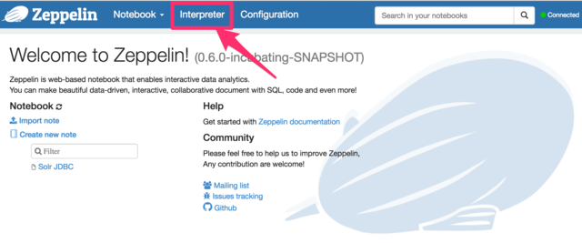
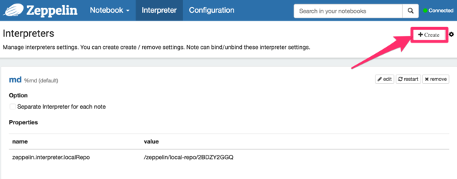
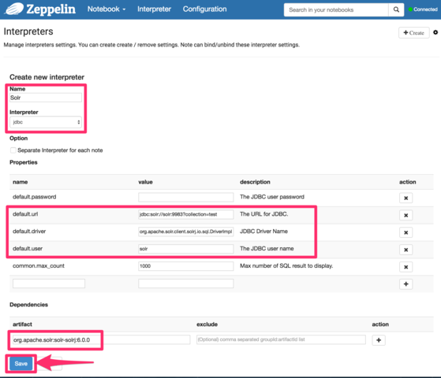
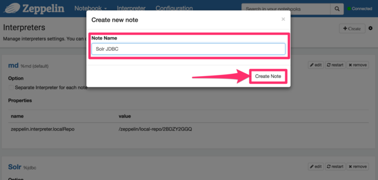
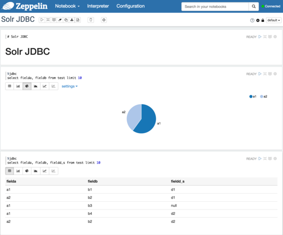

= Solr JDBC - Apache Zeppelin
// Licensed to the Apache Software Foundation (ASF) under one
// or more contributor license agreements.  See the NOTICE file
// distributed with this work for additional information
// regarding copyright ownership.  The ASF licenses this file
// to you under the Apache License, Version 2.0 (the
// "License"); you may not use this file except in compliance
// with the License.  You may obtain a copy of the License at
//
//   http://www.apache.org/licenses/LICENSE-2.0
//
// Unless required by applicable law or agreed to in writing,
// software distributed under the License is distributed on an
// "AS IS" BASIS, WITHOUT WARRANTIES OR CONDITIONS OF ANY
// KIND, either express or implied.  See the License for the
// specific language governing permissions and limitations
// under the License.

The Solr JDBC driver can support Apache Zeppelin.

IMPORTANT: This requires Apache Zeppelin 0.6.0 or greater which contains the JDBC interpreter.

To use http://zeppelin.apache.org[Apache Zeppelin] with Solr, you will need to create a JDBC interpreter for Solr. This will add SolrJ to the interpreter classpath. Once the interpreter has been created, you can create a notebook to issue queries. The http://zeppelin.apache.org/docs/latest/interpreter/jdbc.html[Apache Zeppelin JDBC interpreter documentation] provides additional information about JDBC prefixes and other features.

== Create the Apache Solr JDBC Interpreter

.Click "Interpreter" in the top navigation

.Click "Create"

.Enter information about your Solr installation

[NOTE]
====
For most installations, Apache Zeppelin configures PostgreSQL as the JDBC interpreter default driver. The default driver can either be replaced by the Solr driver as outlined above or you can add a separate JDBC interpreter prefix as outlined in the http://zeppelin.apache.org/docs/latest/interpreter/jdbc.html[Apache Zeppelin JDBC interpreter documentation].
====

== Create a Notebook

.Click Notebook \-> Create new note
image::images/solr-jdbc-apache-zeppelin/zeppelin_solrjdbc_4.png[image,width=517,height=400]

.Provide a name and click "Create Note"

== JDBC Interpreter Copy Sheet

To facilitate easy copying the parameters mentioned in the screenshots, here is a consolidated list of the parameters:

[source,text,subs=attributes]
----
Name : Solr
Interpreter : jdbc
default.url : jdbc:solr://SOLR_ZK_CONNECTION_STRING?collection=<collection_name>
default.driver : org.apache.solr.client.solrj.io.sql.DriverImpl
default.user : solr
dependency : org.apache.solr:solr-solrj:{solr-docs-version}.0
----

== Query with the Notebook

[IMPORTANT]
====
For some notebooks, the JDBC interpreter will not be bound to the notebook by default. Instructions on how to bind the JDBC interpreter to a notebook are available https://zeppelin.apache.org/docs/latest/interpreter/jdbc.html#bind-to-notebook[here].
====

.Results of Solr query

The below code block assumes that the Apache Solr driver is setup as the default JDBC interpreter driver. If that is not the case, instructions for using a different prefix is available https://zeppelin.apache.org/docs/latest/interpreter/jdbc.html#how-to-use[here].

[source,text]
----
%jdbc
select fielda, fieldb, from test limit 10
----
