= Solr JDBC - DbVisualizer
// Licensed to the Apache Software Foundation (ASF) under one
// or more contributor license agreements.  See the NOTICE file
// distributed with this work for additional information
// regarding copyright ownership.  The ASF licenses this file
// to you under the Apache License, Version 2.0 (the
// "License"); you may not use this file except in compliance
// with the License.  You may obtain a copy of the License at
//
//   http://www.apache.org/licenses/LICENSE-2.0
//
// Unless required by applicable law or agreed to in writing,
// software distributed under the License is distributed on an
// "AS IS" BASIS, WITHOUT WARRANTIES OR CONDITIONS OF ANY
// KIND, either express or implied.  See the License for the
// specific language governing permissions and limitations
// under the License.

Solr's JDBC driver supports DBVisualizer for querying Solr.

For https://www.dbvis.com/[DbVisualizer], you will need to create a new driver for Solr using the DbVisualizer Driver Manager. This will add several SolrJ client .jars to the DbVisualizer classpath. The files required are:

* all .jars found in `$SOLR_HOME/dist/solrj-lib`
* the SolrJ .jar found at `$SOLR_HOME/dist/solr-solrj-<version>.jar`

Once the driver has been created, you can create a connection to Solr with the connection string format outlined in the generic section and use the SQL Commander to issue queries.

== Setup Driver

=== Open Driver Manager

From the Tools menu, choose Driver Manager to add a driver.

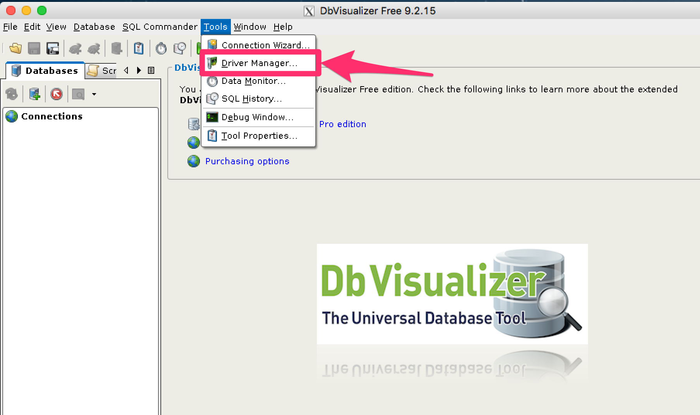


=== Create a New Driver

image::images/solr-jdbc-dbvisualizer/dbvisualizer_solrjdbc_2.png[image,width=532,height=400]


=== Name the Driver in Driver Manager

Provide a name for the driver, and provide the URL format: `jdbc:solr://<zk_connection_string>/?collection=<collection>`. Do not fill in values for the variables "```zk_connection_string```" and "```collection```", those will be provided later when the connection to Solr is configured. The Driver Class will also be automatically added when the driver .jars are added.

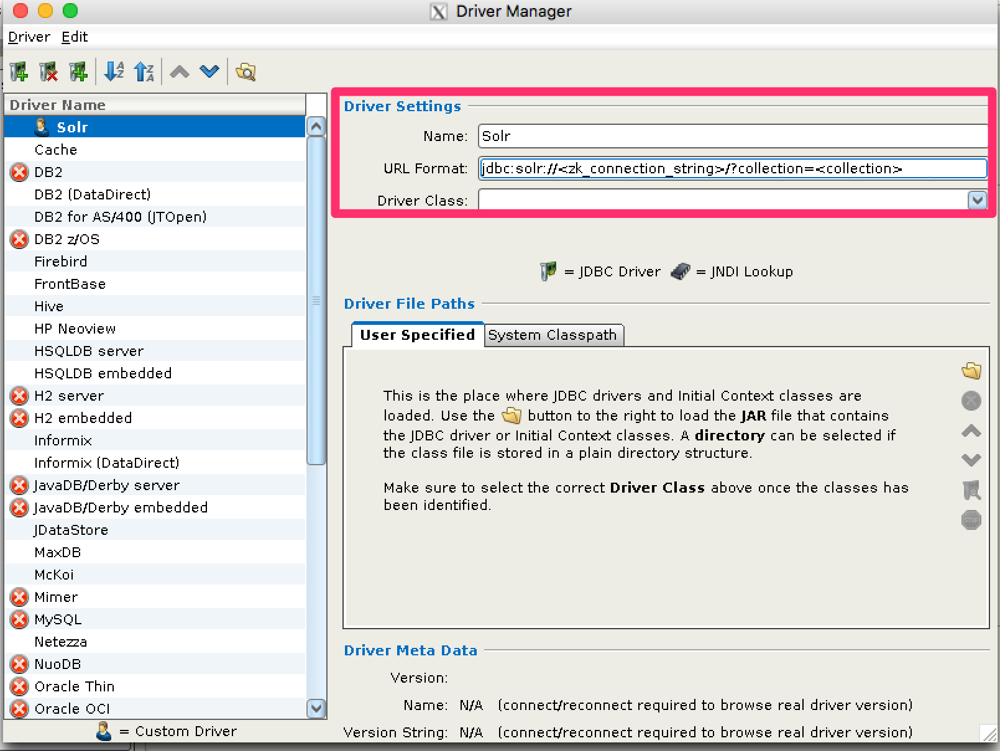


=== Add Driver Files to Classpath

The driver files to be added are:

* all .jars in `$SOLR_HOME/dist/solrj-lib`
* the SolrJ .jar found in `$SOLR_HOME/dist/solr-solrj-<version>.jar`

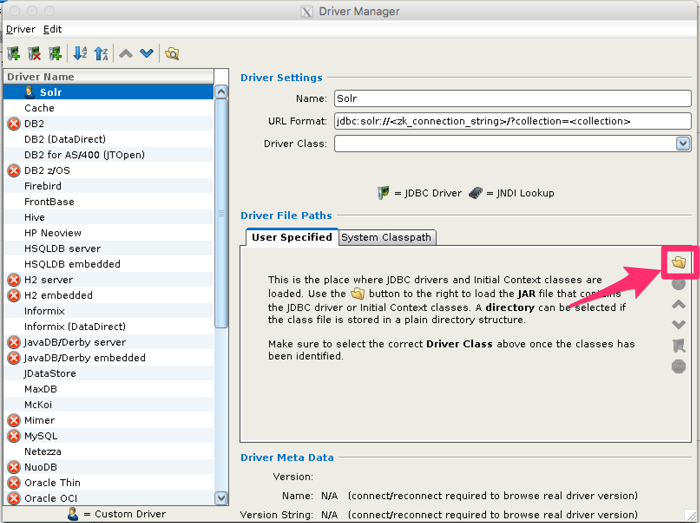


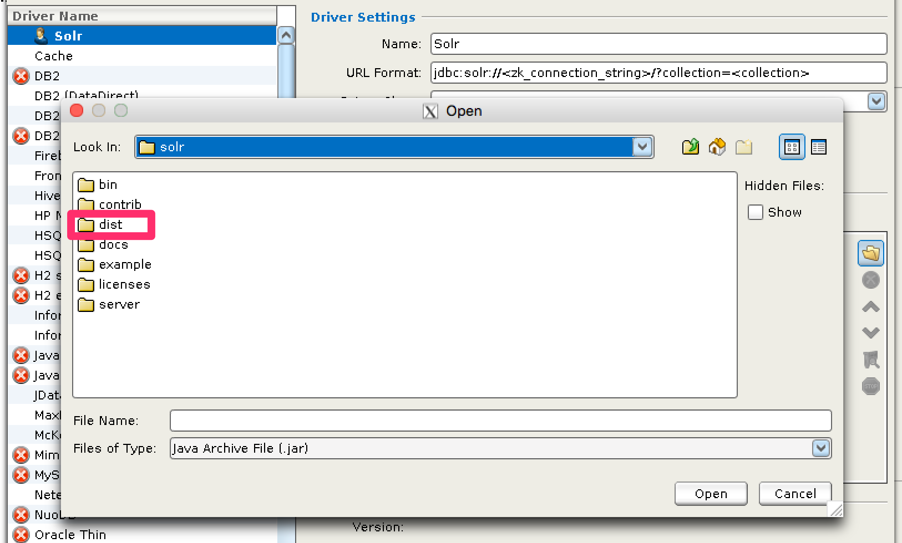


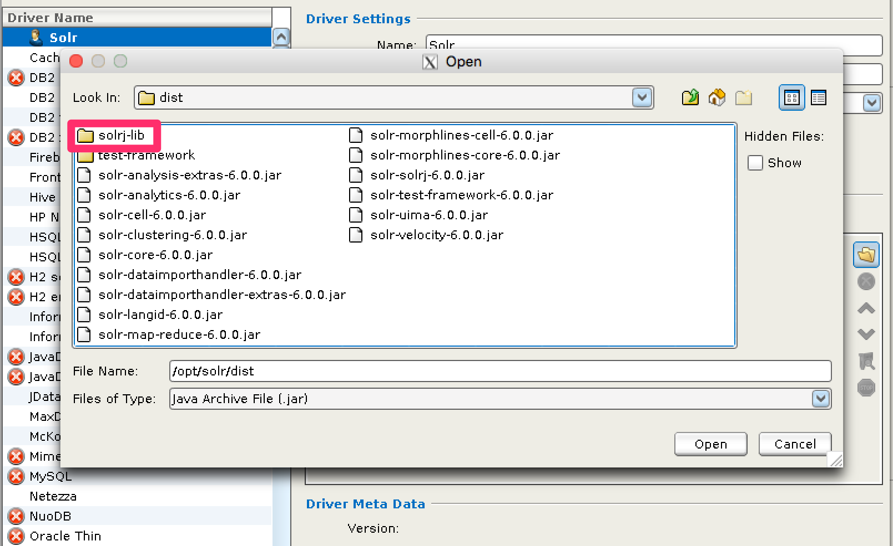


image::images/solr-jdbc-dbvisualizer/dbvisualizer_solrjdbc_7.png[image,width=655,height=400]


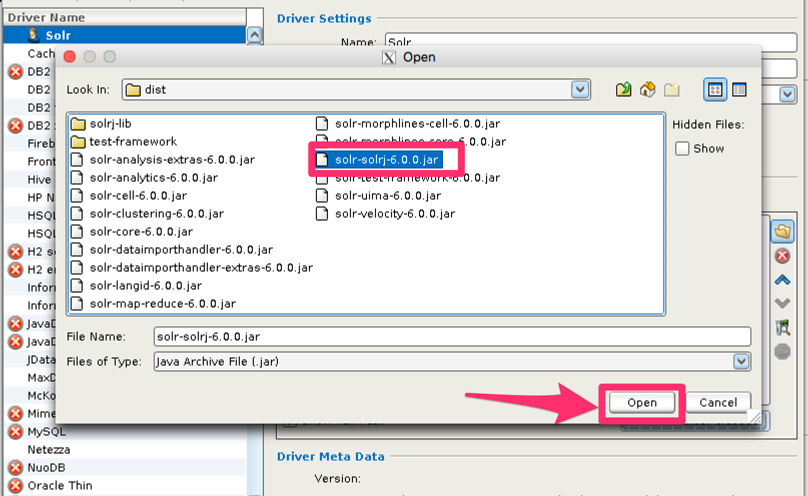


=== Review and Close Driver Manager

Once the driver files have been added, you can close the Driver Manager.

== Create a Connection

Next, create a connection to Solr using the driver just created.

=== Use the Connection Wizard

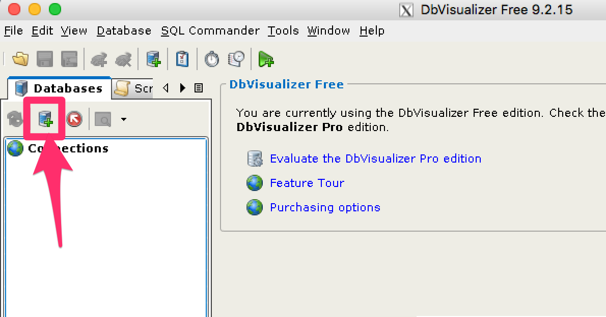


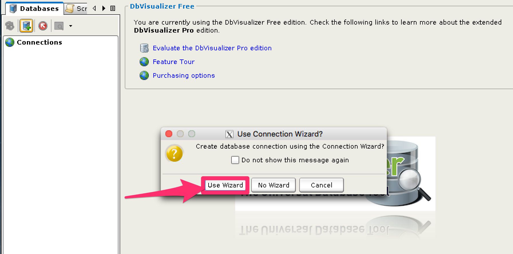


=== Name the Connection

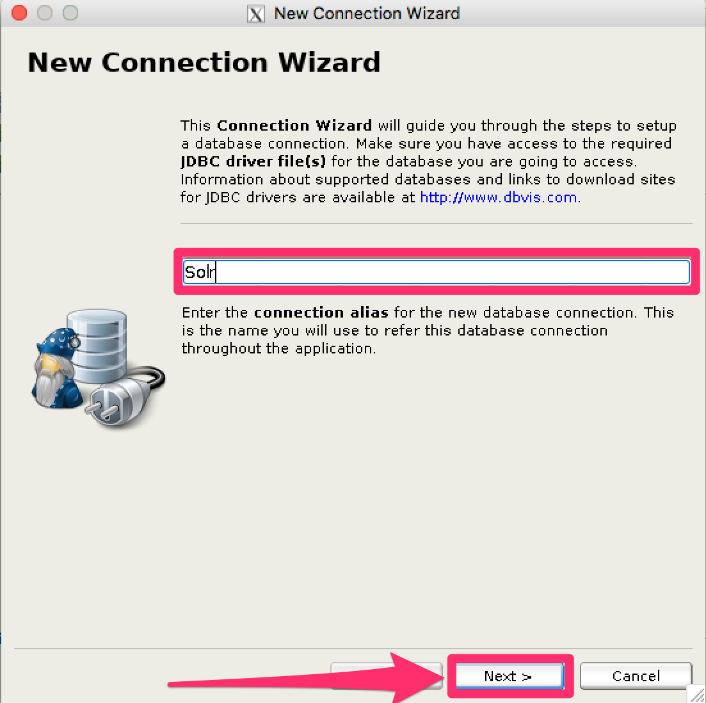


=== Select the Solr driver

image::images/solr-jdbc-dbvisualizer/dbvisualizer_solrjdbc_14.png[image,width=399,height=400]


=== Specify the Solr URL

Provide the Solr URL, using the ZooKeeper host and port and the collection. For example, `jdbc:solr://localhost:9983?collection=test`

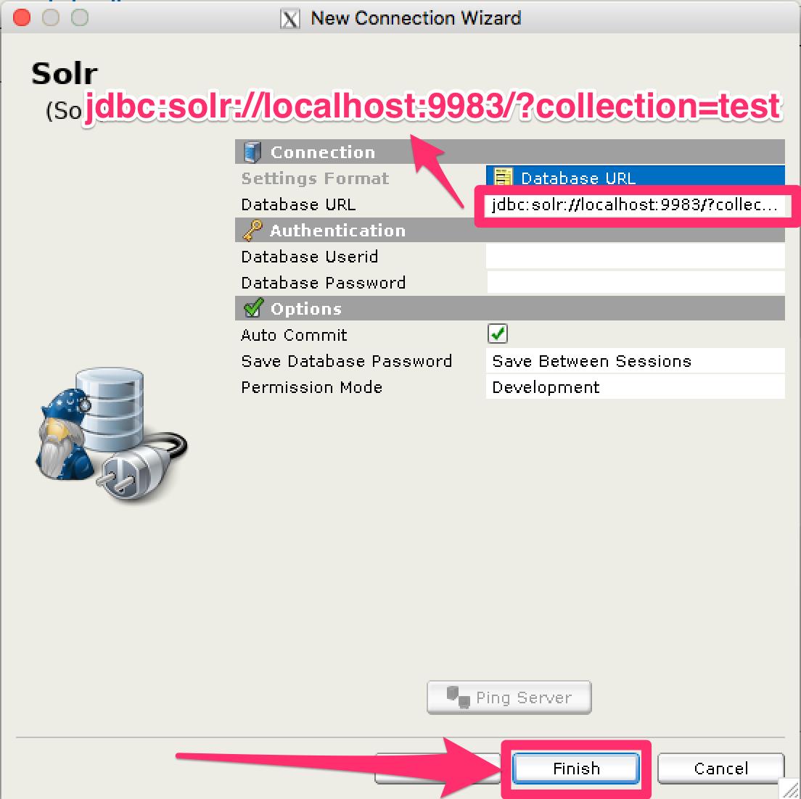


== Open and Connect to Solr

Once the connection has been created, double-click on it to open the connection details screen and connect to Solr.

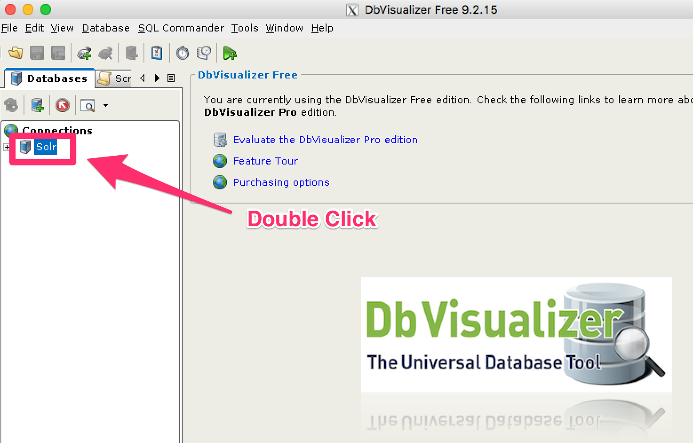


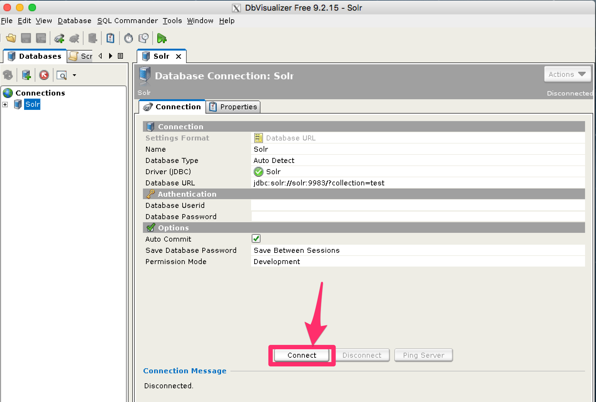


== Open SQL Commander to Enter Queries

When the connection is established, you can use the SQL Commander to issue queries and view data.

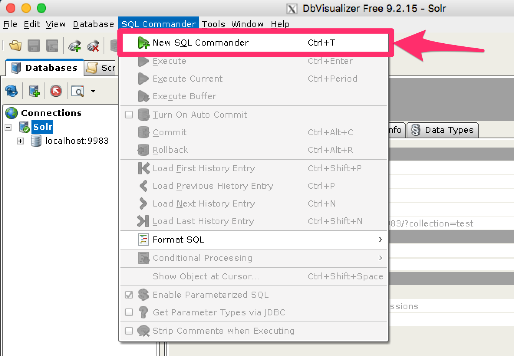


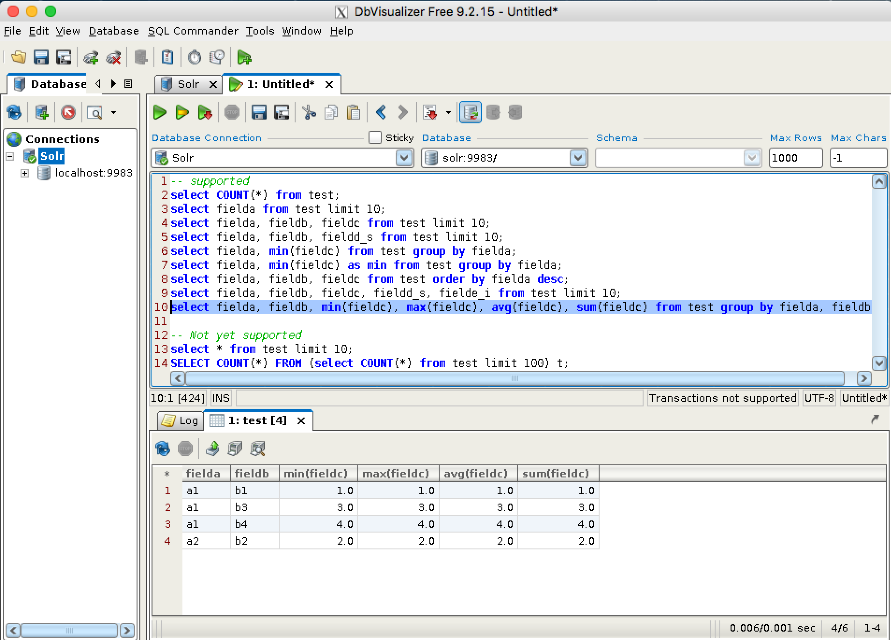
