= Solr JDBC - SQuirreL SQL
// Licensed to the Apache Software Foundation (ASF) under one
// or more contributor license agreements.  See the NOTICE file
// distributed with this work for additional information
// regarding copyright ownership.  The ASF licenses this file
// to you under the Apache License, Version 2.0 (the
// "License"); you may not use this file except in compliance
// with the License.  You may obtain a copy of the License at
//
//   http://www.apache.org/licenses/LICENSE-2.0
//
// Unless required by applicable law or agreed to in writing,
// software distributed under the License is distributed on an
// "AS IS" BASIS, WITHOUT WARRANTIES OR CONDITIONS OF ANY
// KIND, either express or implied.  See the License for the
// specific language governing permissions and limitations
// under the License.

For http://squirrel-sql.sourceforge.net[SQuirreL SQL], you will need to create a new driver for Solr. This will add several SolrJ client .jars to the SQuirreL SQL classpath. The files required are:

* all .jars found in `$SOLR_HOME/dist/solrj-libs`
* the SolrJ .jar found at `$SOLR_HOME/dist/solr-solrj-<version>.jar`

Once the driver has been created, you can create a connection to Solr with the connection string format outlined in the generic section and use the editor to issue queries.

== Add Solr JDBC Driver

=== Open Drivers

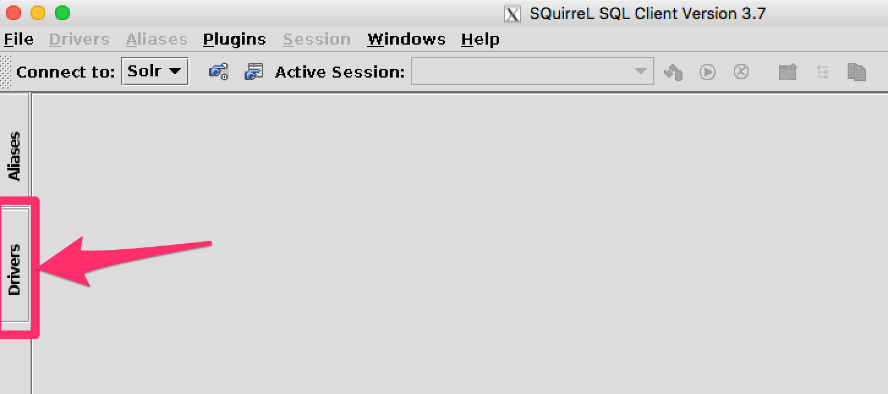


=== Add Driver

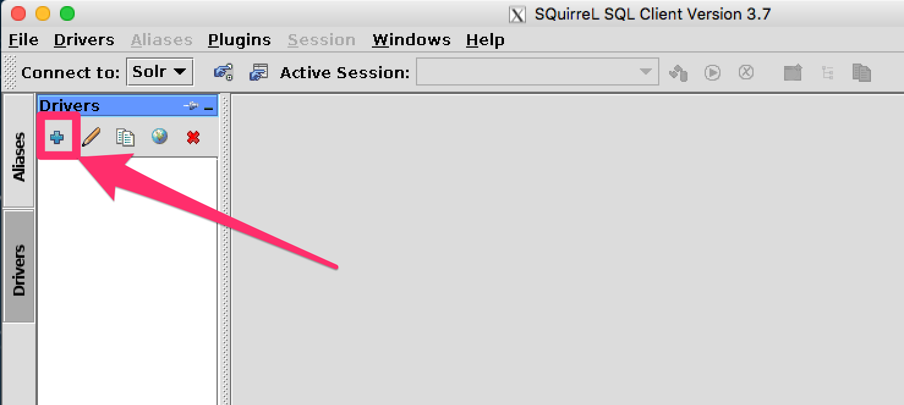


=== Name the Driver

Provide a name for the driver, and provide the URL format: `jdbc:solr://<zk_connection_string>/?collection=<collection>`. Do not fill in values for the variables "```zk_connection_string```" and "```collection```", those will be defined later when the connection to Solr is configured.

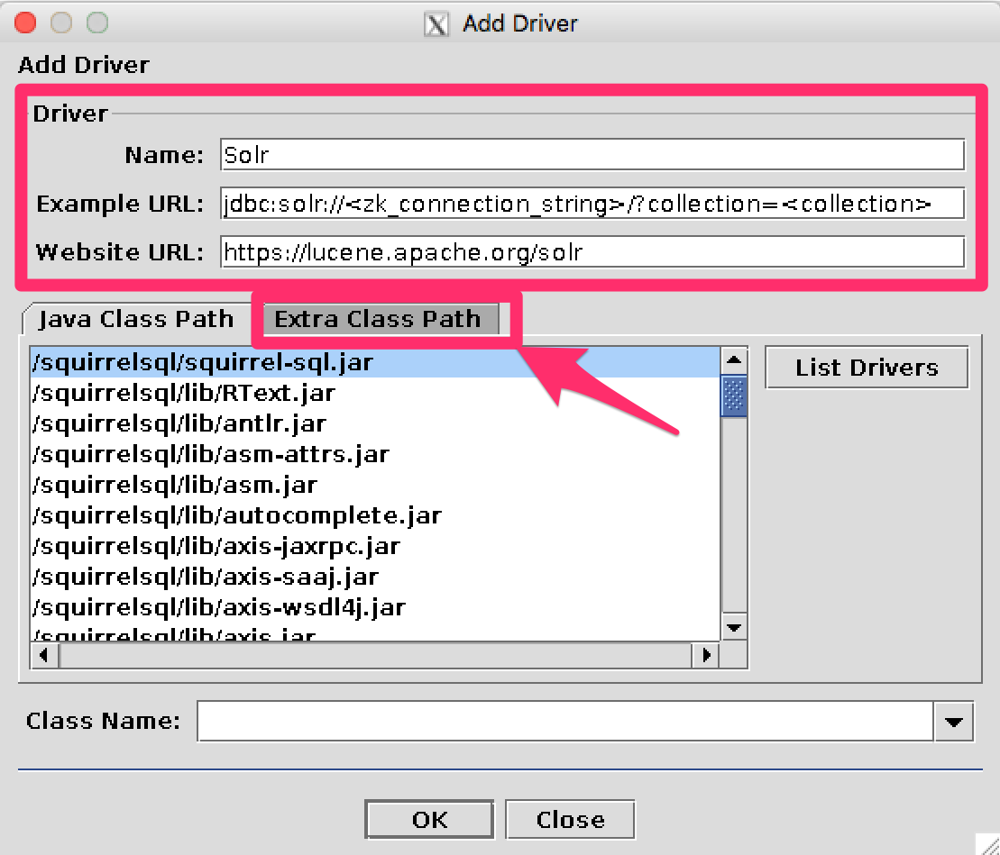


=== Add Solr JDBC jars to Classpath

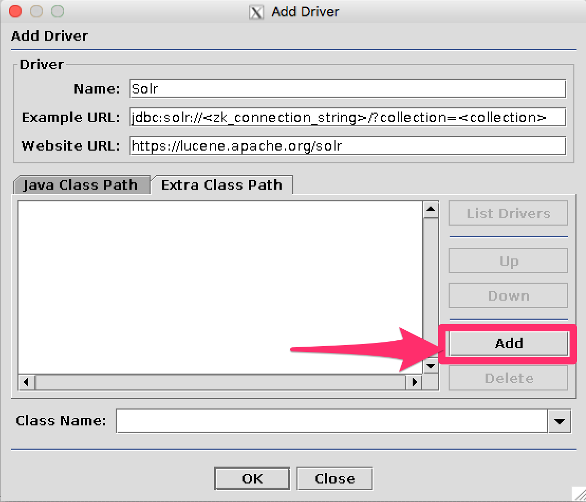


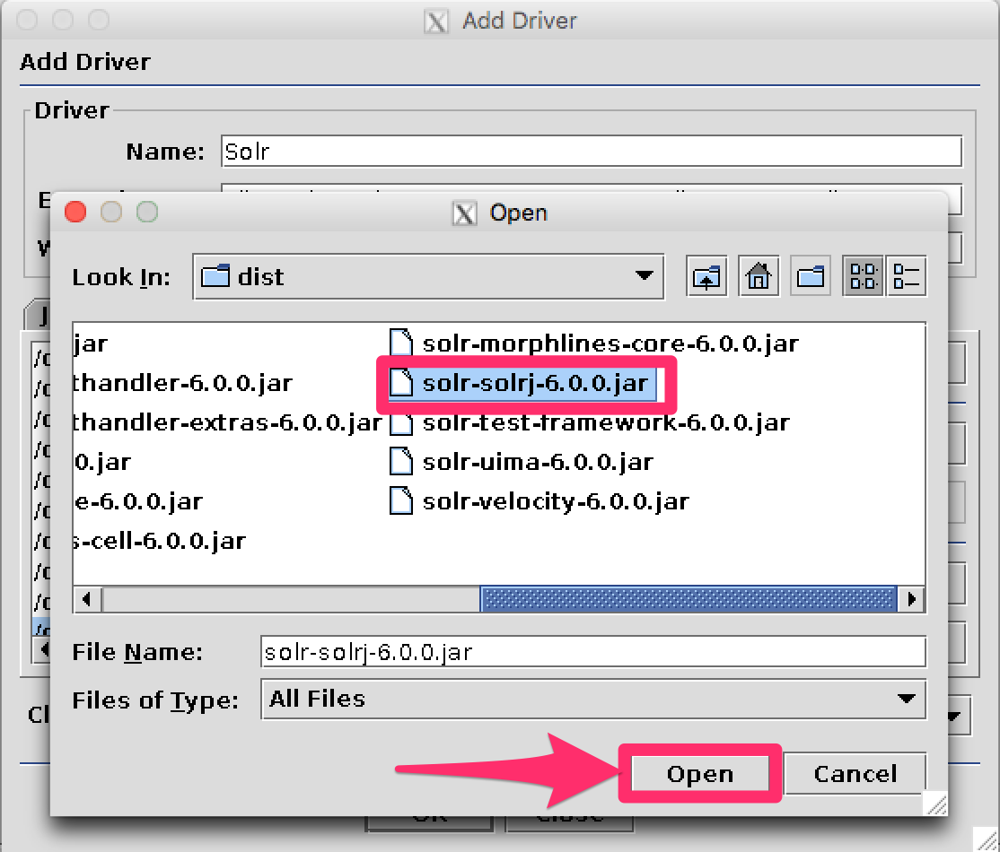


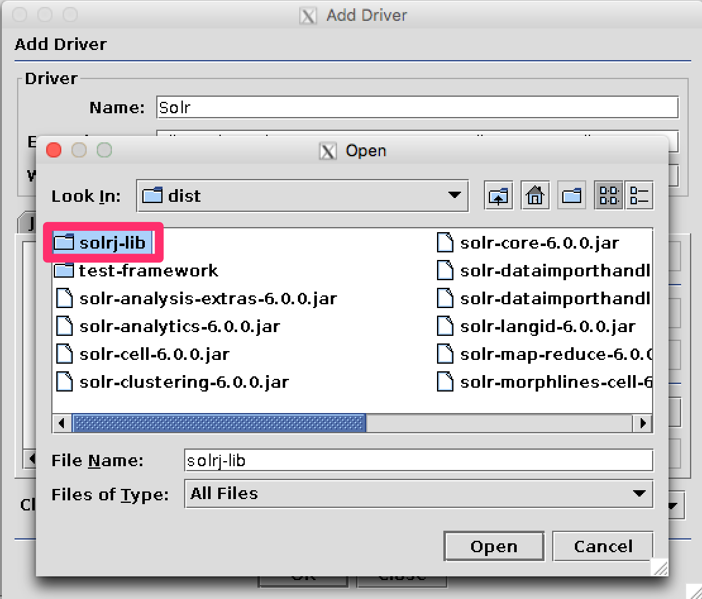


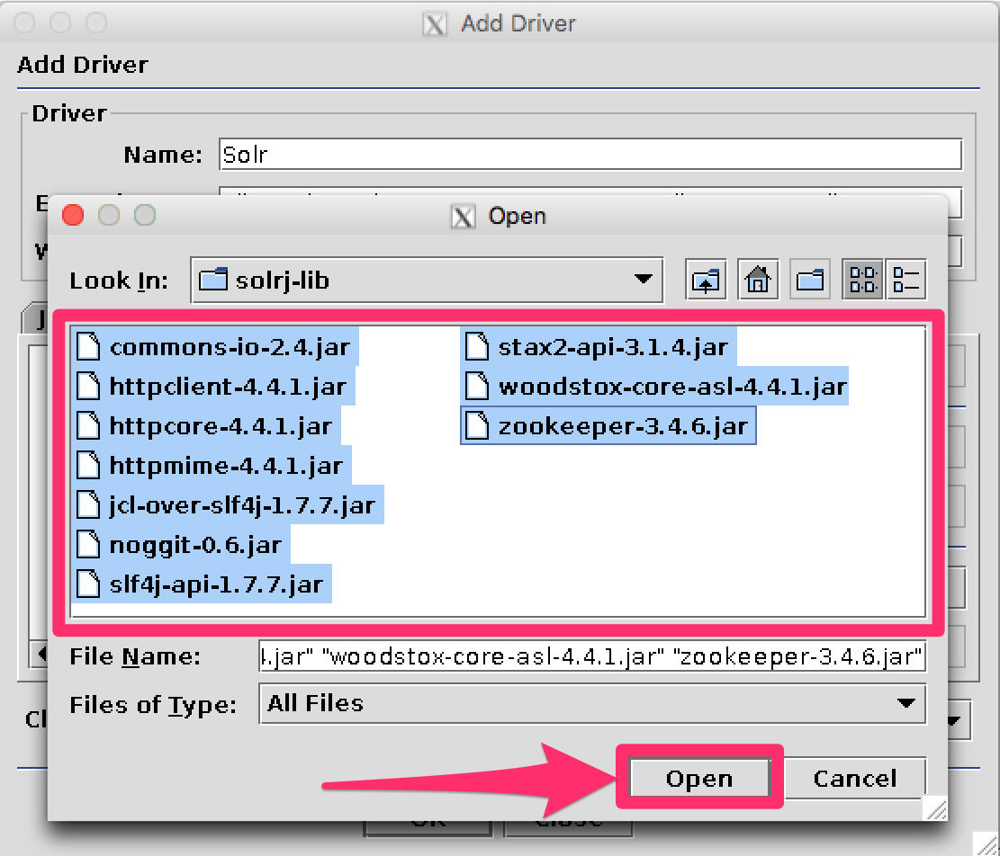


=== Add the Solr JDBC driver class name

After adding the .jars, you will need to additionally define the Class Name `org.apache.solr.client.solrj.io.sql.DriverImpl`.

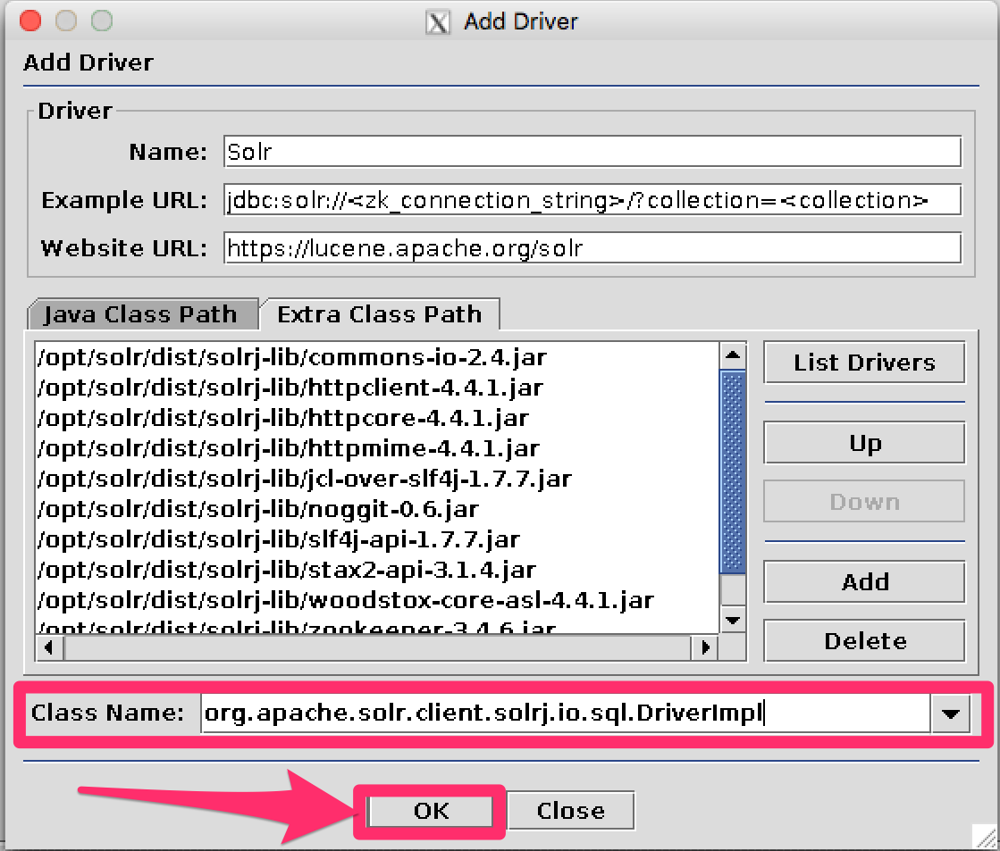


== Create an Alias

To define a JDBC connection, you must define an alias.

=== Open Aliases

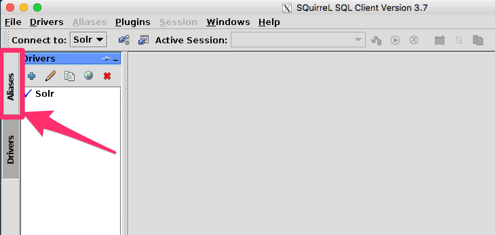


=== Add an Alias

image::images/solr-jdbc-squirrel-sql/squirrelsql_solrjdbc_12.png[image,width=959,height=400]


=== Configure the Alias

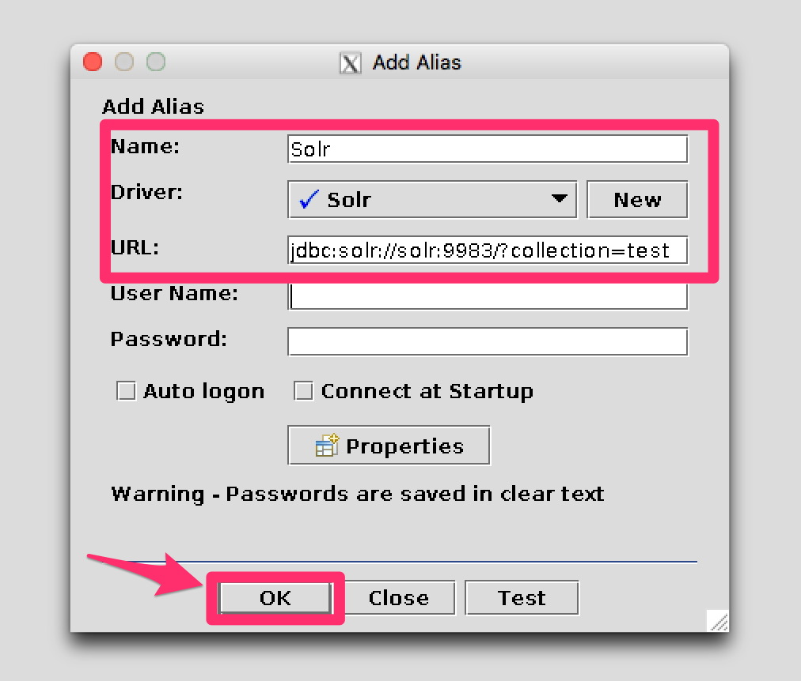


=== Connect to the Alias

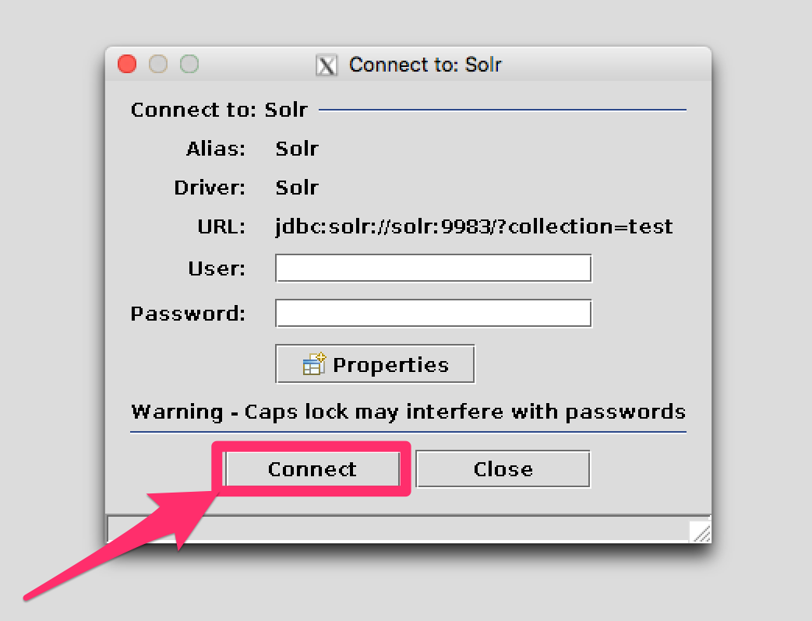


== Querying

Once you've successfully connected to Solr, you can use the SQL interface to enter queries and work with data.

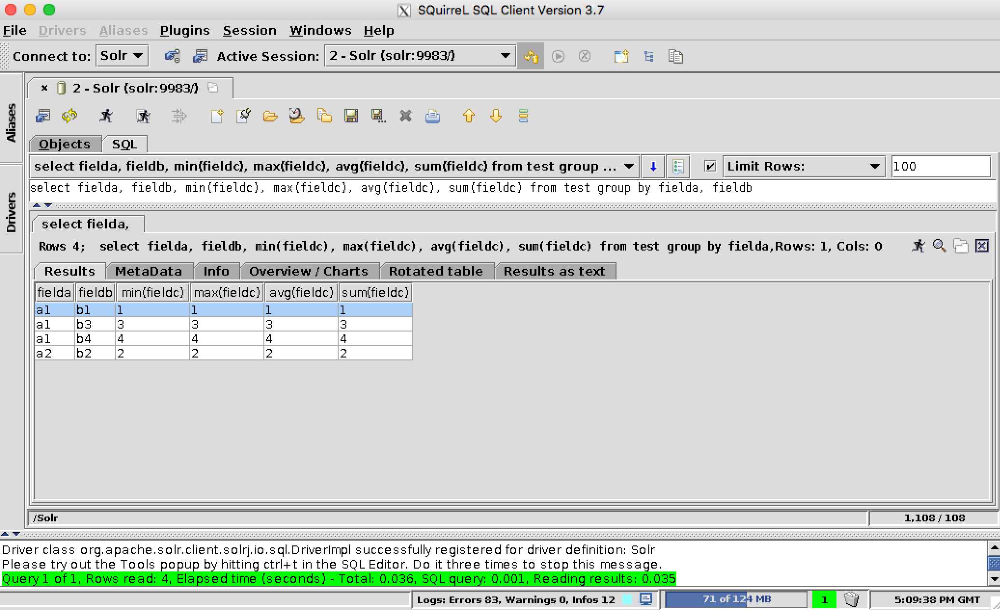
