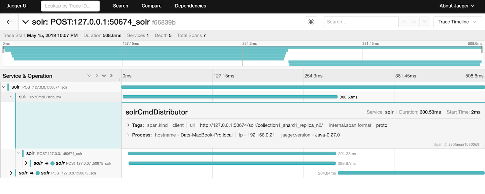

= Distributed Solr Tracing
// Licensed to the Apache Software Foundation (ASF) under one
// or more contributor license agreements.  See the NOTICE file
// distributed with this work for additional information
// regarding copyright ownership.  The ASF licenses this file
// to you under the Apache License, Version 2.0 (the
// "License"); you may not use this file except in compliance
// with the License.  You may obtain a copy of the License at
//
//   http://www.apache.org/licenses/LICENSE-2.0
//
// Unless required by applicable law or agreed to in writing,
// software distributed under the License is distributed on an
// "AS IS" BASIS, WITHOUT WARRANTIES OR CONDITIONS OF ANY
// KIND, either express or implied.  See the License for the
// specific language governing permissions and limitations
// under the License.

Solr includes a general tracing framework based on OpenTracing that can be used to trace lifecycle of a request for performance monitoring.
Tracing data can be configured and send to arbitrary backend like Jaeger, Zipkin, Datadog, etc. For now only Jaeger is
supported out of the box.

A sampled distributed tracing query request on Jaeger looks like this:

.Tracing of a solr query


== Setup Tracer

`TracerConfigurator` is a class used for provide an instance of `io.opentracing.Tracer` based on configuration in `solr.xml`.
Like `JaegerTracerConfigurator` provide JaegerTracer instance to Solr node.

A setup of a `TracerConfigurator` looks like this

```xml
<solr>
  <tracerConfig name="tracerConfig" class="org.apache.solr.jaeger.JaegerTracerConfigurator">
    <str name="agentHost">localhost</str>
    <int name="agentPort">5775</int>
    <bool name="logSpans">true</bool>
    <int name="flushInterval">1000</int>
    <int name="maxQueueSize">10000</int>
  </tracerConfig>
</solr>
```

If `<tracerConfig>` part is absent, `TracerConfigurator` will try to pick up the `Tracer` instance was registered in
in `io.opentracing.util.GlobalTracer`. By doing this some backend like DataDog is supported out of the box since
https://docs.datadoghq.com/tracing/setup/java/[datadog-java-agent] use Javaagent to register a `Tracer` in
`io.opentracing.util.GlobalTracer`.

=== Configuring Sample Rate

By default only 0.1% of requests are sampled, this ensure that tracing activities does not affect performance of a node.

The rate can be changed on the fly (without restarting Solr nodes) by setting new sample rate in cluster property. For example,
below call set sample rate to 100%
```
/admin/collections?action=CLUSTERPROP&name=samplePercentage&val=100
```

== Jaeger Tracer Configurator

Module `contrib/jagertracer-configurator` provides a default implementation for setting up Jaeger Tracer.
Note that all library of jaegertracer-configurator must be included in the classpath of all nodes then Jaeger tracer can be setup in `solr.xml` like this:

```
<tracerConfig name="tracerConfig" class="org.apache.solr.jaeger.JaegerTracerConfigurator">
  <str name="agentHost">localhost</str>
  <int name="agentPort">5775</int>
  <bool name="logSpans">true</bool>
  <int name="flushInterval">1000</int>
  <int name="maxQueueSize">10000</int>
</tracerConfig>
```

List of parameters for JaegerTracerConfigurator include:
|===
|Parameter|Type|Required|Default|Description
|agentHost|string|Yes||The host of Jaeger backend
|agentPort|int|Yes||The port of Jaeger port
|logsSpans|bool|No|true|Whether the tracer should also log the spans
|flushInterval|int|No|5000|The tracer's flush interval (ms)
|maxQueueSize|int|No|10000|The tracer's maximum queue size
|===

Other parameters which are not listed above can be configured using System Properties or Environment Variables. The full list are listed at https://github.com/jaegertracing/jaeger-client-java/blob/master/jaeger-core/README.md[Jaeger-README].
