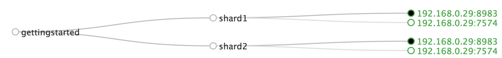
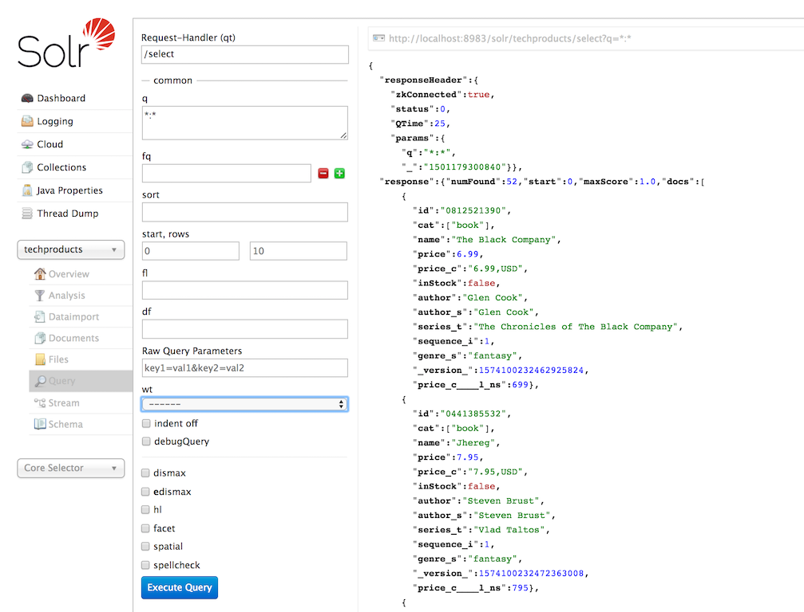
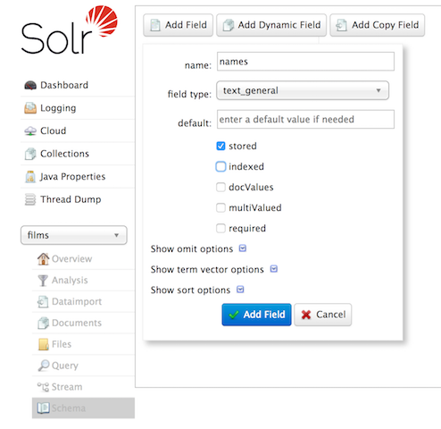
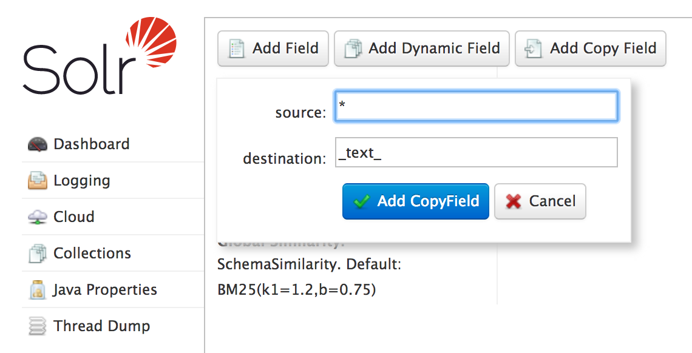
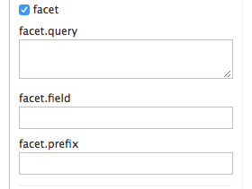

= Solr Tutorial
:experimental:
// Licensed to the Apache Software Foundation (ASF) under one
// or more contributor license agreements.  See the NOTICE file
// distributed with this work for additional information
// regarding copyright ownership.  The ASF licenses this file
// to you under the Apache License, Version 2.0 (the
// "License"); you may not use this file except in compliance
// with the License.  You may obtain a copy of the License at
//
//   http://www.apache.org/licenses/LICENSE-2.0
//
// Unless required by applicable law or agreed to in writing,
// software distributed under the License is distributed on an
// "AS IS" BASIS, WITHOUT WARRANTIES OR CONDITIONS OF ANY
// KIND, either express or implied.  See the License for the
// specific language governing permissions and limitations
// under the License.

This tutorial covers getting Solr up and running, ingesting a variety of data sources into Solr collections,
and getting a feel for the Solr administrative and search interfaces.

The tutorial is organized into three sections that each build on the one before it. The <<exercise-1,first exercise>> will ask you to start Solr, create a collection, index some basic documents, and then perform some searches.

The <<exercise-2,second exercise>> works with a different set of data, and explores requesting facets with the dataset.

The <<exercise-3,third exercise>> encourages you to begin to work with your own data and start a plan for your implementation.

Finally, we'll introduce <<Spatial Queries,spatial search>> and show you how to get your Solr instance back into a clean state.

== Before You Begin

To follow along with this tutorial, you will need...

// TODO possibly remove this system requirements or only replace the link
. To meet the {solr-javadocs}/SYSTEM_REQUIREMENTS.html[system requirements]
. An Apache Solr release http://solr.apache.org/downloads.html[download]. This tutorial is designed for Apache Solr {solr-docs-version}.

For best results, please run the browser showing this tutorial and the Solr server on the same machine so tutorial links will correctly point to your Solr server.

== Unpack Solr

Begin by unzipping the Solr release and changing your working directory to the subdirectory where Solr was installed. For example, with a shell in UNIX, Cygwin, or MacOS:

[source,bash,subs="verbatim,attributes+"]
----
~$ ls solr*
solr-{solr-docs-version}.0.zip

~$ unzip -q solr-{solr-docs-version}.0.zip

~$ cd solr-{solr-docs-version}.0/
----

If you'd like to know more about Solr's directory layout before moving to the first exercise, see the section <<installing-solr.adoc#directory-layout,Directory Layout>> for details.

[[exercise-1]]
== Exercise 1: Index Techproducts Example Data

This exercise will walk you through how to start Solr as a two-node cluster (both nodes on the same machine) and create a collection during startup. Then you will index some sample data that ships with Solr and do some basic searches.

=== Launch Solr in SolrCloud Mode
To launch Solr, run: `bin/solr start -e cloud` on Unix or MacOS; `bin\solr.cmd start -e cloud` on Windows.

This will start an interactive session that will start two Solr "servers" on your machine. This command has an option to run without prompting you for input (`-noprompt`), but we want to modify two of the defaults so we won't use that option now.

[source,subs="verbatim,attributes+"]
----
solr-{solr-docs-version}.0:$ ./bin/solr start -e cloud

Welcome to the SolrCloud example!

This interactive session will help you launch a SolrCloud cluster on your local workstation.
To begin, how many Solr nodes would you like to run in your local cluster? (specify 1-4 nodes) [2]:
----
The first prompt asks how many nodes we want to run. Note the `[2]` at the end of the last line; that is the default number of nodes. Two is what we want for this example, so you can simply press kbd:[enter].

[source,subs="verbatim,attributes+"]
----
Ok, let's start up 2 Solr nodes for your example SolrCloud cluster.
Please enter the port for node1 [8983]:
----
This will be the port that the first node runs on. Unless you know you have something else running on port 8983 on your machine, accept this default option also by pressing kbd:[enter]. If something is already using that port, you will be asked to choose another port.

[source,subs="verbatim,attributes+"]
----
Please enter the port for node2 [7574]:
----
This is the port the second node will run on. Again, unless you know you have something else running on port 8983 on your machine, accept this default option also by pressing kbd:[enter]. If something is already using that port, you will be asked to choose another port.

Solr will now initialize itself and start running on those two nodes. The script will print the commands it uses for your reference.

[source,subs="verbatim,attributes+"]
----
Starting up 2 Solr nodes for your example SolrCloud cluster.

Creating Solr home directory /solr-{solr-docs-version}.0/example/cloud/node1/solr
Cloning /solr-{solr-docs-version}.0/example/cloud/node1 into
   /solr-{solr-docs-version}.0/example/cloud/node2

Starting up Solr on port 8983 using command:
"bin/solr" start -cloud -p 8983 -s "example/cloud/node1/solr"

Waiting up to 180 seconds to see Solr running on port 8983 [\]
Started Solr server on port 8983 (pid=34942). Happy searching!

Starting up Solr on port 7574 using command:
"bin/solr" start -cloud -p 7574 -s "example/cloud/node2/solr" -z localhost:9983

Waiting up to 180 seconds to see Solr running on port 7574 [\]
Started Solr server on port 7574 (pid=35036). Happy searching!

INFO  - 2017-07-27 12:28:02.835; org.apache.solr.client.solrj.impl.ZkClientClusterStateProvider; Cluster at localhost:9983 ready
----

Notice that two instances of Solr have started on two nodes. Because we are starting in SolrCloud mode, and did not define any details about an external ZooKeeper cluster, Solr launches its own ZooKeeper and connects both nodes to it.

After startup is complete, you'll be prompted to create a collection to use for indexing data.

[source,subs="verbatim,attributes+"]
----
Now let's create a new collection for indexing documents in your 2-node cluster.
Please provide a name for your new collection: [gettingstarted]
----

Here's the first place where we'll deviate from the default options. This tutorial will ask you to index some sample data included with Solr, called the "techproducts" data. Let's name our collection "techproducts" so it's easy to differentiate from other collections we'll create later. Enter `techproducts` at the prompt and hit kbd:[enter].

[source,subs="verbatim,attributes+"]
----
How many shards would you like to split techproducts into? [2]
----

This is asking how many <<solr-glossary.adoc#shard,shards>> you want to split your index into across the two nodes. Choosing "2" (the default) means we will split the index relatively evenly across both nodes, which is a good way to start. Accept the default by hitting kbd:[enter].

[source,subs="verbatim,attributes+"]
----
How many replicas per shard would you like to create? [2]
----

A replica is a copy of the index that's used for failover (see also the <<solr-glossary.adoc#replica,Solr Glossary definition>>). Again, the default of "2" is fine to start with here also, so accept the default by hitting kbd:[enter].

[source,subs="verbatim,attributes+"]
----
Please choose a configuration for the techproducts collection, available options are:
_default or sample_techproducts_configs [_default]
----

We've reached another point where we will deviate from the default option. Solr has two sample sets of configuration files (called a configset) available out-of-the-box.

A collection must have a configset, which at a minimum includes the two main configuration files for Solr: the schema file (named either `managed-schema` or `schema.xml`), and `solrconfig.xml`. The question here is which configset you would like to start with. The `_default` is a bare-bones option, but note there's one whose name includes "techproducts", the same as we named our collection. This configset is specifically designed to support the sample data we want to use, so enter `sample_techproducts_configs` at the prompt and hit kbd:[enter].

At this point, Solr will create the collection and again output to the screen the commands it issues.

[source,subs="verbatim,attributes+"]
----
Uploading /solr-{solr-docs-version}.0/server/solr/configsets/_default/conf for config techproducts to ZooKeeper at localhost:9983

Connecting to ZooKeeper at localhost:9983 ...
INFO  - 2017-07-27 12:48:59.289; org.apache.solr.client.solrj.impl.ZkClientClusterStateProvider; Cluster at localhost:9983 ready
Uploading /solr-{solr-docs-version}.0/server/solr/configsets/sample_techproducts_configs/conf for config techproducts to ZooKeeper at localhost:9983

Creating new collection 'techproducts' using command:
http://localhost:8983/solr/admin/collections?action=CREATE&name=techproducts&numShards=2&replicationFactor=2&collection.configName=techproducts

{
  "responseHeader":{
    "status":0,
    "QTime":5460},
  "success":{
    "192.168.0.110:7574_solr":{
      "responseHeader":{
        "status":0,
        "QTime":4056},
      "core":"techproducts_shard1_replica_n1"},
    "192.168.0.110:8983_solr":{
      "responseHeader":{
        "status":0,
        "QTime":4056},
      "core":"techproducts_shard2_replica_n2"}}}

Enabling auto soft-commits with maxTime 3 secs using the Config API

POSTing request to Config API: http://localhost:8983/solr/techproducts/config
{"set-property":{"updateHandler.autoSoftCommit.maxTime":"3000"}}
Successfully set-property updateHandler.autoSoftCommit.maxTime to 3000

SolrCloud example running, please visit: http://localhost:8983/solr
----

*Congratulations!* Solr is ready for data!

You can see that Solr is running by launching the Solr Admin UI in your web browser: http://localhost:8983/solr/. This is the main starting point for administering Solr.

Solr will now be running two "nodes", one on port 7574 and one on port 8983. There is one collection created automatically, `techproducts`, a two shard collection, each with two replicas.

The http://localhost:8983/solr/#/~cloud[Cloud tab] in the Admin UI diagrams the collection nicely:

.SolrCloud Diagram

=== Index the Techproducts Data

Your Solr server is up and running, but it doesn't contain any data yet, so we can't do any queries.

Solr includes the `bin/post` tool in order to facilitate indexing various types of documents easily. We'll use this tool for the indexing examples below.

You'll need a command shell to run some of the following examples, rooted in the Solr install directory; the shell from where you launched Solr works just fine.

NOTE: Currently the `bin/post` tool does not have a comparable Windows script, but the underlying Java program invoked is available. We'll show examples below for Windows, but you can also see the <<post-tool.adoc#post-tool-windows-support,Windows section>> of the Post Tool documentation for more details.

The data we will index is in the `example/exampledocs` directory. The documents are in a mix of document formats (JSON, CSV, etc.), and fortunately we can index them all at once:

.Linux/Mac
[source,subs="verbatim,attributes+"]
----
solr-{solr-docs-version}.0:$ bin/post -c techproducts example/exampledocs/*
----

.Windows
[source,subs="verbatim,attributes+"]
----
C:\solr-{solr-docs-version}.0> java -jar -Dc=techproducts -Dauto example\exampledocs\post.jar example\exampledocs\*
----

You should see output similar to the following:

[source,subs="verbatim,attributes+"]
----
SimplePostTool version 5.0.0
Posting files to [base] url http://localhost:8983/solr/techproducts/update...
Entering auto mode. File endings considered are xml,json,jsonl,csv,pdf,doc,docx,ppt,pptx,xls,xlsx,odt,odp,ods,ott,otp,ots,rtf,htm,html,txt,log
POSTing file books.csv (text/csv) to [base]
POSTing file books.json (application/json) to [base]/json/docs
POSTing file gb18030-example.xml (application/xml) to [base]
POSTing file hd.xml (application/xml) to [base]
POSTing file ipod_other.xml (application/xml) to [base]
POSTing file ipod_video.xml (application/xml) to [base]
POSTing file manufacturers.xml (application/xml) to [base]
POSTing file mem.xml (application/xml) to [base]
POSTing file money.xml (application/xml) to [base]
POSTing file monitor.xml (application/xml) to [base]
POSTing file monitor2.xml (application/xml) to [base]
POSTing file more_books.jsonl (application/json) to [base]/json/docs
POSTing file mp500.xml (application/xml) to [base]
POSTing file post.jar (application/octet-stream) to [base]/extract
POSTing file sample.html (text/html) to [base]/extract
POSTing file sd500.xml (application/xml) to [base]
POSTing file solr-word.pdf (application/pdf) to [base]/extract
POSTing file solr.xml (application/xml) to [base]
POSTing file test_utf8.sh (application/octet-stream) to [base]/extract
POSTing file utf8-example.xml (application/xml) to [base]
POSTing file vidcard.xml (application/xml) to [base]
21 files indexed.
COMMITting Solr index changes to http://localhost:8983/solr/techproducts/update...
Time spent: 0:00:00.822
----

Congratulations again! You have data in your Solr!

Now we're ready to start searching.

[[tutorial-searching]]
=== Basic Searching

Solr can be queried via REST clients, curl, wget, Chrome POSTMAN, etc., as well as via native clients available for many programming languages.

The Solr Admin UI includes a query builder interface via the Query tab for the `techproducts` collection (at http://localhost:8983/solr/#/techproducts/query). If you click the btn:[Execute Query] button without changing anything in the form, you'll get 10 documents in JSON format:

.Query Screen

The URL sent by the Admin UI to Solr is shown in light grey near the top right of the above screenshot. If you click on it, your browser will show you the raw response.

To use curl, give the same URL shown in your browser in quotes on the command line:

`curl "http://localhost:8983/solr/techproducts/select?indent=on&q=\*:*"`

What's happening here is that we are using Solr's query parameter (`q`) with a special syntax that requests all documents in the index (`\*:*`). All of the documents are not returned to us, however, because of the default for a parameter called `rows`, which you can see in the form is `10`. You can change the parameter in the UI or in the defaults if you wish.

Solr has very powerful search options, and this tutorial won't be able to cover all of them. But we can cover some of the most common types of queries.

==== Search for a Single Term

To search for a term, enter it as the `q` parameter value in the Solr Admin UI Query screen, replacing `\*:*` with the term you want to find.

Enter "foundation" and hit btn:[Execute Query] again.

If you prefer curl, enter something like this:

`curl "http://localhost:8983/solr/techproducts/select?q=foundation"`

You'll see something like this:

[source,json]
{
  "responseHeader":{
    "zkConnected":true,
    "status":0,
    "QTime":8,
    "params":{
      "q":"foundation"}},
  "response":{"numFound":4,"start":0,"maxScore":2.7879646,"docs":[
      {
        "id":"0553293354",
        "cat":["book"],
        "name":"Foundation",
        "price":7.99,
        "price_c":"7.99,USD",
        "inStock":true,
        "author":"Isaac Asimov",
        "author_s":"Isaac Asimov",
        "series_t":"Foundation Novels",
        "sequence_i":1,
        "genre_s":"scifi",
        "_version_":1574100232473411586,
        "price_c____l_ns":799}]
}}

The response indicates that there are 4 hits (`"numFound":4`). We've only included one document the above sample output, but since 4 hits is lower than the `rows` parameter default of 10 to be returned, you should see all 4 of them.

Note the `responseHeader` before the documents. This header will include the parameters you have set for the search. By default it shows only the parameters _you_ have set for this query, which in this case is only your query term.

The documents we got back include all the fields for each document that were indexed. This is, again, default behavior. If you want to restrict the fields in the response, you can use the `fl` parameter, which takes a comma-separated list of field names. This is one of the available fields on the query form in the Admin UI.

Put "id" (without quotes) in the "fl" box and hit btn:[Execute Query] again. Or, to specify it with curl:

`curl "http://localhost:8983/solr/techproducts/select?q=foundation&fl=id"`

You should only see the IDs of the matching records returned.

==== Field Searches

All Solr queries look for documents using some field. Often you want to query across multiple fields at the same time, and this is what we've done so far with the "foundation" query. This is possible with the use of copy fields, which are set up already with this set of configurations. We'll cover copy fields a little bit more in Exercise 2.

Sometimes, though, you want to limit your query to a single field. This can make your queries more efficient and the results more relevant for users.

Much of the data in our small sample data set is related to products. Let's say we want to find all the "electronics" products in the index. In the Query screen, enter "electronics" (without quotes) in the `q` box and hit btn:[Execute Query]. You should get 14 results, such as:

[source,json]
{
  "responseHeader":{
    "zkConnected":true,
    "status":0,
    "QTime":6,
    "params":{
      "q":"electronics"}},
  "response":{"numFound":14,"start":0,"maxScore":1.5579545,"docs":[
      {
        "id":"IW-02",
        "name":"iPod & iPod Mini USB 2.0 Cable",
        "manu":"Belkin",
        "manu_id_s":"belkin",
        "cat":["electronics",
          "connector"],
        "features":["car power adapter for iPod, white"],
        "weight":2.0,
        "price":11.5,
        "price_c":"11.50,USD",
        "popularity":1,
        "inStock":false,
        "store":"37.7752,-122.4232",
        "manufacturedate_dt":"2006-02-14T23:55:59Z",
        "_version_":1574100232554151936,
        "price_c____l_ns":1150}]
}}

This search finds all documents that contain the term "electronics" anywhere in the indexed fields. However, we can see from the above there is a `cat` field (for "category"). If we limit our search for only documents with the category "electronics", the results will be more precise for our users.

Update your query in the `q` field of the Admin UI so it's `cat:electronics`. Now you get 12 results:

[source,json]
{
  "responseHeader":{
    "zkConnected":true,
    "status":0,
    "QTime":6,
    "params":{
      "q":"cat:electronics"}},
  "response":{"numFound":12,"start":0,"maxScore":0.9614112,"docs":[
      {
        "id":"SP2514N",
        "name":"Samsung SpinPoint P120 SP2514N - hard drive - 250 GB - ATA-133",
        "manu":"Samsung Electronics Co. Ltd.",
        "manu_id_s":"samsung",
        "cat":["electronics",
          "hard drive"],
        "features":["7200RPM, 8MB cache, IDE Ultra ATA-133",
          "NoiseGuard, SilentSeek technology, Fluid Dynamic Bearing (FDB) motor"],
        "price":92.0,
        "price_c":"92.0,USD",
        "popularity":6,
        "inStock":true,
        "manufacturedate_dt":"2006-02-13T15:26:37Z",
        "store":"35.0752,-97.032",
        "_version_":1574100232511160320,
        "price_c____l_ns":9200}]
     }}

Using curl, this query would look like this:

`curl "http://localhost:8983/solr/techproducts/select?q=cat:electronics"`

==== Phrase Search

To search for a multi-term phrase, enclose it in double quotes: `q="multiple terms here"`. For example, search for "CAS latency" by entering that phrase in quotes to the `q` box in the Admin UI.

If you're following along with curl, note that the space between terms must be converted to "+" in a URL, as so:

`curl "http://localhost:8983/solr/techproducts/select?q=\"CAS+latency\""`

We get 2 results:

[source,json]
{
  "responseHeader":{
    "zkConnected":true,
    "status":0,
    "QTime":7,
    "params":{
      "q":"\"CAS latency\""}},
  "response":{"numFound":2,"start":0,"maxScore":5.937691,"docs":[
      {
        "id":"VDBDB1A16",
        "name":"A-DATA V-Series 1GB 184-Pin DDR SDRAM Unbuffered DDR 400 (PC 3200) System Memory - OEM",
        "manu":"A-DATA Technology Inc.",
        "manu_id_s":"corsair",
        "cat":["electronics",
          "memory"],
        "features":["CAS latency 3,   2.7v"],
        "popularity":0,
        "inStock":true,
        "store":"45.18414,-93.88141",
        "manufacturedate_dt":"2006-02-13T15:26:37Z",
        "payloads":"electronics|0.9 memory|0.1",
        "_version_":1574100232590852096},
      {
        "id":"TWINX2048-3200PRO",
        "name":"CORSAIR  XMS 2GB (2 x 1GB) 184-Pin DDR SDRAM Unbuffered DDR 400 (PC 3200) Dual Channel Kit System Memory - Retail",
        "manu":"Corsair Microsystems Inc.",
        "manu_id_s":"corsair",
        "cat":["electronics",
          "memory"],
        "features":["CAS latency 2,  2-3-3-6 timing, 2.75v, unbuffered, heat-spreader"],
        "price":185.0,
        "price_c":"185.00,USD",
        "popularity":5,
        "inStock":true,
        "store":"37.7752,-122.4232",
        "manufacturedate_dt":"2006-02-13T15:26:37Z",
        "payloads":"electronics|6.0 memory|3.0",
        "_version_":1574100232584560640,
        "price_c____l_ns":18500}]
  }}

==== Combining Searches

By default, when you search for multiple terms and/or phrases in a single query, Solr will only require that one of them is present in order for a document to match. Documents containing more terms will be sorted higher in the results list.

You can require that a term or phrase is present by prefixing it with a `+`; conversely, to disallow the presence of a term or phrase, prefix it with a `-`.

To find documents that contain both terms "electronics" and "music", enter `+electronics +music` in the `q` box in the Admin UI Query tab.

If you're using curl, you must encode the `+` character because it has a reserved purpose in URLs (encoding the space character). The encoding for `+` is `%2B` as in:

`curl "http://localhost:8983/solr/techproducts/select?q=%2Belectronics%20%2Bmusic"`

You should only get a single result.

To search for documents that contain the term "electronics" but *don't* contain the term "music", enter `+electronics -music` in the `q` box in the Admin UI. For curl, again, URL encode `+` as `%2B` as in:

`curl "http://localhost:8983/solr/techproducts/select?q=%2Belectronics+-music"`

This time you get 13 results.

==== More Information on Searching

We have only scratched the surface of the search options available in Solr. For more Solr search options, see the section on <<searching.adoc#,Searching>>.

=== Exercise 1 Wrap Up

At this point, you've seen how Solr can index data and have done some basic queries. You can choose now to continue to the next example which will introduce more Solr concepts, such as faceting results and managing your schema, or you can strike out on your own.

If you decide not to continue with this tutorial, the data we've indexed so far is likely of little value to you. You can delete your installation and start over, or you can use the `bin/solr` script we started out with to delete this collection:

`bin/solr delete -c techproducts`

And then create a new collection:

`bin/solr create -c <yourCollection> -s 2 -rf 2`

To stop both of the Solr nodes we started, issue the command:

`bin/solr stop -all`

For more information on start/stop and collection options with `bin/solr`, see <<solr-control-script-reference.adoc#,Solr Control Script Reference>>.

[[exercise-2]]
== Exercise 2: Modify the Schema and Index Films Data

This exercise will build on the last one and introduce you to the index schema and Solr's powerful faceting features.

=== Restart Solr

Did you stop Solr after the last exercise? No? Then go ahead to the next section.

If you did, though, and need to restart Solr, issue these commands:

`./bin/solr start -c -p 8983 -s example/cloud/node1/solr`

This starts the first node. When it's done start the second node, and tell it how to connect to to ZooKeeper:

`./bin/solr start -c -p 7574 -s example/cloud/node2/solr -z localhost:9983`

NOTE: If you have defined `ZK_HOST` in `solr.in.sh`/`solr.in.cmd` (see <<setting-up-an-external-zookeeper-ensemble#updating-solr-include-files,instructions>>) you can omit `-z <zk host string>` from the above command.

=== Create a New Collection

We're going to use a whole new data set in this exercise, so it would be better to have a new collection instead of trying to reuse the one we had before.

One reason for this is we're going to use a feature in Solr called "field guessing", where Solr attempts to guess what type of data is in a field while it's indexing it. It also automatically creates new fields in the schema for new fields that appear in incoming documents. This mode is called "Schemaless". We'll see the benefits and limitations of this approach to help you decide how and where to use it in your real application.

.What is a "schema" and why do I need one?
[sidebar]
****
Solr's schema is a single file (in XML) that stores the details about the fields and field types Solr is expected to understand. The schema defines not only the field or field type names, but also any modifications that should happen to a field before it is indexed. For example, if you want to ensure that a user who enters "abc" and a user who enters "ABC" can both find a document containing the term "ABC", you will want to normalize (lower-case it, in this case) "ABC" when it is indexed, and normalize the user query to be sure of a match. These rules are defined in your schema.

Earlier in the tutorial we mentioned copy fields, which are fields made up of data that originated from other fields. You can also define dynamic fields, which use wildcards (such as `*_t` or `*_s`) to dynamically create fields of a specific field type. These types of rules are also defined in the schema.
****

When you initially started Solr in the first exercise, we had a choice of a configset to use. The one we chose had a schema that was pre-defined for the data we later indexed. This time, we're going to use a configset that has a very minimal schema and let Solr figure out from the data what fields to add.

The data you're going to index is related to movies, so start by creating a collection named "films" that uses the `_default` configset:

`bin/solr create -c films -s 2 -rf 2`

Whoa, wait. We didn't specify a configset! That's fine, the `_default` is appropriately named, since it's the default and is used if you don't specify one at all.

We did, however, set two parameters `-s` and `-rf`. Those are the number of shards to split the collection across (2) and how many replicas to create (2). This is equivalent to the options we had during the interactive example from the first exercise.

You should see output like:

[source,subs="verbatim,attributes+"]
----
WARNING: Using _default configset. Data driven schema functionality is enabled by default, which is
         NOT RECOMMENDED for production use.

         To turn it off:
            bin/solr config -c films -p 7574 -action set-user-property -property update.autoCreateFields -value false

Connecting to ZooKeeper at localhost:9983 ...
INFO  - 2017-07-27 15:07:46.191; org.apache.solr.client.solrj.impl.ZkClientClusterStateProvider; Cluster at localhost:9983 ready
Uploading /{solr-docs-version}.0/server/solr/configsets/_default/conf for config films to ZooKeeper at localhost:9983

Creating new collection 'films' using command:
http://localhost:7574/solr/admin/collections?action=CREATE&name=films&numShards=2&replicationFactor=2&collection.configName=films

{
  "responseHeader":{
    "status":0,
    "QTime":3830},
  "success":{
    "192.168.0.110:8983_solr":{
      "responseHeader":{
        "status":0,
        "QTime":2076},
      "core":"films_shard2_replica_n1"},
    "192.168.0.110:7574_solr":{
      "responseHeader":{
        "status":0,
        "QTime":2494},
      "core":"films_shard1_replica_n2"}}}
----

The first thing the command printed was a warning about not using this configset in production. That's due to some of the limitations we'll cover shortly.

Otherwise, though, the collection should be created. If we go to the Admin UI at http://localhost:8983/solr/#/films/collection-overview we should see the overview screen.

==== Preparing Schemaless for the Films Data

There are two parallel things happening with the schema that comes with the `_default` configset.

First, we are using a "managed schema", which is configured to only be modified by Solr's Schema API. That means we should not hand-edit it so there isn't confusion about which edits come from which source. Solr's Schema API allows us to make changes to fields, field types, and other types of schema rules.

Second, we are using "field guessing", which is configured in the `solrconfig.xml` file (and includes most of Solr's various configuration settings). Field guessing is designed to allow us to start using Solr without having to define all the fields we think will be in our documents before trying to index them. This is why we call it "schemaless", because you can start quickly and let Solr create fields for you as it encounters them in documents.

Sounds great! Well, not really, there are limitations. It's a bit brute force, and if it guesses wrong, you can't change much about a field after data has been indexed without having to reindex. If we only have a few thousand documents that might not be bad, but if you have millions and millions of documents, or, worse, don't have access to the original data anymore, this can be a real problem.

For these reasons, the Solr community does not recommend going to production without a schema that you have defined yourself. By this we mean that the schemaless features are fine to start with, but you should still always make sure your schema matches your expectations for how you want your data indexed and how users are going to query it.

It is possible to mix schemaless features with a defined schema. Using the Schema API, you can define a few fields that you know you want to control, and let Solr guess others that are less important or which you are confident (through testing) will be guessed to your satisfaction. That's what we're going to do here.

===== Create the "names" Field
The films data we are going to index has a small number of fields for each movie: an ID, director name(s), film name, release date, and genre(s).

If you look at one of the files in `example/films`, you'll see the first film is named _.45_, released in 2006. As the first document in the dataset, Solr is going to guess the field type based on the data in the record. If we go ahead and index this data, that first film name is going to indicate to Solr that that field type is a "float" numeric field, and will create a "name" field with a type `FloatPointField`. All data after this record will be expected to be a float.

Well, that's not going to work. We have titles like _A Mighty Wind_ and _Chicken Run_, which are strings - decidedly not numeric and not floats. If we let Solr guess the "name" field is a float, what will happen is later titles will cause an error and indexing will fail. That's not going to get us very far.

What we can do is set up the "name" field in Solr before we index the data to be sure Solr always interprets it as a string. At the command line, enter this curl command:

[source,bash]
curl -X POST -H 'Content-type:application/json' --data-binary '{"add-field": {"name":"name", "type":"text_general", "multiValued":false, "stored":true}}' http://localhost:8983/solr/films/schema

This command uses the Schema API to explicitly define a field named "name" that has the field type "text_general" (a text field). It will not be permitted to have multiple values, but it will be stored (meaning it can be retrieved by queries).

You can also use the Admin UI to create fields, but it offers a bit less control over the properties of your field. It will work for our case, though:

.Creating a field

===== Create a "catchall" Copy Field

There's one more change to make before we start indexing.

In the first exercise when we queried the documents we had indexed, we didn't have to specify a field to search because the configuration we used was set up to copy fields into a `text` field, and that field was the default when no other field was defined in the query.

The configuration we're using now doesn't have that rule. We would need to define a field to search for every query. We can, however, set up a "catchall field" by defining a copy field that will take all data from all fields and index it into a field named `\_text_`. Let's do that now.

You can use either the Admin UI or the Schema API for this.

At the command line, use the Schema API again to define a copy field:

[source,bash]
curl -X POST -H 'Content-type:application/json' --data-binary '{"add-copy-field" : {"source":"*","dest":"_text_"}}' http://localhost:8983/solr/films/schema

In the Admin UI, choose btn:[Add Copy Field], then fill out the source and destination for your field, as in this screenshot.

.Creating a copy field

What this does is make a copy of all fields and put the data into the "\_text_" field.

TIP: It can be very expensive to do this with your production data because it tells Solr to effectively index everything twice. It will make indexing slower, and make your index larger. With your production data, you will want to be sure you only copy fields that really warrant it for your application.

OK, now we're ready to index the data and start playing around with it.

=== Index Sample Film Data

The films data we will index is located in the `example/films` directory of your installation. It comes in three formats: JSON, XML and CSV. Pick one of the formats and index it into the "films" collection (in each example, one command is for Unix/MacOS and the other is for Windows):

.To Index JSON Format
[source,subs="verbatim,attributes+"]
----
bin/post -c films example/films/films.json

C:\solr-{solr-docs-version}.0> java -jar -Dc=films -Dauto example\exampledocs\post.jar example\films\*.json
----

.To Index XML Format
[source,subs="verbatim,attributes+"]
----
bin/post -c films example/films/films.xml

C:\solr-{solr-docs-version}.0> java -jar -Dc=films -Dauto example\exampledocs\post.jar example\films\*.xml
----

.To Index CSV Format
[source,subs="verbatim,attributes+"]
----
bin/post -c films example/films/films.csv -params "f.genre.split=true&f.directed_by.split=true&f.genre.separator=|&f.directed_by.separator=|"

C:\solr-{solr-docs-version}.0> java -jar -Dc=films -Dparams=f.genre.split=true&f.directed_by.split=true&f.genre.separator=|&f.directed_by.separator=| -Dauto example\exampledocs\post.jar example\films\*.csv
----

Each command includes these main parameters:

* `-c films`: this is the Solr collection to index data to.
* `example/films/films.json` (or `films.xml` or `films.csv`): this is the path to the data file to index. You could simply supply the directory where this file resides, but since you know the format you want to index, specifying the exact file for that format is more efficient.

Note the CSV command includes extra parameters. This is to ensure multi-valued entries in the "genre" and "directed_by" columns are split by the pipe (`|`) character, used in this file as a separator. Telling Solr to split these columns this way will ensure proper indexing of the data.

Each command will produce output similar to the below seen while indexing JSON:

[source,bash,subs="verbatim,attributes"]
----
$ ./bin/post -c films example/films/films.json
/bin/java -classpath /solr-{solr-docs-version}.0/dist/solr-core-{solr-docs-version}.0.jar -Dauto=yes -Dc=films -Ddata=files org.apache.solr.util.SimplePostTool example/films/films.json
SimplePostTool version 5.0.0
Posting files to [base] url http://localhost:8983/solr/films/update...
Entering auto mode. File endings considered are xml,json,jsonl,csv,pdf,doc,docx,ppt,pptx,xls,xlsx,odt,odp,ods,ott,otp,ots,rtf,htm,html,txt,log
POSTing file films.json (application/json) to [base]/json/docs
1 files indexed.
COMMITting Solr index changes to http://localhost:8983/solr/films/update...
Time spent: 0:00:00.878
----

Hooray!

If you go to the Query screen in the Admin UI for films (http://localhost:8983/solr/#/films/query) and hit btn:[Execute Query] you should see 1100 results, with the first 10 returned to the screen.

Let's do a query to see if the "catchall" field worked properly. Enter "comedy" in the `q` box and hit btn:[Execute Query] again. You should see get 417 results. Feel free to play around with other searches before we move on to faceting.

[[tutorial-faceting]]
=== Faceting

One of Solr's most popular features is faceting. Faceting allows the search results to be arranged into subsets (or buckets, or categories), providing a count for each subset. There are several types of faceting: field values, numeric and date ranges, pivots (decision tree), and arbitrary query faceting.

==== Field Facets

In addition to providing search results, a Solr query can return the number of documents that contain each unique value in the whole result set.

On the Admin UI Query tab, if you check the `facet` checkbox, you'll see a few facet-related options appear:

.Facet options in the Query screen

To see facet counts from all documents (`q=\*:*`): turn on faceting (`facet=true`), and specify the field to facet on via the `facet.field` parameter. If you only want facets, and no document contents, specify `rows=0`. The `curl` command below will return facet counts for the `genre_str` field:

`curl "http://localhost:8983/solr/films/select?q=\*:*&rows=0&facet=true&facet.field=genre_str"`

In your terminal, you'll see something like:

[source,json]
{
  "responseHeader":{
    "zkConnected":true,
    "status":0,
    "QTime":11,
    "params":{
      "q":"*:*",
      "facet.field":"genre_str",
      "rows":"0",
      "facet":"true"}},
  "response":{"numFound":1100,"start":0,"maxScore":1.0,"docs":[]
  },
  "facet_counts":{
    "facet_queries":{},
    "facet_fields":{
      "genre_str":[
        "Drama",552,
        "Comedy",389,
        "Romance Film",270,
        "Thriller",259,
        "Action Film",196,
        "Crime Fiction",170,
        "World cinema",167]},
        "facet_ranges":{},
        "facet_intervals":{},
        "facet_heatmaps":{}}}

We've truncated the output here a little bit, but in the `facet_counts` section, you see by default you get a count of the number of documents using each genre for every genre in the index. Solr has a parameter `facet.mincount` that you could use to limit the facets to only those that contain a certain number of documents (this parameter is not shown in the UI). Or, perhaps you do want all the facets, and you'll let your application's front-end control how it's displayed to users.

If you wanted to control the number of items in a bucket, you could do something like this:

`curl "http://localhost:8983/solr/films/select?=&q=\*:*&facet.field=genre_str&facet.mincount=200&facet=on&rows=0"`

You should only see 4 facets returned.

There are a great deal of other parameters available to help you control how Solr constructs the facets and facet lists. We'll cover some of them in this exercise, but you can also see the section <<faceting.adoc#,Faceting>> for more detail.

==== Range Facets

For numerics or dates, it's often desirable to partition the facet counts into ranges rather than discrete values. A prime example of numeric range faceting, using the example techproducts data from our previous exercise, is `price`.
The films data includes the release date for films, and we could use that to create date range facets, which are another common use for range facets.

The Solr Admin UI doesn't yet support range facet options, so you will need to use curl or similar command line tool for the following examples.

If we construct a query that looks like this:

[source,bash]
curl 'http://localhost:8983/solr/films/select?q=*:*&rows=0'\
    '&facet=true'\
    '&facet.range=initial_release_date'\
    '&facet.range.start=NOW-20YEAR'\
    '&facet.range.end=NOW'\
    '&facet.range.gap=%2B1YEAR'

This will request all films and ask for them to be grouped by year starting with 20 years ago (our earliest release date is in 2000) and ending today. Note that this query again URL encodes a `+` as `%2B`.

In the terminal you will see:

[source,json]
{
  "responseHeader":{
    "zkConnected":true,
    "status":0,
    "QTime":8,
    "params":{
      "facet.range":"initial_release_date",
      "facet.limit":"300",
      "q":"*:*",
      "facet.range.gap":"+1YEAR",
      "rows":"0",
      "facet":"on",
      "facet.range.start":"NOW-20YEAR",
      "facet.range.end":"NOW"}},
  "response":{"numFound":1100,"start":0,"maxScore":1.0,"docs":[]
  },
  "facet_counts":{
    "facet_queries":{},
    "facet_fields":{},
    "facet_ranges":{
      "initial_release_date":{
        "counts":[
          "1997-07-28T17:12:06.919Z",0,
          "1998-07-28T17:12:06.919Z",0,
          "1999-07-28T17:12:06.919Z",48,
          "2000-07-28T17:12:06.919Z",82,
          "2001-07-28T17:12:06.919Z",103,
          "2002-07-28T17:12:06.919Z",131,
          "2003-07-28T17:12:06.919Z",137,
          "2004-07-28T17:12:06.919Z",163,
          "2005-07-28T17:12:06.919Z",189,
          "2006-07-28T17:12:06.919Z",92,
          "2007-07-28T17:12:06.919Z",26,
          "2008-07-28T17:12:06.919Z",7,
          "2009-07-28T17:12:06.919Z",3,
          "2010-07-28T17:12:06.919Z",0,
          "2011-07-28T17:12:06.919Z",0,
          "2012-07-28T17:12:06.919Z",1,
          "2013-07-28T17:12:06.919Z",1,
          "2014-07-28T17:12:06.919Z",1,
          "2015-07-28T17:12:06.919Z",0,
          "2016-07-28T17:12:06.919Z",0],
        "gap":"+1YEAR",
        "start":"1997-07-28T17:12:06.919Z",
        "end":"2017-07-28T17:12:06.919Z"}},
    "facet_intervals":{},
    "facet_heatmaps":{}}}

==== Pivot Facets

Another faceting type is pivot facets, also known as "decision trees", allowing two or more fields to be nested for all the various possible combinations. Using the films data, pivot facets can be used to see how many of the films in the "Drama" category (the `genre_str` field) are directed by a director. Here's how to get at the raw data for this scenario:

`curl "http://localhost:8983/solr/films/select?q=\*:*&rows=0&facet=on&facet.pivot=genre_str,directed_by_str"`

This results in the following response, which shows a facet for each category and director combination:

[source,json]
{"responseHeader":{
    "zkConnected":true,
    "status":0,
    "QTime":1147,
    "params":{
      "q":"*:*",
      "facet.pivot":"genre_str,directed_by_str",
      "rows":"0",
      "facet":"on"}},
  "response":{"numFound":1100,"start":0,"maxScore":1.0,"docs":[]
  },
  "facet_counts":{
    "facet_queries":{},
    "facet_fields":{},
    "facet_ranges":{},
    "facet_intervals":{},
    "facet_heatmaps":{},
    "facet_pivot":{
      "genre_str,directed_by_str":[{
          "field":"genre_str",
          "value":"Drama",
          "count":552,
          "pivot":[{
              "field":"directed_by_str",
              "value":"Ridley Scott",
              "count":5},
            {
              "field":"directed_by_str",
              "value":"Steven Soderbergh",
              "count":5},
            {
              "field":"directed_by_str",
              "value":"Michael Winterbottom",
              "count":4}}]}]}}}

We've truncated this output as well - you will see a lot of genres and directors in your screen.

=== Exercise 2 Wrap Up

In this exercise, we learned a little bit more about how Solr organizes data in the indexes, and how to work with the Schema API to manipulate the schema file. We also learned a bit about facets in Solr, including range facets and pivot facets. In both of these things, we've only scratched the surface of the available options. If you can dream it, it might be possible!

Like our previous exercise, this data may not be relevant to your needs. We can clean up our work by deleting the collection. To do that, issue this command at the command line:

`bin/solr delete -c films`

[[exercise-3]]
== Exercise 3: Index Your Own Data

For this last exercise, work with a dataset of your choice. This can be files on your local hard drive, a set of data you have worked with before, or maybe a sample of the data you intend to index to Solr for your production application.

This exercise is intended to get you thinking about what you will need to do for your application:

* What sorts of data do you need to index?
* What will you need to do to prepare Solr for your data (such as, create specific fields, set up copy fields, determine analysis rules, etc.)
* What kinds of search options do you want to provide to users?
* How much testing will you need to do to ensure everything works the way you expect?

=== Create Your Own Collection

Before you get started, create a new collection, named whatever you'd like. In this example, the collection will be named "localDocs"; replace that name with whatever name you choose if you want to.

`./bin/solr create -c localDocs -s 2 -rf 2`

Again, as we saw from Exercise 2 above, this will use the `_default` configset and all the schemaless features it provides. As we noted previously, this may cause problems when we index our data. You may need to iterate on indexing a few times before you get the schema right.

=== Indexing Ideas

Solr has lots of ways to index data. Choose one of the approaches below and try it out with your system:

Local Files with bin/post::
If you have a local directory of files, the Post Tool (`bin/post`) can index a directory of files. We saw this in action in our first exercise.
+
We used only JSON, XML and CSV in our exercises, but the Post Tool can also handle HTML, PDF, Microsoft Office formats (such as MS Word), plain text, and more.
+
In this example, assume there is a directory named "Documents" locally. To index it, we would issue a command like this (correcting the collection name after the `-c` parameter as needed):
+
`./bin/post -c localDocs ~/Documents`
+
You may get errors as it works through your documents. These might be caused by the field guessing, or the file type may not be supported. Indexing content such as this demonstrates the need to plan Solr for your data, which requires understanding it and perhaps also some trial and error.

SolrJ::
SolrJ is a Java-based client for interacting with Solr. Use <<using-solrj.adoc#,SolrJ>> for JVM-based languages or other <<client-apis.adoc#,Solr clients>> to programmatically create documents to send to Solr.

Documents Screen::
Use the Admin UI <<documents-screen.adoc#,Documents tab>> (at http://localhost:8983/solr/#/localDocs/documents) to paste in a document to be indexed, or select `Document Builder` from the `Document Type` dropdown to build a document one field at a time. Click on the btn:[Submit Document] button below the form to index your document.

=== Updating Data

You may notice that even if you index content in this tutorial more than once, it does not duplicate the results found. This is because the example Solr schema (a file named either `managed-schema` or `schema.xml`) specifies a `uniqueKey` field called `id`. Whenever you POST commands to Solr to add a document with the same value for the `uniqueKey` as an existing document, it automatically replaces it for you.

You can see that that has happened by looking at the values for `numDocs` and `maxDoc` in the core-specific Overview section of the Solr Admin UI.

`numDocs` represents the number of searchable documents in the index (and will be larger than the number of XML, JSON, or CSV files since some files contained more than one document). The `maxDoc` value may be larger as the `maxDoc` count includes logically deleted documents that have not yet been physically removed from the index. You can re-post the sample files over and over again as much as you want and `numDocs` will never increase, because the new documents will constantly be replacing the old.

Go ahead and edit any of the existing example data files, change some of the data, and re-run the PostTool (`bin/post`). You'll see your changes reflected in subsequent searches.

=== Deleting Data

If you need to iterate a few times to get your schema right, you may want to delete documents to clear out the collection and try again. Note, however, that merely removing documents doesn't change the underlying field definitions. Essentially, this will allow you to reindex your data after making changes to fields for your needs.

You can delete data by POSTing a delete command to the update URL and specifying the value of the document's unique key field, or a query that matches multiple documents (be careful with that one!). We can use `bin/post` to delete documents also if we structure the request properly.

Execute the following command to delete a specific document:

`bin/post -c localDocs -d "<delete><id>SP2514N</id></delete>"`

To delete all documents, you can use "delete-by-query" command like:

`bin/post -c localDocs -d "<delete><query>*:*</query></delete>"`

You can also modify the above to only delete documents that match a specific query.

=== Exercise 3 Wrap Up

At this point, you're ready to start working on your own.

Jump ahead to the overall <<Wrapping Up,wrap up>> when you're ready to stop Solr and remove all the examples you worked with and start fresh.

== Spatial Queries

Solr has sophisticated geospatial support, including searching within a specified distance range of a given location (or within a bounding box), sorting by distance, or even boosting results by the distance.

Some of the example techproducts documents we indexed in Exercise 1 have locations associated with them to illustrate the spatial capabilities. To reindex this data, see <<index-the-techproducts-data,Exercise 1>>.

To learn more about Solr's spatial capabilities, see the section <<spatial-search.adoc#,Spatial Search>>.

== Wrapping Up

If you've run the full set of commands in this quick start guide you have done the following:

* Launched Solr into SolrCloud mode, two nodes, two collections including shards and replicas
* Indexed several types of files
* Used the Schema API to modify your schema
* Opened the admin console, used its query interface to get results
* Opened the /browse interface to explore Solr's features in a more friendly and familiar interface

Nice work!

== Cleanup

As you work through this tutorial, you may want to stop Solr and reset the environment back to the starting point. The following command line will stop Solr and remove the directories for each of the two nodes that were created all the way back in Exercise 1:

`bin/solr stop -all ; rm -Rf example/cloud/`

== Where to next?

This Guide will be your best resource for learning more about Solr.

Solr also has a robust community made up of people happy to help you get started. For more information, check out the Solr website's http://solr.apache.org/resources.html[Resources page].
