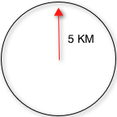
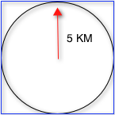

= Spatial Search
// Licensed to the Apache Software Foundation (ASF) under one
// or more contributor license agreements.  See the NOTICE file
// distributed with this work for additional information
// regarding copyright ownership.  The ASF licenses this file
// to you under the Apache License, Version 2.0 (the
// "License"); you may not use this file except in compliance
// with the License.  You may obtain a copy of the License at
//
//   http://www.apache.org/licenses/LICENSE-2.0
//
// Unless required by applicable law or agreed to in writing,
// software distributed under the License is distributed on an
// "AS IS" BASIS, WITHOUT WARRANTIES OR CONDITIONS OF ANY
// KIND, either express or implied.  See the License for the
// specific language governing permissions and limitations
// under the License.

Solr supports location data for use in spatial/geospatial searches.

Using spatial search, you can:

* Index points or other shapes
* Filter search results by a bounding box or circle or by other shapes
* Sort or boost scoring by distance between points, or relative area between rectangles
* Generate a 2D grid of facet count numbers for heatmap generation or point-plotting.

There are four main field types available for spatial search:

* `LatLonPointSpatialField`
* `LatLonType` (now deprecated) and its non-geodetic twin `PointType`
* `SpatialRecursivePrefixTreeFieldType` (RPT for short), including `RptWithGeometrySpatialField`, a derivative
* `BBoxField`

`LatLonPointSpatialField` is the ideal field type for the most common use-cases for lat-lon point data. It replaces LatLonType which still exists for backwards compatibility. RPT offers some more features for more advanced/custom use cases and options like polygons and heatmaps.

`RptWithGeometrySpatialField` is for indexing and searching non-point data though it can do points too. It can't do sorting/boosting.

`BBoxField` is for indexing bounding boxes, querying by a box, specifying a search predicate (Intersects,Within,Contains,Disjoint,Equals), and a relevancy sort/boost like overlapRatio or simply the area.

Some esoteric details that are not in this guide can be found at http://wiki.apache.org/solr/SpatialSearch.

== LatLonPointSpatialField

Here's how `LatLonPointSpatialField` (LLPSF) should usually be configured in the schema:

[source,xml]
<fieldType name="location" class="solr.LatLonPointSpatialField" docValues="true"/>

LLPSF supports toggling `indexed`, `stored`, `docValues`, and `multiValued`. LLPSF internally uses a 2-dimensional Lucene "Points" (BDK tree) index when "indexed" is enabled (the default). When "docValues" is enabled, a latitude and longitudes pair are bit-interleaved into 64 bits and put into Lucene DocValues. The accuracy of the docValues data is about a centimeter.

== Indexing Points

For indexing geodetic points (latitude and longitude), supply it in "lat,lon" order (comma separated).

For indexing non-geodetic points, it depends. Use `x y` (a space) if RPT. For PointType however, use `x,y` (a comma).

If you'd rather use a standard industry format, Solr supports https://en.wikipedia.org/wiki/Well-known_text[WKT] and http://geojson.org/[GeoJSON]. However it's much bulkier than the raw coordinates for such simple data. (Not supported by the deprecated LatLonType or PointType)

=== Indexing GeoJSON and WKT

Using the `bin/post` tool:

[source,text]
bin/post -type "application/json" -url "http://localhost:8983/solr/mycollection/update?format=geojson" /path/to/geojson.file

The key parameter to pass in with your request is:

`format`::
The format of the file to pass in.  Accepted values: `WKT` or `geojson`.

== Searching with Query Parsers

There are two spatial Solr "query parsers" for geospatial search: `geofilt` and `bbox`. They take the following parameters:

`d`::
The radial distance, usually in kilometers. RPT & BBoxField can set other units via the setting `distanceUnits`.

`pt`::
The center point using the format "lat,lon" if latitude & longitude. Otherwise, "x,y" for PointType or "x y" for RPT field types.

`sfield`::
A spatial indexed field.

`score`::
(Advanced option; not supported by LatLonType (deprecated) or PointType) If the query is used in a scoring context (e.g., as the main query in `q`), this _<<local-parameters-in-queries.adoc#local-parameters-in-queries,local parameter>>_ determines what scores will be produced. Valid values are:

* `none`: A fixed score of 1.0. (the default)
* `kilometers`: distance in kilometers between the field value and the specified center point
* `miles`: distance in miles between the field value and the specified center point
* `degrees`: distance in degrees between the field value and the specified center point
* `distance`: distance between the field value and the specified center point in the `distanceUnits` configured for this field
* `recipDistance`: 1 / the distance
+
[WARNING]
====
Don't use this for indexed non-point shapes (e.g., polygons). The results will be erroneous. And with RPT, it's only recommended for multi-valued point data, as the implementation doesn't scale very well and for single-valued fields, you should instead use a separate non-RPT field purely for distance sorting.
====
+
When used with `BBoxField`, additional options are supported:
+
* `overlapRatio`: The relative overlap between the indexed shape & query shape.
* `area`: haversine based area of the overlapping shapes expressed in terms of the `distanceUnits` configured for this field
* `area2D`: cartesian coordinates based area of the overlapping shapes expressed in terms of the `distanceUnits` configured for this field

`filter`::
(Advanced option; not supported by LatLonType (deprecated) or PointType). If you only want the query to score (with the above `score` local parameter), not filter, then set this local parameter to false.

=== geofilt

The `geofilt` filter allows you to retrieve results based on the geospatial distance (AKA the "great circle distance") from a given point. Another way of looking at it is that it creates a circular shape filter. For example, to find all documents within five kilometers of a given lat/lon point, you could enter:

[source,text]
&q=*:*&fq={!geofilt sfield=store}&pt=45.15,-93.85&d=5

This filter returns all results within a circle of the given radius around the initial point:

=== bbox

The `bbox` filter is very similar to `geofilt` except it uses the _bounding box_ of the calculated circle. See the blue box in the diagram below. It takes the same parameters as geofilt.

Here's a sample query:

[source,text]
&q=*:*&fq={!bbox sfield=store}&pt=45.15,-93.85&d=5

The rectangular shape is faster to compute and so it's sometimes used as an alternative to `geofilt` when it's acceptable to return points outside of the radius. However, if the ideal goal is a circle but you want it to run faster, then instead consider using the RPT field and try a large `distErrPct` value like `0.1` (10% radius). This will return results outside the radius but it will do so somewhat uniformly around the shape.

[IMPORTANT]
====
When a bounding box includes a pole, the bounding box ends up being a "bounding bowl" (a _spherical cap_) that includes all values north of the lowest latitude of the circle if it touches the north pole (or south of the highest latitude if it touches the south pole).
====

=== Filtering by an Arbitrary Rectangle

Sometimes the spatial search requirement calls for finding everything in a rectangular area, such as the area covered by a map the user is looking at. For this case, geofilt and bbox won't cut it. This is somewhat of a trick, but you can use Solr's range query syntax for this by supplying the lower-left corner as the start of the range and the upper-right corner as the end of the range.

Here's an example:

[source,text]
&q=*:*&fq=store:[45,-94 TO 46,-93]

LatLonType (deprecated) does *not* support rectangles that cross the dateline. For RPT and BBoxField, if you are non-geospatial coordinates (`geo="false"`) then you must quote the points due to the space, e.g., `"x y"`.

=== Optimizing: Cache or Not

It's most common to put a spatial query into an "fq" parameter – a filter query. By default, Solr will cache the query in the filter cache.

If you know the filter query (be it spatial or not) is fairly unique and not likely to get a cache hit then specify `cache="false"` as a local-param as seen in the following example. The only spatial types which stand to benefit from this technique are LatLonPointSpatialField and LatLonType (deprecated). Enable docValues on the field (if it isn't already). LatLonType (deprecated) additionally requires a `cost="100"` (or more) local-param.

[source,text]
&q=...mykeywords...&fq=...someotherfilters...&fq={!geofilt cache=false}&sfield=store&pt=45.15,-93.85&d=5

LLPSF does not support Solr's "PostFilter".

== Distance Sorting or Boosting (Function Queries)

There are four distance function queries:

* `geodist`, see below, usually the most appropriate;
*  <<function-queries.adoc#dist-function,`dist`>>, to calculate the p-norm distance between multi-dimensional vectors;
* <<function-queries.adoc#hsin-function,`hsin`>>, to calculate the distance between two points on a sphere;
* <<function-queries.adoc#sqedist-function,`sqedist`>>, to calculate the squared Euclidean distance between two points.

For more information about these function queries, see the section on <<function-queries.adoc#function-queries,Function Queries>>.

=== geodist

`geodist` is a distance function that takes three optional parameters: `(sfield,latitude,longitude)`. You can use the `geodist` function to sort results by distance or score return results.

For example, to sort your results by ascending distance, use a request like:

[source,text]
&q=*:*&fq={!geofilt}&sfield=store&pt=45.15,-93.85&d=50&sort=geodist() asc

To return the distance as the document score, use a request like:

[source,text]
&q={!func}geodist()&sfield=store&pt=45.15,-93.85&sort=score+asc&fl=*,score

== More Spatial Search Examples

Here are a few more useful examples of what you can do with spatial search in Solr.

=== Use as a Sub-Query to Expand Search Results

Here we will query for results in Jacksonville, Florida, or within 50 kilometers of 45.15,-93.85 (near Buffalo, Minnesota):

[source,text]
&q=*:*&fq=(state:"FL" AND city:"Jacksonville") OR {!geofilt}&sfield=store&pt=45.15,-93.85&d=50&sort=geodist()+asc

=== Facet by Distance

To facet by distance, you can use the `frange` query parser:

[source,text]
&q=*:*&sfield=store&pt=45.15,-93.85&facet.query={!frange l=0 u=5}geodist()&facet.query={!frange l=5.001 u=3000}geodist()

There are other ways to do it too, like using a `{!geofilt}` in each facet.query.

=== Boost Nearest Results

Using the <<the-dismax-query-parser.adoc#the-dismax-query-parser,DisMax>> or <<the-extended-dismax-query-parser.adoc#the-extended-dismax-query-parser,Extended DisMax>>, you can combine spatial search with the boost function to boost the nearest results:

[source,text]
&q.alt=*:*&fq={!geofilt}&sfield=store&pt=45.15,-93.85&d=50&bf=recip(geodist(),2,200,20)&sort=score desc

== RPT

RPT refers to either `SpatialRecursivePrefixTreeFieldType` (aka simply RPT) and an extended version:
  `RptWithGeometrySpatialField` (aka RPT with Geometry).
RPT offers several functional improvements over LatLonPointSpatialField:

* Non-geodetic – geo=false general x & y (_not_ latitude and longitude) -- if desired
* Query by polygons and other complex shapes, in addition to circles & rectangles
* Ability to index non-point shapes (e.g., polygons) as well as points – see RptWithGeometrySpatialField
* Heatmap grid faceting

RPT _shares_ various features in common with `LatLonPointSpatialField`. Some are listed here:

* Latitude/Longitude indexed point data; possibly multi-valued
* Fast filtering with `geofilt`, `bbox` filters, and range query syntax (dateline crossing is supported)
* Well-Known-Text (WKT) shape syntax (required for specifying polygons & other complex shapes), and GeoJSON too.
  In addition to indexing and searching, this works with the `wt=geojson` (GeoJSON Solr response-writer) and `[geo f=myfield]` (geo Solr document-transformer).
* Sort/boost via `geodist` -- _although not recommended_

[IMPORTANT]
====
Although RPT supports distance sorting/boosting, it is so inefficient at doing this that it might be
 removed in the future.  Fortunately, you can use LatLonPointSpatialField _as well_ as RPT.  Use LLPSF for the distance
 sorting/boosting; it only needs to have docValues for this; the index attribute can be disabled as it won't be used.
====

=== Schema Configuration for RPT

To use RPT, the field type must be registered and configured in `schema.xml`. There are many options for this field type.

`name`::
The name of the field type.

`class`::
This should be `solr.SpatialRecursivePrefixTreeFieldType`. But be aware that the Lucene spatial module includes some other so-called "spatial strategies" other than RPT, notably TermQueryPT*, BBox, PointVector*, and SerializedDV. Solr requires a field type to parallel these in order to use them. The asterisked ones have them.

`spatialContextFactory`::
This is a Java class name to an internal extension point governing support for shape definitions & parsing.
There are two built-in aliases for known implementations: `Geo3D` and `JTS`.
The default blank value does not support polygons.

`geo`::
If `true`, the default, latitude and longitude coordinates will be used and the mathematical model will generally be a sphere. If `false`, the coordinates will be generic X & Y on a 2D plane using Euclidean/Cartesian geometry.

`format`:: Defines the shape syntax/format to be used. Defaults to `WKT` but `GeoJSON` is another popular format. Spatial4j governs this feature and supports https://locationtech.github.io/spatial4j/apidocs/org/locationtech/spatial4j/io/package-frame.html[other formats]. If a given shape is parseable as "lat,lon" or "x y" then that is always supported.

`distanceUnits`::
This is used to specify the units for distance measurements used throughout the use of this field. This can be `degrees`, `kilometers` or `miles`. It is applied to nearly all distance measurements involving the field: `maxDistErr`, `distErr`, `d`, `geodist` and the `score` when score is `distance`, `area`, or `area2d`. However, it doesn't affect distances embedded in WKT strings, (e.g., `BUFFER(POINT(200 10),0.2)`), which are still in degrees.
+
`distanceUnits` defaults to either `kilometers` if `geo` is `true`, or `degrees` if `geo` is `false`.
+
`distanceUnits` replaces the `units` attribute; which is now deprecated and mutually exclusive with this attribute.

`distErrPct`::
Defines the default precision of non-point shapes (both index & query), as a fraction between `0.0` (fully precise) to `0.5`. The closer this number is to zero, the more accurate the shape will be. However, more precise indexed shapes use more disk space and take longer to index.
+
Bigger `distErrPct` values will make queries faster but less accurate. At query time this can be overridden in the query syntax, such as to `0.0` so as to not approximate the search shape. The default for the RPT field is `0.025`.
+
NOTE: For RPTWithGeometrySpatialField (see below), there's always complete accuracy with the serialized geometry and so this doesn't control accuracy so much as it controls the trade-off of how big the index should be. distErrPct defaults to 0.15 for that field.

`maxDistErr`:: Defines the highest level of detail required for indexed data. If left blank, the default is one meter – just a bit less than 0.000009 degrees. This setting is used internally to compute an appropriate maxLevels (see below).

`worldBounds`::
Defines the valid numerical ranges for x and y, in the format of `ENVELOPE(minX, maxX, maxY, minY)`. If `geo="true"`, the standard lat-lon world boundaries are assumed. If `geo=false`, you should define your boundaries.

`distCalculator`::
Defines the distance calculation algorithm. If `geo=true`, `haversine` is the default. If `geo=false`, `cartesian` will be the default. Other possible values are `lawOfCosines`, `vincentySphere` and `cartesian^2`.

`prefixTree`:: Defines the spatial grid implementation. Since a PrefixTree (such as RecursivePrefixTree) maps the world as a grid, each grid cell is decomposed to another set of grid cells at the next level.
+
If `geo=true` then the default prefix tree is `geohash`, otherwise it's `quad`. Geohash has 32 children at each level, quad has 4. Geohash can only be used for `geo=true` as it's strictly geospatial.
+
A third choice is `packedQuad`, which is generally more efficient than `quad`, provided there are many levels -- perhaps 20 or more.

`maxLevels`:: Sets the maximum grid depth for indexed data. Instead, it's usually more intuitive to compute an appropriate maxLevels by specifying `maxDistErr`.

*_And there are others:_* `normWrapLongitude`, `datelineRule`, `validationRule`, `autoIndex`, `allowMultiOverlap`, `precisionModel`. For further info, see notes below about `spatialContextFactory` implementations referenced above, especially the link to the JTS based one.

=== Standard Shapes

The RPT field types support a set of standard shapes:
points, circles (aka buffered points), envelopes (aka rectangles or bounding boxes), line strings,
polygons, and "multi" variants of these.  The envelopes and line strings are Euclidean/cartesian (flat 2D) shapes.
Underlying Solr is the Spatial4j library which implements them.  To support other shapes, you can configure the
`spatialContextFactory` attribute on the field type to reference other options.  Two are available: JTS and Geo3D.

=== JTS and Polygons (flat)

The https://github.com/locationtech/jts[JTS Topology Suite] is a popular computational geometry library with a Euclidean/cartesian (flat 2D) model.
It supports a variety of shapes including polygons, buffering shapes, and some invalid polygon repair fall-backs.
With the help of Spatial4j, included with Solr, the polygons support dateline (anti-meridian) crossing.
You must download it (a JAR file) and put that in a special location internal to Solr:  `SOLR_INSTALL/server/solr-webapp/webapp/WEB-INF/lib/`.
You can readily download it here: http://central.maven.org/maven2/org/locationtech/jts/jts-core/1.15.0/.
_It will not work if placed in other more typical Solr lib directories, unfortunately._

Set the `spatialContextFactory` attribute on the field type to `JTS`.

When activated, there are additional configuration attributes available; see
  https://locationtech.github.io/spatial4j/apidocs/org/locationtech/spatial4j/context/jts/JtsSpatialContextFactory.html[org.locationtech.spatial4j.context.jts.JtsSpatialContextFactory]
  for the Javadocs, and remember to look at the superclass's options as well.
One option in particular you should most likely enable is `autoIndex` (i.e., use JTS's PreparedGeometry) as it's been shown to be a major performance boost for non-trivial polygons.

[source,xml]
----
<fieldType name="location_rpt"   class="solr.SpatialRecursivePrefixTreeFieldType"
               spatialContextFactory="JTS"
               autoIndex="true"
               validationRule="repairBuffer0"
               distErrPct="0.025"
               maxDistErr="0.001"
               distanceUnits="kilometers" />
----

Once the field type has been defined, define a field that uses it.

Here's an example polygon query for a field "geo" that can be either solr.SpatialRecursivePrefixTreeFieldType or RptWithGeometrySpatialField:

[source,plain]
&q=*:*&fq={!field f=geo}Intersects(POLYGON((-10 30, -40 40, -10 -20, 40 20, 0 0, -10 30)))

Inside the parenthesis following the search predicate is the shape definition. The format of that shape is governed by the `format` attribute on the field type, defaulting to WKT. If you prefer GeoJSON, you can specify that instead.

Beyond this Reference Guide and Spatila4j's docs, there are some details that remain at the Solr Wiki at http://wiki.apache.org/solr/SolrAdaptersForLuceneSpatial4.

=== Geo3D and Polygons (on the ellipsoid)

Geo3D is the colloquial name of the Lucene spatial-3d module, included with Solr.
It's a computational geometry library implementing a variety of shapes (including polygons) on a sphere or WGS84 ellipsoid.
Geo3D is particularly suited for spatial applications where the geometries cover large distances across the globe or are near the poles.
Geo3D is named as-such due to its internal implementation that uses geocentric coordinates (X,Y,Z),
  *not* for 3-dimensional geometry, which it does not support.
Despite these internal details, you still supply latitude and longitude as you would normally in Solr.

Set the `spatialContextFactory` attribute on the field type to `Geo3D`.

[source,xml]
----
<fieldType name="geom"
  class="solr.SpatialRecursivePrefixTreeFieldType"
  spatialContextFactory="Geo3D"
  prefixTree="s2"
  planetModel="WGS84"/><!-- or "sphere" -->
----

Once the field type has been defined, define a field that uses it.

The `prefixTree="s2"` setting is optional and only possible with Geo3D.
It was developed with Geo3D in mind to be more efficient than the other grids.

IMPORTANT: When using Geo3D, the order of polygon points matters!
You must follow the so-called "right hand rule": the exterior ring must be counter-clockwise order and the interior holes must be clockwise.
If the order is wrong then the interpretation is inverted, thus the polygon will be interpreted as encompassing most of the globe.

=== RptWithGeometrySpatialField

The `RptWithGeometrySpatialField` field type is a derivative of `SpatialRecursivePrefixTreeFieldType` that also stores the original geometry internally in Lucene DocValues, which it uses to achieve accurate search. It can also be used for indexed point fields. The Intersects predicate (the default) is particularly fast, since many search results can be returned as an accurate hit without requiring a geometry check. This field type is configured just like RPT except that the default `distErrPct` is 0.15 (higher than 0.025) because the grid squares are purely for performance and not to fundamentally represent the shape.

An optional in-memory cache can be defined in `solrconfig.xml`, which should be done when the data tends to have shapes with many vertices. Assuming you name your field "geom", you can configure an optional cache in `solrconfig.xml` by adding the following – notice the suffix of the cache name:

[source,xml]
----
<cache name="perSegSpatialFieldCache_geom"
           class="solr.CaffeineCache"
           size="256"
           initialSize="0"
           autowarmCount="100%"
           regenerator="solr.NoOpRegenerator"/>
----

When using this field type, you will likely _not_ want to mark the field as stored because it's redundant with the DocValues data and surely larger because of the formatting (be it WKT or GeoJSON). To retrieve the spatial data in search results from DocValues, use the `[geo]` transformer -- <<transforming-result-documents.adoc#transforming-result-documents,Transforming Result Documents>>.

=== Heatmap Faceting

The RPT field supports generating a 2D grid of facet counts for documents having spatial data in each grid cell. For high-detail grids, this can be used to plot points, and for lesser detail it can be used for heatmap generation. The grid cells are determined at index-time based on RPT's configuration. At facet counting time, the indexed cells in the region of interest are traversed and a grid of counters corresponding to each cell are incremented. Solr can return the data in a straight-forward 2D array of integers or in a PNG which compresses better for larger data sets but must be decoded.

The heatmap feature is accessible both from Solr's standard faceting feature, plus the newer more flexible <<json-facet-api.adoc#heatmap-facet,JSON Facet API>>.
We'll proceed now with standard faceting.
As a part of faceting, it supports the `key` local parameter as well as excluding tagged filter queries, just like other types of faceting do.
This allows multiple heatmaps to be returned on the same field with different filters.

`facet`::
Set to `true` to enable standard faceting.

`facet.heatmap`::
The field name of type RPT.

`facet.heatmap.geom`::
The region to compute the heatmap on, specified using the rectangle-range syntax or WKT. It defaults to the world. ex: `["-180 -90" TO "180 90"]`.

`facet.heatmap.gridLevel`::
A specific grid level, which determines how big each grid cell is. Defaults to being computed via `distErrPct` (or `distErr`).

`facet.heatmap.distErrPct`::
A fraction of the size of geom used to compute gridLevel. Defaults to 0.15. It's computed the same as a similarly named parameter for RPT.

`facet.heatmap.distErr`::
A cell error distance used to pick the grid level indirectly. It's computed the same as a similarly named parameter for RPT.

`facet.heatmap.format`::
The format, either `ints2D` (default) or `png`.

[TIP]
====
You'll experiment with different `distErrPct` values (probably 0.10 - 0.20) with various input geometries till the default size is what you're looking for. The specific details of how it's computed isn't important. For high-detail grids used in point-plotting (loosely one cell per pixel), set `distErr` to be the number of decimal-degrees of several pixels or so of the map being displayed. Also, you probably don't want to use a geohash-based grid because the cell orientation between grid levels flip-flops between being square and rectangle. Quad is consistent and has more levels, albeit at the expense of a larger index.
====

Here's some sample output in JSON (with "..." inserted for brevity):

[source,plain]
----
{gridLevel=6,columns=64,rows=64,minX=-180.0,maxX=180.0,minY=-90.0,maxY=90.0,
counts_ints2D=[[0, 0, 2, 1, ....],[1, 1, 3, 2, ...],...]}
----

The output shows the gridLevel which is interesting since it's often computed from other parameters. If an interface being developed allows an explicit resolution increase/decrease feature then subsequent requests can specify the gridLevel explicitly.

The `minX`, `maxX`, `minY`, `maxY` reports the region where the counts are. This is the minimally enclosing bounding rectangle of the input `geom` at the target grid level. This may wrap the dateline. The `columns` and `rows` values are how many columns and rows that the output rectangle is to be divided by evenly. Note: Don't divide an on-screen projected map rectangle evenly to plot these rectangles/points since the cell data is in the coordinate space of decimal degrees if geo=true or whatever units were given if geo=false. This could be arranged to be the same as an on-screen map but won't necessarily be.

The `counts_ints2D` key has a 2D array of integers. The initial outer level is in row order (top-down), then the inner arrays are the columns (left-right). If any array would be all zeros, a null is returned instead for efficiency reasons. The entire value is null if there is no matching spatial data.

If `format=png` then the output key is `counts_png`. It's a base-64 encoded string of a 4-byte PNG. The PNG logically holds exactly the same data that the ints2D format does. Note that the alpha channel byte is flipped to make it easier to view the PNG for diagnostic purposes, since otherwise counts would have to exceed 2^24 before it becomes non-opague. Thus counts greater than this value will become opaque.

== BBoxField

The `BBoxField` field type indexes a single rectangle (bounding box) per document field and supports searching via a bounding box. It supports most spatial search predicates, it has enhanced relevancy modes based on the overlap or area between the search rectangle and the indexed rectangle. It's particularly useful for its relevancy modes. To configure it in the schema, use a configuration like this:

[source,xml]
----
<field name="bbox" type="bbox" />

<fieldType name="bbox" class="solr.BBoxField"
           geo="true" distanceUnits="kilometers" numberType="pdouble" />
<fieldType name="pdouble" class="solr.DoublePointField" docValues="true"/>
----

BBoxField is actually based off of 4 instances of another field type referred to by numberType. It also uses a boolean to flag a dateline cross. Assuming you want to use the relevancy feature, docValues is required. Some of the attributes are in common with the RPT field like geo, units, worldBounds, and spatialContextFactory because they share some of the same spatial infrastructure.

To index a box, add a field value to a bbox field that's a string in the WKT/CQL ENVELOPE syntax. Example: `ENVELOPE(-10, 20, 15, 10)` which is minX, maxX, maxY, minY order. The parameter ordering is unintuitive but that's what the spec calls for. Alternatively, you could provide a rectangular polygon in WKT (or GeoJSON if you set set `format="GeoJSON"`).

To search, you can use the `{!bbox}` query parser, or the range syntax e.g., `[10,-10 TO 15,20]`, or the ENVELOPE syntax wrapped in parenthesis with a leading search predicate. The latter is the only way to choose a predicate other than Intersects. For example:

[source,plain]
&q={!field f=bbox}Contains(ENVELOPE(-10, 20, 15, 10))

Now to sort the results by one of the relevancy modes, use it like this:

[source,plain]
&q={!field f=bbox score=overlapRatio}Intersects(ENVELOPE(-10, 20, 15, 10))

The `score` local parameter can be one of `overlapRatio`, `area`, and `area2D`. `area` scores by the document area using surface-of-a-sphere (assuming `geo=true`) math, while `area2D` uses simple width * height. `overlapRatio` computes a [0-1] ranged score based on how much overlap exists relative to the document's area and the query area. The javadocs of {lucene-javadocs}/spatial-extras/org/apache/lucene/spatial/bbox/BBoxOverlapRatioValueSource.html[BBoxOverlapRatioValueSource] have more info on the formula. There is an additional parameter `queryTargetProportion` that allows you to weight the query side of the formula to the index (target) side of the formula. You can also use `&debug=results` to see useful score computation info.
