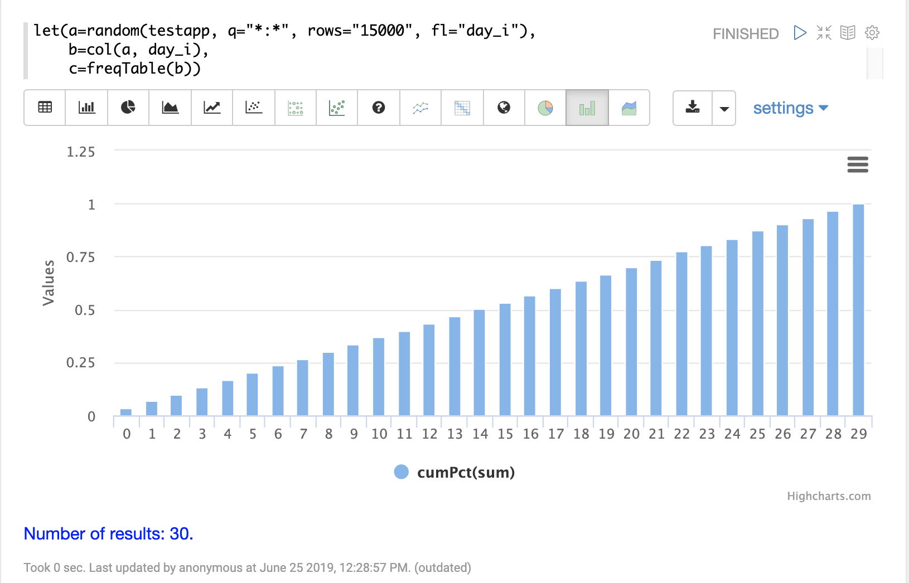
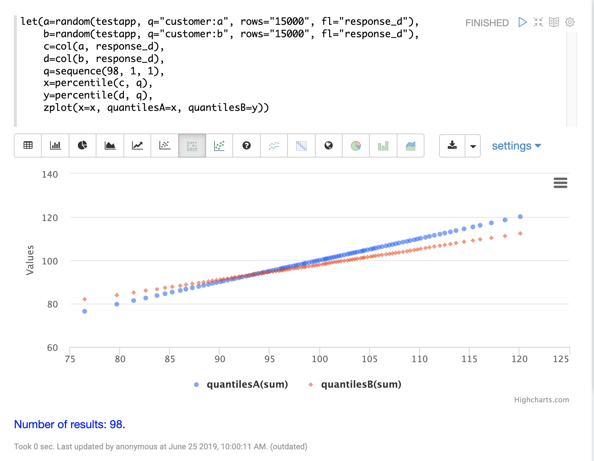

= Statistics
// Licensed to the Apache Software Foundation (ASF) under one
// or more contributor license agreements.  See the NOTICE file
// distributed with this work for additional information
// regarding copyright ownership.  The ASF licenses this file
// to you under the Apache License, Version 2.0 (the
// "License"); you may not use this file except in compliance
// with the License.  You may obtain a copy of the License at
//
//   http://www.apache.org/licenses/LICENSE-2.0
//
// Unless required by applicable law or agreed to in writing,
// software distributed under the License is distributed on an
// "AS IS" BASIS, WITHOUT WARRANTIES OR CONDITIONS OF ANY
// KIND, either express or implied.  See the License for the
// specific language governing permissions and limitations
// under the License.

This section of the user guide covers the core statistical functions
available in math expressions.

== Descriptive Statistics

The `describe` function can be used to return descriptive statistics about a
numeric array. The `describe` function returns a single *tuple* with name/value
pairs containing descriptive statistics.

Below is a simple example that selects a random sample of documents,
vectorizes the *price_f* field in the result set and uses the `describe` function to
return descriptive statistics about the vector:

[source,text]
----
let(a=random(collection1, q="*:*", rows="1500", fl="price_f"),
    b=col(a, price_f),
    c=describe(b))
----

When this expression is sent to the `/stream` handler it responds with:

[source,json]
----
{
  "result-set": {
    "docs": [
      {
        "c": {
          "sumsq": 4999.041975263254,
          "max": 0.99995726,
          "var": 0.08344429493940454,
          "geometricMean": 0.36696588922559575,
          "sum": 7497.460565552007,
          "kurtosis": -1.2000739963006035,
          "N": 15000,
          "min": 0.00012338161,
          "mean": 0.49983070437013266,
          "popVar": 0.08343873198640858,
          "skewness": -0.001735537500095477,
          "stdev": 0.28886726179926403
        }
      },
      {
        "EOF": true,
        "RESPONSE_TIME": 305
      }
    ]
  }
}
----

This describe function can be visualized in a table with Zeppelin-Solr:

image::images/math-expressions/describe.png[]

== Histograms and Frequency Tables

Histograms and frequency tables are are tools for understanding the distribution
of a random variable.

The `hist` function creates a histogram designed for usage with continuous data. The
`freqTable` function creates a frequency table for use with discrete data.

=== histograms

Below is an example that selects a random sample, creates a vector from the
result set and uses the `hist` function to return a histogram with 15 bins.
The `hist` function returns a list of tuples with summary statistics for each bin.

[source,text]
----
let(a=random(testapp, q="*:*", rows="15000", fl="response_d"),
    b=col(a, response_d),
    c=hist(b, 15))
----

When this expression is sent to the `/stream` handler it responds with:

[source,json]
----
{
  "result-set": {
    "docs": [
      {
        "prob": 0.00021598266688541547,
        "min": 675.8131195271407,
        "max": 690.4491626920295,
        "mean": 683.1150404530058,
        "var": 62.68733114037831,
        "cumProb": 0.00010781401860771812,
        "sum": 2732.460161812023,
        "stdev": 7.917533147412666,
        "N": 4
      },
      {
        "prob": 0.0008119830346328834,
        "min": 703.2132289932538,
        "max": 721.1545076964856,
        "mean": 712.8045685730215,
        "var": 41.16456697234485,
        "cumProb": 0.0007397051651814922,
        "sum": 9266.459391449276,
        "stdev": 6.415961889876283,
        "N": 13
      },
      {
        "prob": 0.005621625404424438,
        "min": 722.3966535859041,
        "max": 743.8768517321993,
        "mean": 735.0570449093976,
        "var": 34.32748804550742,
        "cumProb": 0.004137705733961876,
        "sum": 62479.84881729879,
        "stdev": 5.8589664656411395,
        "N": 85
      },
      ...
----

With Zeppelin-Solr the histogram can be first visualized in a table:

image::images/math-expressions/histtable.png[]

Then the histogram can be visualized with a bar chart by plotting the *mean* of
the bins on the *x-axis* and the *prob* (probability) on the *y-axis*:

image::images/math-expressions/hist.png[]

The cumulative probability can be plotted by switching the *y-axis* to the *cumProb* column:

image::images/math-expressions/cumProb.png[]

=== Frequency Tables

The `freqTable` function returns a frequency distribution for a discrete data set.
The `freqTable` function doesn't create bins like the histogram. Instead it counts
the occurrence of each discrete data value and returns a list of tuples with the
frequency statistics for each value.

Below is a simple example of a frequency table built from a random sample of
a discrete variable.

[source,text]
----
let(a=random(testapp, q="*:*", rows="15000", fl="day_i"),
     b=col(a, day_i),
     c=freqTable(b))
----

When this expression is sent to the `/stream` handler it responds with:

[source,json]
----
 {
   "result-set": {
     "docs": [
       {
         "pct": 0.0362,
         "count": 543,
         "cumFreq": 543,
         "cumPct": 0.0362,
         "value": 0
       },
       {
         "pct": 0.03186666666666667,
         "count": 478,
         "cumFreq": 1021,
         "cumPct": 0.06806666666666666,
         "value": 1
       },
       {
         "pct": 0.0338,
         "count": 507,
         "cumFreq": 1528,
         "cumPct": 0.10186666666666666,
         "value": 2
       },
       {
         "pct": 0.03546666666666667,
         "count": 532,
         "cumFreq": 2060,
         "cumPct": 0.13733333333333334,
         "value": 3
       },
       ...
----

With Zeppelin-Solr the frequency table can be first visualized in a table:

image::images/math-expressions/freqTable.png[]

The frequency table can then be plotted by switching to a bar chart and selecting
the *value* column for the *x-axis*. Any of the other columns can be visualized
on the *y-axis*. The example below visualizes the *cumPct* column which is the
cumulative percent at each value.

== Percentiles

The `percentile` function returns the estimated value for a specific percentile in
a sample set. The example below returns the estimation for the 95th percentile
of the *price_f* field.

[source,text]
----
let(a=random(collection1, q="*:*", rows="15000", fl="price_f"),
     b=col(a, price_f),
     c=percentile(b, 95))
----

When this expression is sent to the `/stream` handler it responds with:

[source,json]
----
 {
   "result-set": {
     "docs": [
       {
         "c": 312.94
       },
       {
         "EOF": true,
         "RESPONSE_TIME": 286
       }
     ]
   }
 }
----

The `percentile` function also operates on an array of percentile values.
The example below is computing the 20th, 40th, 60th and 80th percentiles for a random sample
of the *response_d* field:

[source,text]
----
let(a=random(collection2, q="*:*", rows="15000", fl="response_d"),
    b=col(a, response_d),
    c=percentile(b, array(20,40,60,80)))
----

When this expression is sent to the `/stream` handler it responds with:

[source,json]
----
{
  "result-set": {
    "docs": [
      {
        "c": [
          818.0835543394625,
          843.5590348165282,
          866.1789509894824,
          892.5033386599067
        ]
      },
      {
        "EOF": true,
        "RESPONSE_TIME": 291
      }
    ]
  }
}
----

=== Quantile Plots

A quantile plot or QQ Plot plots the percentiles from two distributions on the
the same scatter plot. 

== Covariance and Correlation

Covariance and Correlation measure how random variables move
together.

=== Covariance and Covariance Matrices

The `cov` function calculates the covariance of two sample sets of data.

In the example below covariance is calculated for two numeric
arrays.

The example below uses arrays created by the `array` function. Its important to note that
vectorized data from Solr Cloud collections can be used with any function that
operates on arrays.

[source,text]
----
let(a=array(1, 2, 3, 4, 5),
    b=array(100, 200, 300, 400, 500),
    c=cov(a, b))
----

When this expression is sent to the `/stream` handler it responds with:

[source,json]
----
 {
   "result-set": {
     "docs": [
       {
         "c": 0.9484775349999998
       },
       {
         "EOF": true,
         "RESPONSE_TIME": 286
       }
     ]
   }
 }
----

If a matrix is passed to the `cov` function it will automatically compute a covariance
matrix for the columns of the matrix.

Notice in the example three numeric arrays are added as rows
in a matrix. The matrix is then transposed to turn the rows into
columns, and the covariance matrix is computed for the columns of the
matrix.

[source,text]
----
let(a=array(1, 2, 3, 4, 5),
     b=array(100, 200, 300, 400, 500),
     c=array(30, 40, 80, 90, 110),
     d=transpose(matrix(a, b, c)),
     e=cov(d))
----

When this expression is sent to the `/stream` handler it responds with:

[source,json]
----
 {
   "result-set": {
     "docs": [
       {
         "e": [
           [
             2.5,
             250,
             52.5
           ],
           [
             250,
             25000,
             5250
           ],
           [
             52.5,
             5250,
             1150
           ]
         ]
       },
       {
         "EOF": true,
         "RESPONSE_TIME": 2
       }
     ]
   }
 }
----

=== Correlation and Correlation Matrices

Correlation is measure of covariance that has been scaled between
-1 and 1.

Three correlation types are supported:

* *pearsons* (default)
* *kendalls*
* *spearmans*

The type of correlation is specified by adding the *type* named parameter in the
function call. The example below demonstrates the use of the *type*
named parameter.

[source,text]
----
let(a=array(1, 2, 3, 4, 5),
    b=array(100, 200, 300, 400, 5000),
    c=corr(a, b, type=spearmans))
----

When this expression is sent to the `/stream` handler it responds with:

[source,json]
----
 {
   "result-set": {
     "docs": [
       {
         "c": 0.7432941462471664
       },
       {
         "EOF": true,
         "RESPONSE_TIME": 0
       }
     ]
   }
 }
----

Like the `cov` function, the `corr` function automatically builds a correlation matrix
if a matrix is passed as a parameter. The correlation matrix is built by correlating the columns
of the matrix passed in.

== Statistical Inference Tests

Statistical inference tests test a hypothesis on *random samples* and return p-values which
can be used to infer the reliability of the test for the entire population.

The following statistical inference tests are available:

* `anova`: One-Way-Anova tests if there is a statistically significant difference in the
means of two or more random samples.

* `ttest`: The T-test tests if there is a statistically significant difference in the means of two
random samples.

* `pairedTtest`: The paired t-test tests if there is a statistically significant difference
in the means of two random samples with paired data.

* `gTestDataSet`: The G-test tests if two samples of binned discrete data were drawn
from the same population.

* `chiSquareDataset`: The Chi-Squared test tests if two samples of binned discrete data were
drawn from the same population.

* `mannWhitney`: The Mann-Whitney test is a non-parametric test that tests if two
samples of continuous were pulled
from the same population. The Mann-Whitney test is often used instead of the T-test when the
underlying assumptions of the T-test are not
met.

* `ks`: The Kolmogorov-Smirnov test tests if two samples of continuous data were drawn from
the same distribution.

Below is a simple example of a T-test performed on two random samples.
The returned p-value of .93 means we can accept the null hypothesis
that the two samples do not have statistically significantly differences in the means.

[source,text]
----
let(a=random(collection1, q="*:*", rows="1500", fl="price_f"),
    b=random(collection1, q="*:*", rows="1500", fl="price_f"),
    c=col(a, price_f),
    d=col(b, price_f),
    e=ttest(c, d))
----

When this expression is sent to the `/stream` handler it responds with:

[source,json]
----
{
  "result-set": {
    "docs": [
      {
        "e": {
          "p-value": 0.9350135639249795,
          "t-statistic": 0.081545541074817
        }
      },
      {
        "EOF": true,
        "RESPONSE_TIME": 48
      }
    ]
  }
}
----

== Transformations

In statistical analysis its often useful to transform data sets before performing
statistical calculations. The statistical function library includes the following
commonly used transformations:

* `rank`: Returns a numeric array with the rank-transformed value of each element of the original
array.

* `log`: Returns a numeric array with the natural log of each element of the original array.

* `log10`: Returns a numeric array with the base 10 log of each element of the original array.

* `sqrt`: Returns a numeric array with the square root of each element of the original array.

* `cbrt`: Returns a numeric array with the cube root of each element of the original array.

* `recip`: Returns a numeric array with the reciprocal of each element of the original array.

Below is an example of a ttest performed on log transformed data sets:

[source,text]
----
let(a=random(collection1, q="*:*", rows="1500", fl="price_f"),
    b=random(collection1, q="*:*", rows="1500", fl="price_f"),
    c=log(col(a, price_f)),
    d=log(col(b, price_f)),
    e=ttest(c, d))
----

When this expression is sent to the `/stream` handler it responds with:

[source,json]
----
{
  "result-set": {
    "docs": [
      {
        "e": {
          "p-value": 0.9655110070265056,
          "t-statistic": -0.04324265449471238
        }
      },
      {
        "EOF": true,
        "RESPONSE_TIME": 58
      }
    ]
  }
}
----

== Back Transformations

Vectors that have been transformed with the `log`, `log10`, `sqrt` and `cbrt` functions
can be back transformed using the `pow` function.

The example below shows how to back transform data that has been transformed by the
`sqrt` function.

[source,text]
----
let(echo="b,c",
    a=array(100, 200, 300),
    b=sqrt(a),
    c=pow(b, 2))
----

When this expression is sent to the `/stream` handler it responds with:

[source,json]
----
{
  "result-set": {
    "docs": [
      {
        "b": [
          10,
          14.142135623730951,
          17.320508075688775
        ],
        "c": [
          100,
          200.00000000000003,
          300.00000000000006
        ]
      },
      {
        "EOF": true,
        "RESPONSE_TIME": 0
      }
    ]
  }
}
----

The example below shows how to back transform data that has been transformed by the
`log10` function.

[source,text]
----
let(echo="b,c",
    a=array(100, 200, 300),
    b=log10(a),
    c=pow(10, b))
----

When this expression is sent to the `/stream` handler it responds with:

[source,json]
----
{
  "result-set": {
    "docs": [
      {
        "b": [
          2,
          2.3010299956639813,
          2.4771212547196626
        ],
        "c": [
          100,
          200.00000000000003,
          300.0000000000001
        ]
      },
      {
        "EOF": true,
        "RESPONSE_TIME": 0
      }
    ]
  }
}
----

Vectors that have been transformed with the `recip` function can be back-transformed by taking the reciprocal
of the reciprocal.

The example below shows an example of the back-transformation of the `recip` function.

[source,text]
----
let(echo="b,c",
    a=array(100, 200, 300),
    b=recip(a),
    c=recip(b))
----

When this expression is sent to the `/stream` handler it responds with:

[source,json]
----
{
  "result-set": {
    "docs": [
      {
        "b": [
          0.01,
          0.005,
          0.0033333333333333335
        ],
        "c": [
          100,
          200,
          300
        ]
      },
      {
        "EOF": true,
        "RESPONSE_TIME": 0
      }
    ]
  }
}
----

== Z-scores

The `zscores` function converts a numeric array to an array of z-scores. The z-score
is the number of standard deviations a number is from the mean.

The example below computes the z-scores for the values in an array.

[source,text]
----
let(a=array(1,2,3),
    b=zscores(a))
----

When this expression is sent to the `/stream` handler it responds with:

[source,json]
----
{
  "result-set": {
    "docs": [
      {
        "b": [
          -1,
          0,
          1
        ]
      },
      {
        "EOF": true,
        "RESPONSE_TIME": 27
      }
    ]
  }
}
----