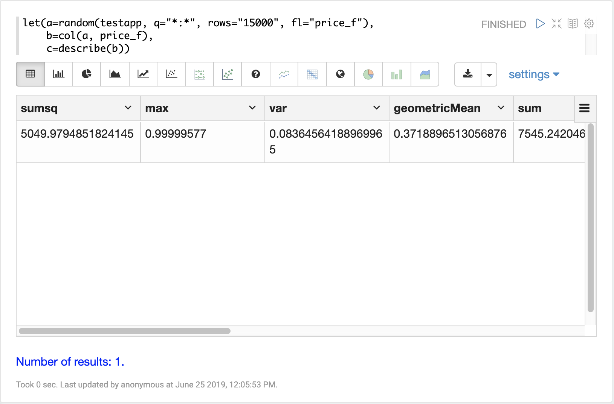
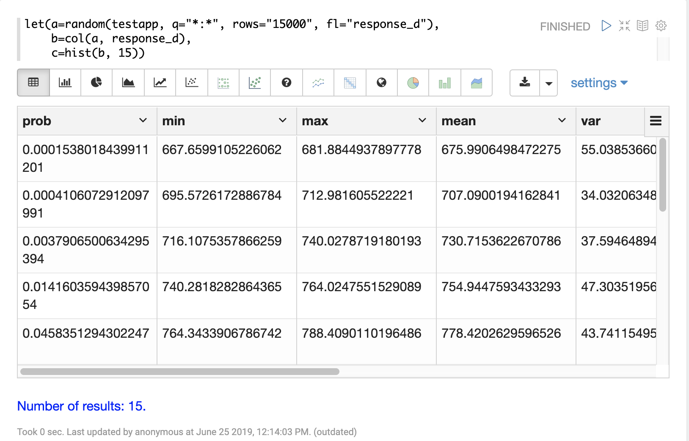
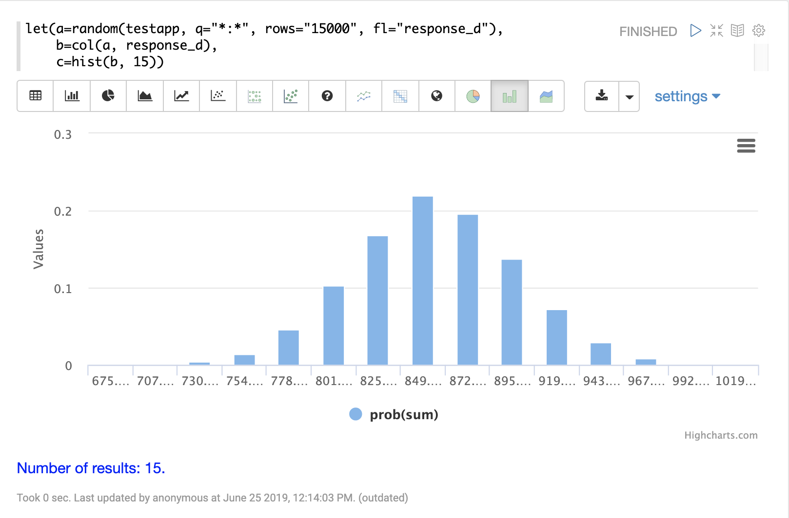
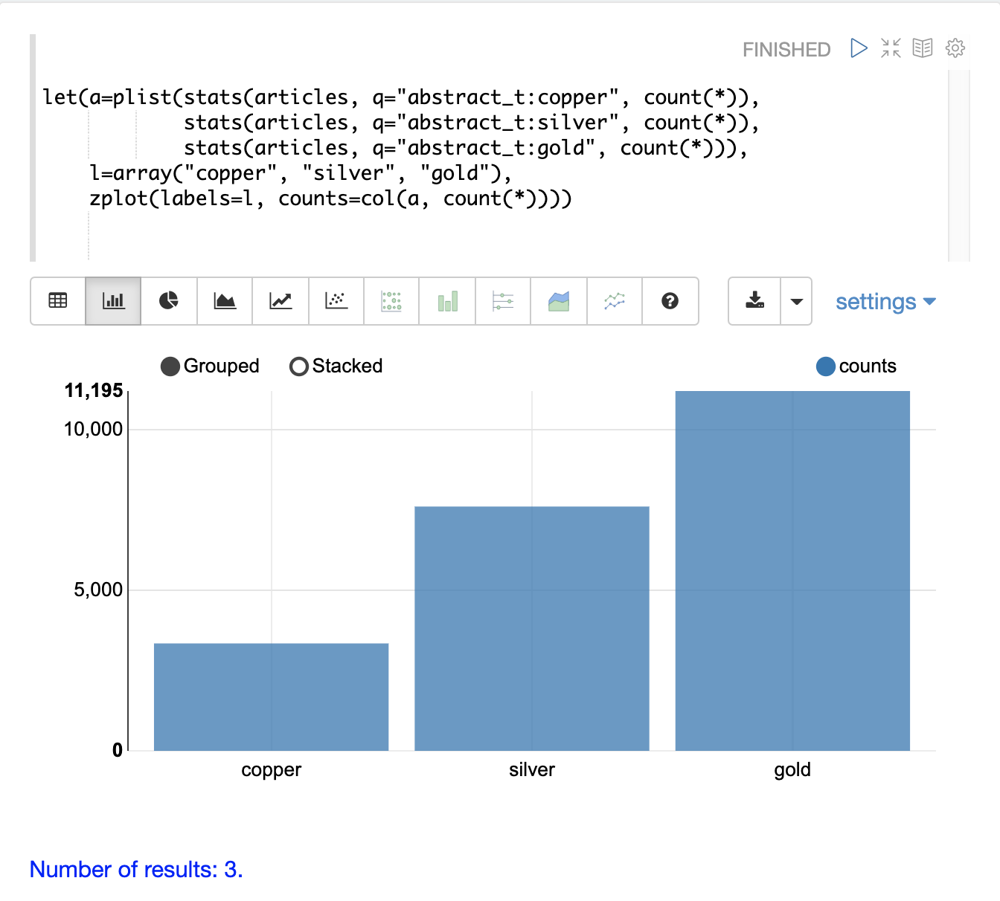
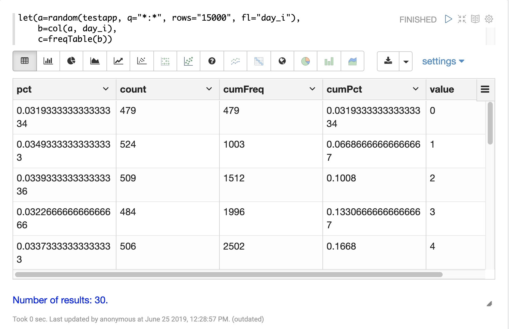
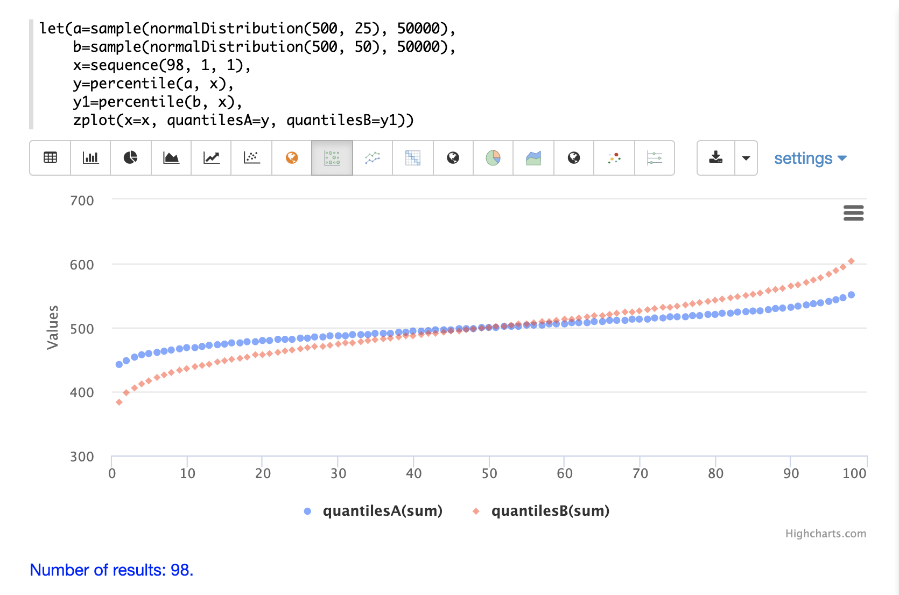
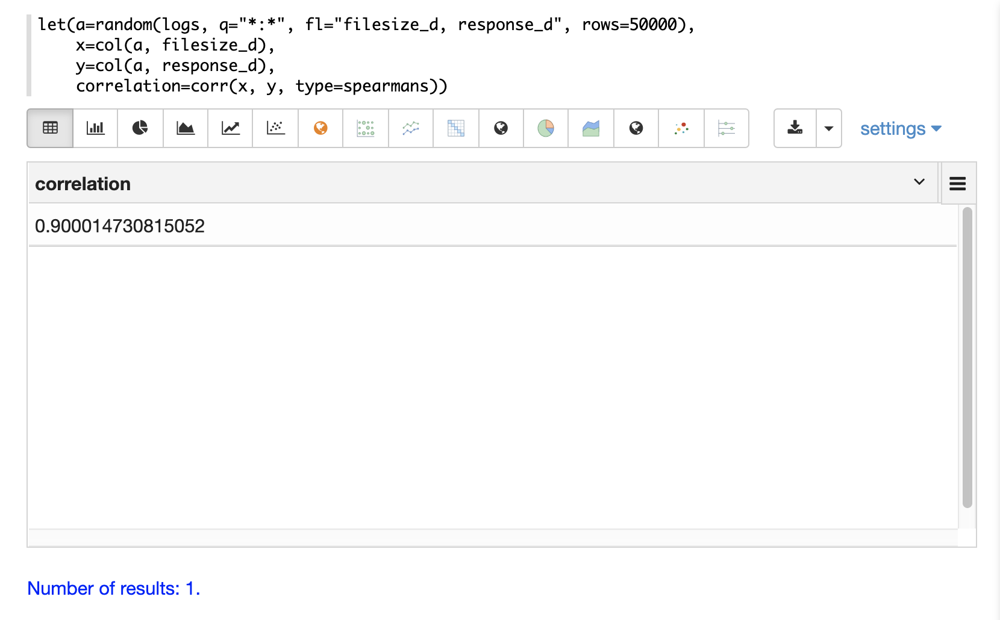
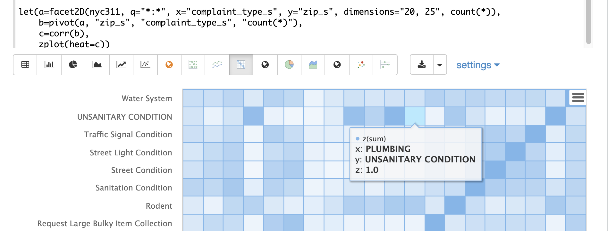
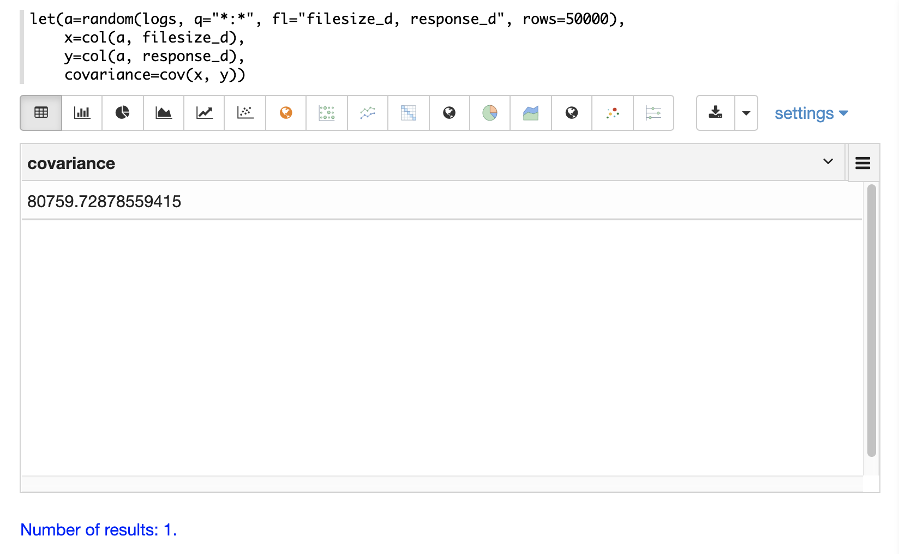

= Statistics
// Licensed to the Apache Software Foundation (ASF) under one
// or more contributor license agreements.  See the NOTICE file
// distributed with this work for additional information
// regarding copyright ownership.  The ASF licenses this file
// to you under the Apache License, Version 2.0 (the
// "License"); you may not use this file except in compliance
// with the License.  You may obtain a copy of the License at
//
//   http://www.apache.org/licenses/LICENSE-2.0
//
// Unless required by applicable law or agreed to in writing,
// software distributed under the License is distributed on an
// "AS IS" BASIS, WITHOUT WARRANTIES OR CONDITIONS OF ANY
// KIND, either express or implied.  See the License for the
// specific language governing permissions and limitations
// under the License.

This section of the user guide covers the core statistical functions
available in math expressions.

== Descriptive Statistics

The `describe` function returns descriptive statistics for a
numeric array. The `describe` function returns a single *tuple* with name/value
pairs containing the descriptive statistics.

Below is a simple example that selects a random sample of documents from the *logs* collection,
vectorizes the `response_d` field in the result set and uses the `describe` function to
return descriptive statistics about the vector.

[source,text]
----
let(a=random(logs, q="*:*", fl="response_d", rows="50000"),
    b=col(a, response_d),
    c=describe(b))
----

When this expression is sent to the `/stream` handler it responds with:

[source,json]
----
{
  "result-set": {
    "docs": [
      {
        "sumsq": 36674200601.78738,
        "max": 1068.854686837548,
        "var": 1957.9752647562789,
        "geometricMean": 854.1445499569674,
        "sum": 42764648.83319176,
        "kurtosis": 0.013189848821424377,
        "N": 50000,
        "min": 656.023249311864,
        "mean": 855.2929766638425,
        "popVar": 1957.936105250984,
        "skewness": 0.0014560741802307174,
        "stdev": 44.24901428005237
      },
      {
        "EOF": true,
        "RESPONSE_TIME": 430
      }
    ]
  }
}
----

Notice that the random sample contains 50,000 records and the response
time is only 430 milliseconds. Samples of this size can be used to
reliably estimate the statistics for very large underlying
data sets with sub-second performance.

The `describe` function can also be visualized in a table with Zeppelin-Solr:

== Histograms and Frequency Tables

Histograms and frequency tables are tools for visualizing the distribution
of a random variable.

The `hist` function creates a histogram designed for usage with continuous data. The
`freqTable` function creates a frequency table for use with discrete data.

=== histograms

In the example below a histogram is used to visualize a random sample of
response times from the logs collection. The example retrieves the
random sample with the `random` function and creates a vector from the `response_d` field
in the result set. Then the `hist` function is applied to the vector
to return a histogram with 22 bins. The `hist` function returns a
list of tuples with summary statistics for each bin.

[source,text]
----
let(a=random(logs, q="*:*", fl="response_d", rows="50000"),
    b=col(a, response_d),
    c=hist(b,  22))
----

When this expression is sent to the `/stream` handler it responds with:

[source,text]
----
{
  "result-set": {
    "docs": [
      {
        "prob": 0.00004896007228311655,
        "min": 675.573084576817,
        "max": 688.3309631697003,
        "mean": 683.805542728906,
        "var": 50.9974629924082,
        "cumProb": 0.000030022417162809913,
        "sum": 2051.416628186718,
        "stdev": 7.141250800273591,
        "N": 3
      },
      {
        "prob": 0.00029607514624062624,
        "min": 696.2875238591652,
        "max": 707.9706315779541,
        "mean": 702.1110569558929,
        "var": 14.136444379466969,
        "cumProb": 0.00022705264963879807,
        "sum": 11233.776911294284,
        "stdev": 3.759846323916307,
        "N": 16
      },
      {
        "prob": 0.0011491235433157194,
        "min": 709.1574910598678,
        "max": 724.9027194369135,
        "mean": 717.8554290699951,
        "var": 20.6935845290122,
        "cumProb": 0.0009858515418689757,
        "sum": 41635.61488605971,
        "stdev": 4.549020172412098,
        "N": 58
      },
      ...
      ]}}
----

With Zeppelin-Solr the histogram can be first visualized as a table:

Then the histogram can be visualized with an area chart by plotting the *mean* of
the bins on the *x-axis* and the *prob* (probability) on the *y-axis*:

The cumulative probability can be plotted by switching the *y-axis* to the *cumProb* column:

image::images/math-expressions/cumProb.png[]

=== Custom Histograms

Custom histograms can be defined and visualized by combining the output from multiple
`stats` functions into a single histogram. Instead of automatically binning a numeric
field the custom histogram allows for comparison of bins based on queries.

NOTE: The `stats` function is first discussed in the *Searching, Sampling and Aggregation* section of the
user guide.

A simple example will illustrate how to define and visualize a custom histogram.

In this example, three `stats` functions are wrapped in a `plist` function. The
`plist` (parallel list) function  executes each of its internal functions in parallel
and concatenates the results into a single stream. `plist` also maintains the order
of the outputs from each of the sub-functions. In this example each `stats` function
computes the count of documents that match a specific query. In this case they count the
number of documents that contain the terms copper, gold and silver. The list of tuples
with the counts is then stored in variable *a*.

Then an `array` of labels is created and set to variable *l*.

Finally the `zplot` function is used to plot the labels vector and the `count(*)` column.
Notice the `col` function is used inside of the `zplot` function to extract the
counts from the `stats` results.

=== Frequency Tables

The `freqTable` function returns a frequency distribution for a discrete data set.
The `freqTable` function doesn't create bins like the histogram. Instead it counts
the occurrence of each discrete data value and returns a list of tuples with the
frequency statistics for each value.

Below is an example of a frequency table built from a result set
of rounded *differences* in daily opening stock prices for the stock ticker *amzn*.

This example is interesting because it shows a multi-step process to arrive
at the result. The first step is to *search* for records in the *stocks*
collection with a ticker of *amzn*. Notice that the result set is sorted by
date ascending and it returns the `open_d` field which is the opening price for
the day.

The `open_d` field is then vectorized and set to variable *b*, which now contains
a vector of opening prices ordered by date ascending.

The `diff` function is then used to calculate the *first difference* for the
vector of opening prices. The first difference simply subtracts the previous value
from each value in the array. This will provide an array of price differences
for each day which will show daily change in opening price.

Then the `round` function is used to round the price differences to the nearest
integer to create a vector of discrete values. The `round` function in this
example is effectively *binning* continuous data at integer boundaries.

Finally the `freqTable` function is run on the discrete values to calculate
the frequency table.

[source,text]
----
let(a=search(stocks,
             q="ticker_s:amzn",
             fl="open_d, date_dt",
             sort="date_dt asc",
             rows=25000),
    b=col(a, open_d),
    c=diff(b),
    d=round(c),
    e=freqTable(d))
----

When this expression is sent to the `/stream` handler it responds with:

[source,text]
----
 {
   "result-set": {
     "docs": [
       {
         "pct": 0.00019409937888198756,
         "count": 1,
         "cumFreq": 1,
         "cumPct": 0.00019409937888198756,
         "value": -57
       },
       {
         "pct": 0.00019409937888198756,
         "count": 1,
         "cumFreq": 2,
         "cumPct": 0.00038819875776397513,
         "value": -51
       },
       {
         "pct": 0.00019409937888198756,
         "count": 1,
         "cumFreq": 3,
         "cumPct": 0.0005822981366459627,
         "value": -49
       },
       ...
       ]}}
----

With Zeppelin-Solr the frequency table can be first visualized as a table:

The frequency table can then be plotted by switching to a scatter chart and selecting
the *value* column for the *x-axis* and the *count* column for the *y-axis*

image::images/math-expressions/freqTable1.png[]

Notice that the visualization nicely displays the frequency of daily change in stock prices
rounded to integers. The most frequently occurring value is 0 with 1494 occurrences followed by
 -1 and 1 with around 700 occurrences.

== Percentiles

The `percentile` function returns the estimated value for a specific percentile in
a sample set. The example below returns a random sample containing the `response_d` field
from the logs collection. The `response_d` field is vectorized and the 20th percentile
is calculated for the vector:

[source,text]
----
let(a=random(logs, q="*:*", rows="15000", fl="response_d"),
    b=col(a, response_d),
    c=percentile(b, 20))
----

When this expression is sent to the `/stream` handler it responds with:

[source,json]
----
 {
   "result-set": {
     "docs": [
       {
         "c": 818.073554
       },
       {
         "EOF": true,
         "RESPONSE_TIME": 286
       }
     ]
   }
 }
----

The `percentile` function can also compute an array of percentile values.
The example below is computing the 20th, 40th, 60th and 80th percentiles for a random sample
of the `response_d` field:

[source,text]
----
let(a=random(logs, q="*:*", rows="15000", fl="response_d"),
    b=col(a, response_d),
    c=percentile(b, array(20,40,60,80)))
----

When this expression is sent to the `/stream` handler it responds with:

[source,json]
----
{
  "result-set": {
    "docs": [
      {
        "c": [
          818.0835543394625,
          843.5590348165282,
          866.1789509894824,
          892.5033386599067
        ]
      },
      {
        "EOF": true,
        "RESPONSE_TIME": 291
      }
    ]
  }
}
----

=== Quantile Plots

Quantile plots or QQ Plots are powerful tools for visually comparing two or more distributions.

A quantile plot, plots the percentiles from two or more distributions in the same visualization. This allows
for visual comparison of the distributions at each percentile. A simple example will help illustrate the power
of quantile plots.

In this example the distribution of daily stock price changes for two stock tickers, *goog* and
*amzn*, are visualized with a quantile plot.

The example first creates an array of values representing the percentiles that will be calculated and sets this array
to variable *p*. Then random samples of the `change_d` field are drawn for the tickers *amzn* and *goog*. The `change_d` field
represents the change in stock price for one day. Then the `change_d` field is vectorized for both samples and placed
in the variables *amzn* and *goog*. The `percentile` function is then used to calculate the percentiles for both vectors. Notice that
the variable *p* is used to specify the list of percentiles that are calculated.

Finally `zplot` is used to plot the percentiles sequence on the *x-axis* and the calculated
percentile values for both distributions on the *y-axis*. And a line plot is used
to visualize the QQ plot.

This quantile plot provides a clear picture of the distributions of daily price changes for *amzn*
and *googl*. In the plot the *x-axis* is the percentiles and the *y-axis* is the percentile value calculated.

Notice that the *goog* percentile value starts lower and ends higher than the *amzn* plot and that there is a
steeper slope. This shows the greater variability in the *goog* price change distribution. The plot gives a clear picture
of the difference
in the distributions across the full range of percentiles.

== Correlation and Covariance

Correlation and Covariance measure how random variables fluctuate
together.

=== Correlation and Correlation Matrices

Correlation is a measure of the linear correlation between two vectors. Correlation is scaled between
-1 and 1.

Three correlation types are supported:

* *pearsons* (default)
* *kendalls*
* *spearmans*

The type of correlation is specified by adding the *type* named parameter in the
function call.

In the example below a random sample containing two fields, `filesize_d` and `response_d`, is drawn from
the logs collection using the `random` function. The fields are vectorized into the
variables *x* and *y* and then *Spearman's* correlation for
the two vectors is calculated using the `corr` function.

==== Correlation Matrices

Correlation matrices are powerful tools for visualizing the correlation between two or more
vectors.

The `corr` function builds a correlation matrix
if a matrix is passed as the parameter. The correlation matrix is computed by correlating the *columns*
of the matrix.

The example below demonstrates the power of correlation matrices combined with 2 dimensional faceting.

In this example the `facet2D` function is used to generate a two dimensional facet aggregation
over the fields `complaint_type_s` and `zip_s` from the *nyc311* complaints database.
The *top 20* complaint types and the *top 25* zip codes for each complaint type are aggregated.
The result is a stream of tuples each containing the fields `complaint_type_s`, `zip_s` and
the count for the pair.

The `pivot` function is then used to pivot the fields into a *matrix* with the `zip_s`
field as the *rows* and the `complaint_type_s` field as the *columns*. The `count(*)` field populates
the values in the cells of the matrix.

The `corr` function is then used correlate the *columns* of the matrix. This produces a correlation matrix
that shows how complaint types are correlated based on the zip codes they appear in. Another way to look at this
is it shows how the different complaint types tend to co-occur across zip codes.

Finally the `zplot` function is used to plot the correlation matrix as a heat map.

image::images/math-expressions/corrmatrix.png[]

Notice in the example the correlation matrix is square with complaint types shown on both
the *x* and y-axises. The color of the cells in the heat map shows the
intensity of the correlation between the complaint types.

The heat map is interactive, so mousing over one of the cells pops up the values
for the cell.

Notice that HEAT/HOT WATER and UNSANITARY CONDITION complaints have a correlation of 8 (rounded to the nearest
tenth).

=== Covariance and Covariance Matrices

Covariance is an unscaled measure of correlation.

The `cov` function calculates the covariance of two vectors of data.

In the example below a random sample containing two fields, `filesize_d` and `response_d`, is drawn from
the logs collection using the `random` function. The fields are vectorized into the
variables *x* and *y* and then the covariance for
the two vectors is calculated using the `cov` function.

If a matrix is passed to the `cov` function it will automatically compute a covariance
matrix for the *columns* of the matrix.

Notice in the example below that the *x* and *y* vectors are added to a matrix.
The matrix is then transposed to turn the rows into columns,
and the covariance matrix is computed for the columns of the matrix.

[source,text]
----
let(a=random(logs, q="*:*", fl="filesize_d, response_d", rows=50000),
    x=col(a, filesize_d),
    y=col(a, response_d),
    m=transpose(matrix(x, y)),
    covariance=cov(m))
----

When this expression is sent to the `/stream` handler it responds with:

[source,json]
----
 {
   "result-set": {
     "docs": [
       {
         "covariance": [
           [
             4018404.072532102,
             80243.3948172242
           ],
           [
             80243.3948172242,
             1948.3216661122592
           ]
         ]
       },
       {
         "EOF": true,
         "RESPONSE_TIME": 534
       }
     ]
   }
 }
----

The covariance matrix contains both the variance for the two vectors and the covariance between the vectors
in the following format:

[source,text]
----
         x                 y
 x [4018404.072532102, 80243.3948172242],
 y [80243.3948172242,  1948.3216661122592]
----

The covariance matrix is always square. So a covariance matrix created from 3 vectors will produce a 3 x 3 matrix.

== Statistical Inference Tests

Statistical inference tests test a hypothesis on *random samples* and return p-values which
can be used to infer the reliability of the test for the entire population.

The following statistical inference tests are available:

* `anova`: One-Way-Anova tests if there is a statistically significant difference in the
means of two or more random samples.

* `ttest`: The T-test tests if there is a statistically significant difference in the means of two
random samples.

* `pairedTtest`: The paired t-test tests if there is a statistically significant difference
in the means of two random samples with paired data.

* `gTestDataSet`: The G-test tests if two samples of binned discrete data were drawn
from the same population.

* `chiSquareDataset`: The Chi-Squared test tests if two samples of binned discrete data were
drawn from the same population.

* `mannWhitney`: The Mann-Whitney test is a non-parametric test that tests if two
samples of continuous data were pulled
from the same population. The Mann-Whitney test is often used instead of the T-test when the
underlying assumptions of the T-test are not
met.

* `ks`: The Kolmogorov-Smirnov test tests if two samples of continuous data were drawn from
the same distribution.

Below is a simple example of a T-test performed on two random samples.
The returned p-value of .93 means we can accept the null hypothesis
that the two samples do not have statistically significantly differences in the means.

[source,text]
----
let(a=random(collection1, q="*:*", rows="1500", fl="price_f"),
    b=random(collection1, q="*:*", rows="1500", fl="price_f"),
    c=col(a, price_f),
    d=col(b, price_f),
    e=ttest(c, d))
----

When this expression is sent to the `/stream` handler it responds with:

[source,json]
----
{
  "result-set": {
    "docs": [
      {
        "e": {
          "p-value": 0.9350135639249795,
          "t-statistic": 0.081545541074817
        }
      },
      {
        "EOF": true,
        "RESPONSE_TIME": 48
      }
    ]
  }
}
----

== Transformations

In statistical analysis its often useful to transform data sets before performing
statistical calculations. The statistical function library includes the following
commonly used transformations:

* `rank`: Returns a numeric array with the rank-transformed value of each element of the original
array.

* `log`: Returns a numeric array with the natural log of each element of the original array.

* `log10`: Returns a numeric array with the base 10 log of each element of the original array.

* `sqrt`: Returns a numeric array with the square root of each element of the original array.

* `cbrt`: Returns a numeric array with the cube root of each element of the original array.

* `recip`: Returns a numeric array with the reciprocal of each element of the original array.

Below is an example of a ttest performed on log transformed data sets:

[source,text]
----
let(a=random(collection1, q="*:*", rows="1500", fl="price_f"),
    b=random(collection1, q="*:*", rows="1500", fl="price_f"),
    c=log(col(a, price_f)),
    d=log(col(b, price_f)),
    e=ttest(c, d))
----

When this expression is sent to the `/stream` handler it responds with:

[source,json]
----
{
  "result-set": {
    "docs": [
      {
        "e": {
          "p-value": 0.9655110070265056,
          "t-statistic": -0.04324265449471238
        }
      },
      {
        "EOF": true,
        "RESPONSE_TIME": 58
      }
    ]
  }
}
----

== Back Transformations

Vectors that have been transformed with the `log`, `log10`, `sqrt` and `cbrt` functions
can be back transformed using the `pow` function.

The example below shows how to back transform data that has been transformed by the
`sqrt` function.

[source,text]
----
let(echo="b,c",
    a=array(100, 200, 300),
    b=sqrt(a),
    c=pow(b, 2))
----

When this expression is sent to the `/stream` handler it responds with:

[source,json]
----
{
  "result-set": {
    "docs": [
      {
        "b": [
          10,
          14.142135623730951,
          17.320508075688775
        ],
        "c": [
          100,
          200.00000000000003,
          300.00000000000006
        ]
      },
      {
        "EOF": true,
        "RESPONSE_TIME": 0
      }
    ]
  }
}
----

The example below shows how to back transform data that has been transformed by the
`log10` function.

[source,text]
----
let(echo="b,c",
    a=array(100, 200, 300),
    b=log10(a),
    c=pow(10, b))
----

When this expression is sent to the `/stream` handler it responds with:

[source,json]
----
{
  "result-set": {
    "docs": [
      {
        "b": [
          2,
          2.3010299956639813,
          2.4771212547196626
        ],
        "c": [
          100,
          200.00000000000003,
          300.0000000000001
        ]
      },
      {
        "EOF": true,
        "RESPONSE_TIME": 0
      }
    ]
  }
}
----

Vectors that have been transformed with the `recip` function can be back-transformed by taking the reciprocal
of the reciprocal.

The example below shows an example of the back-transformation of the `recip` function.

[source,text]
----
let(echo="b,c",
    a=array(100, 200, 300),
    b=recip(a),
    c=recip(b))
----

When this expression is sent to the `/stream` handler it responds with:

[source,json]
----
{
  "result-set": {
    "docs": [
      {
        "b": [
          0.01,
          0.005,
          0.0033333333333333335
        ],
        "c": [
          100,
          200,
          300
        ]
      },
      {
        "EOF": true,
        "RESPONSE_TIME": 0
      }
    ]
  }
}
----

== Z-scores

The `zscores` function converts a numeric array to an array of z-scores. The z-score
is the number of standard deviations a number is from the mean.

The example below computes the z-scores for the values in an array.

[source,text]
----
let(a=array(1,2,3),
    b=zscores(a))
----

When this expression is sent to the `/stream` handler it responds with:

[source,json]
----
{
  "result-set": {
    "docs": [
      {
        "b": [
          -1,
          0,
          1
        ]
      },
      {
        "EOF": true,
        "RESPONSE_TIME": 27
      }
    ]
  }
}
----
