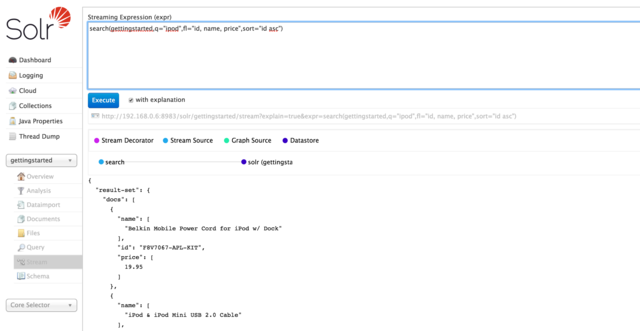

= Stream Screen
// Licensed to the Apache Software Foundation (ASF) under one
// or more contributor license agreements.  See the NOTICE file
// distributed with this work for additional information
// regarding copyright ownership.  The ASF licenses this file
// to you under the Apache License, Version 2.0 (the
// "License"); you may not use this file except in compliance
// with the License.  You may obtain a copy of the License at
//
//   http://www.apache.org/licenses/LICENSE-2.0
//
// Unless required by applicable law or agreed to in writing,
// software distributed under the License is distributed on an
// "AS IS" BASIS, WITHOUT WARRANTIES OR CONDITIONS OF ANY
// KIND, either express or implied.  See the License for the
// specific language governing permissions and limitations
// under the License.

The Stream screen allows you to enter a <<streaming-expressions.adoc#,streaming expression>> and see the results. It is very similar to the <<query-screen.adoc#,Query Screen>>, except the input box is at the top and all options must be declared in the expression.

The screen will insert everything up to the streaming expression itself, so you do not need to enter the full URI with the hostname, port, collection, etc. Simply input the expression after the `expr=` part, and the URL will be constructed dynamically as appropriate.

Under the input box, the Execute button will run the expression. An option "with explanation" will show the parts of the streaming expression that were executed. Under this, the streamed results are shown. A URL to be able to view the output in a browser is also available.

.Stream Screen with query and results

