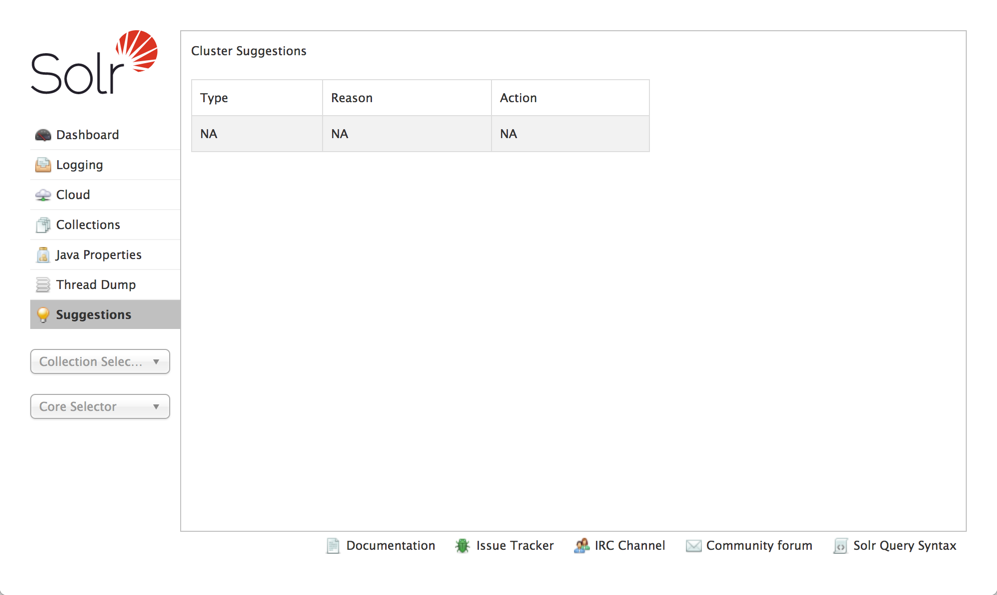
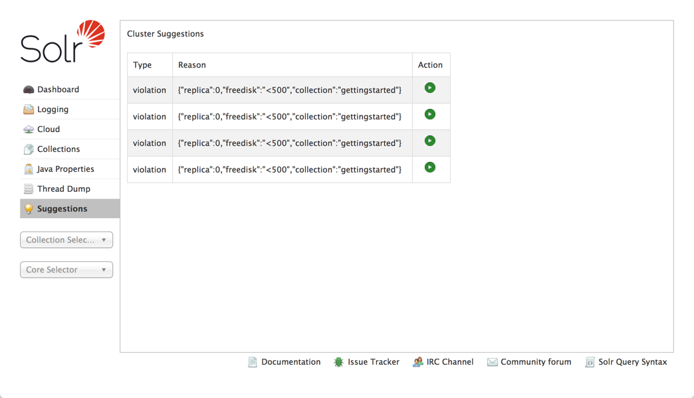
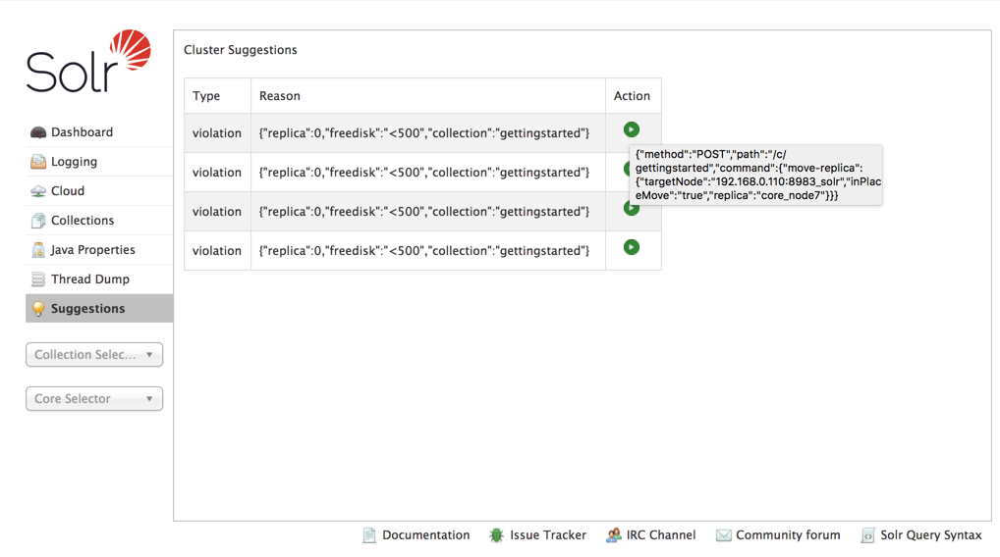

= Suggestions Screen
// Licensed to the Apache Software Foundation (ASF) under one
// or more contributor license agreements.  See the NOTICE file
// distributed with this work for additional information
// regarding copyright ownership.  The ASF licenses this file
// to you under the Apache License, Version 2.0 (the
// "License"); you may not use this file except in compliance
// with the License.  You may obtain a copy of the License at
//
//   http://www.apache.org/licenses/LICENSE-2.0
//
// Unless required by applicable law or agreed to in writing,
// software distributed under the License is distributed on an
// "AS IS" BASIS, WITHOUT WARRANTIES OR CONDITIONS OF ANY
// KIND, either express or implied.  See the License for the
// specific language governing permissions and limitations
// under the License.

[.lead]
The Suggestions screen shows violations to an <<solrcloud-autoscaling-policy-preferences.adoc#policy-specification,autoscaling policy>> that exist in the system, and allows you to take action to correct the violations.

This screen is a visual representation of the output of the <<solrcloud-autoscaling-api.adoc#suggestions-api,Suggestions API>>.

When there are no violations or other suggestions, the screen will appear somewhat blank:

When the system is in violation of an aspect of a policy, each violation will be shown, as in this screenshot:

A line is shown for each violation. In this case, we have defined a policy where no replica can exist on a node that has less than 500Gb of available disk space. In this example, 4 replicas in our sample cluster violates this rule.

In the "Action" column, the green button allows you to execute the recommended change to allow the system to return to compliance with the policy. If you hover your mouse over this button, you will see the recommended Collections API command:

In this case, the recommendation is to issue a MOVEREPLICA command to move this replica to a node with more available disk space.

NOTE: Since autoscaling features are only available in SolrCloud mode, this screen will only appear when running Solr in SolrCloud mode.
