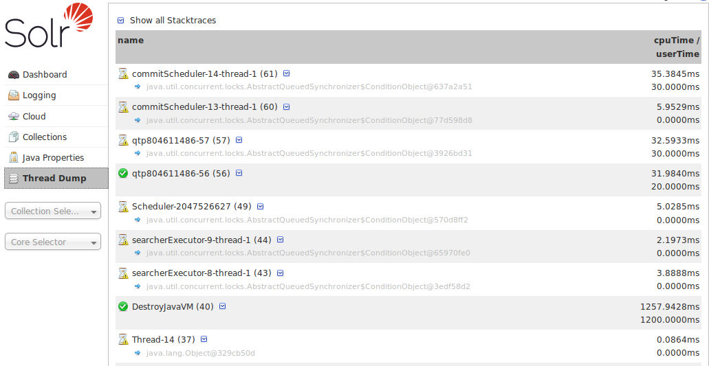
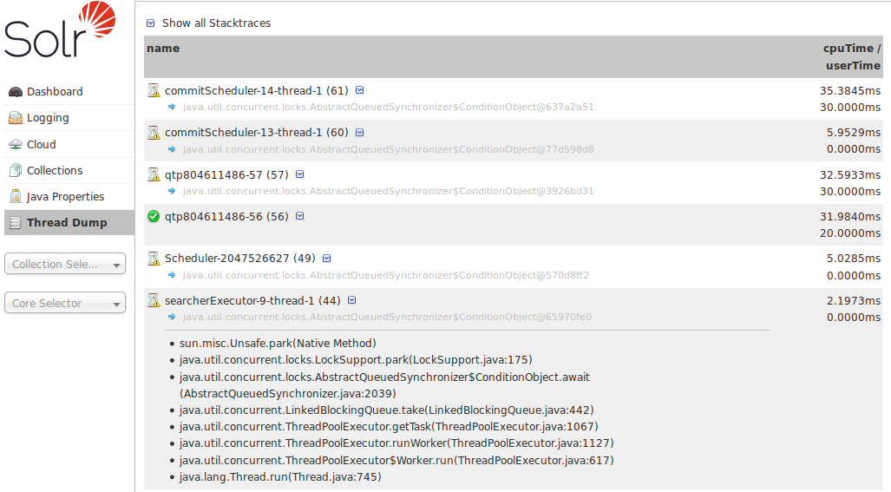

= Thread Dump
// Licensed to the Apache Software Foundation (ASF) under one
// or more contributor license agreements.  See the NOTICE file
// distributed with this work for additional information
// regarding copyright ownership.  The ASF licenses this file
// to you under the Apache License, Version 2.0 (the
// "License"); you may not use this file except in compliance
// with the License.  You may obtain a copy of the License at
//
//   http://www.apache.org/licenses/LICENSE-2.0
//
// Unless required by applicable law or agreed to in writing,
// software distributed under the License is distributed on an
// "AS IS" BASIS, WITHOUT WARRANTIES OR CONDITIONS OF ANY
// KIND, either express or implied.  See the License for the
// specific language governing permissions and limitations
// under the License.

The Thread Dump screen lets you inspect the currently active threads on your server.

Each thread is listed and access to the stacktraces is available where applicable. Icons to the left indicate the state of the thread: for example, threads with a green check-mark in a green circle are in a "RUNNABLE" state. On the right of the thread name, a down-arrow means you can expand to see the stacktrace for that thread.

.List of Threads

When you move your cursor over a thread name, a box floats over the name with the state for that thread. Thread states can be:

// TODO: Change column width to %autowidth.spread when https://github.com/asciidoctor/asciidoctor-pdf/issues/599 is fixed

[cols="25,75",options="header"]
|===
|State |Meaning
|NEW |A thread that has not yet started.
|RUNNABLE |A thread executing in the Java virtual machine.
|BLOCKED |A thread that is blocked waiting for a monitor lock.
|WAITING |A thread that is waiting indefinitely for another thread to perform a particular action.
|TIMED_WAITING |A thread that is waiting for another thread to perform an action for up to a specified waiting time.
|TERMINATED |A thread that has exited.
|===

When you click on one of the threads that can be expanded, you'll see the stacktrace, as in the example below:

.Inspecting a Thread

You can also check the *Show all Stacktraces* button to automatically enable expansion for all threads.
