= Time Series
// Licensed to the Apache Software Foundation (ASF) under one
// or more contributor license agreements.  See the NOTICE file
// distributed with this work for additional information
// regarding copyright ownership.  The ASF licenses this file
// to you under the Apache License, Version 2.0 (the
// "License"); you may not use this file except in compliance
// with the License.  You may obtain a copy of the License at
//
//   http://www.apache.org/licenses/LICENSE-2.0
//
// Unless required by applicable law or agreed to in writing,
// software distributed under the License is distributed on an
// "AS IS" BASIS, WITHOUT WARRANTIES OR CONDITIONS OF ANY
// KIND, either express or implied.  See the License for the
// specific language governing permissions and limitations
// under the License.

This section of the user guide provides an overview of some of the time series capabilities available
in Streaming Expressions and Math Expressions.

== Time Series Aggregation

The `timeseries` function performs fast, distributed time
series aggregation leveraging Solr's built-in faceting and date math capabilities.

The example below performs a monthly time series aggregation over a collection of daily stock price data.
In this example the average monthly closing price is calculated for the stock
ticker *AMZN* between a specific date range.

[source,text]
----
timeseries(stocks,
           q=ticker_s:amzn,
           field="date_dt",
           start="2010-01-01T00:00:00Z",
           end="2017-11-01T00:00:00Z",
           gap="+1MONTH",
           format="YYYY-MM",
           avg(close_d))
----

When this expression is sent to the `/stream` handler it responds with:

[source,json]
----
{
  "result-set": {
    "docs": [
      {
        "date_dt": "2010-01",
        "avg(close_d)": 127.42315789473685
      },
      {
        "date_dt": "2010-02",
        "avg(close_d)": 118.02105263157895
      },
      {
        "date_dt": "2010-03",
        "avg(close_d)": 130.89739130434782
      },
      {
        "date_dt": "2010-04",
        "avg(close_d)": 141.07
      },
      {
        "date_dt": "2010-05",
        "avg(close_d)": 127.606
      },
      {
        "date_dt": "2010-06",
        "avg(close_d)": 121.66681818181816
      },
      {
        "date_dt": "2010-07",
        "avg(close_d)": 117.5190476190476
      }
]}}
----

Using Zeppelin-Solr this time series can be visualized using a line chart.

image::images/math-expressions/timeseries1.png[]

== Vectorizing the Time Series

Before a time series can be smoothed or modeled the data will need to be vectorized.
The `col` function can be used
to copy a column of data from a list of tuples into an array.

The expression below demonstrates the vectorization of the `date_dt` and `avg(close_d)` fields.
The `zplot` function is then used to plot the months on the x-axis and the average closing prices on the y-axis.

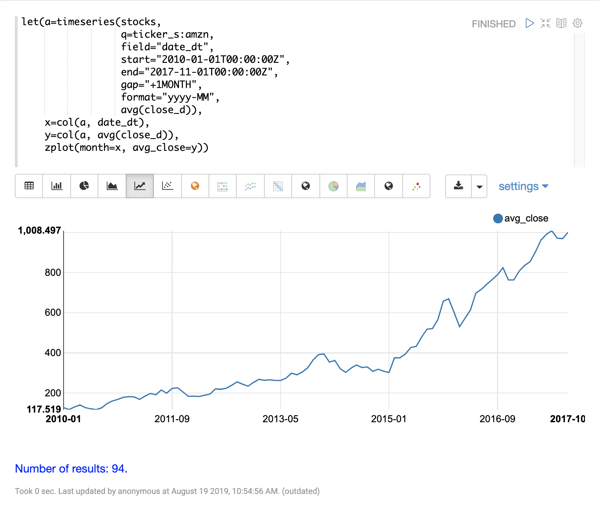

== Smoothing

Time series smoothing is often used to remove the noise from a time series and help spot the underlying trend.
The math expressions library has three *sliding window* approaches
for time series smoothing.
These approaches use a summary value from a sliding window of the data to calculate a new set of smoothed data points.

The three *sliding window* functions are lagging indicators, which means
they don't start to move in the direction of the trend until the trend effects
the summary value of the sliding window.
Because of this lagging quality these smoothing functions are often used to confirm the direction of the trend.

=== Moving Average

The `movingAvg` function computes a simple moving average over a sliding window of data.
The example below generates a time series, vectorizes the `avg(close_d)` field and computes the
moving average with a window size of 5.

The moving average function returns an array that is of shorter length
then the original vector. This is because results are generated only when a full window of data
is available for computing the average. With a window size of five the moving average will
begin generating results at the 5th value. The prior values are not included in the result.

The `zplot` function is then used to plot the months on the x-axis, and the average close and moving
average on the y-axis. Notice that the `ltrim` function is used to trim the first 4 values from
the x-axis and the average closing prices. This is done to line up the three arrays so they start
from the 5th value.

image::images/math-expressions/movingavg.png[]

=== Exponential Moving Average

The `expMovingAvg` function uses a different formula for computing the moving average that
responds faster to changes in the underlying data. This means that it is
less of a lagging indicator than the simple moving average.

Below is an example that computes a moving average and exponential moving average and plots them
along with the original y values. Notice how the exponential moving average is more sensitive
to changes in the y values.

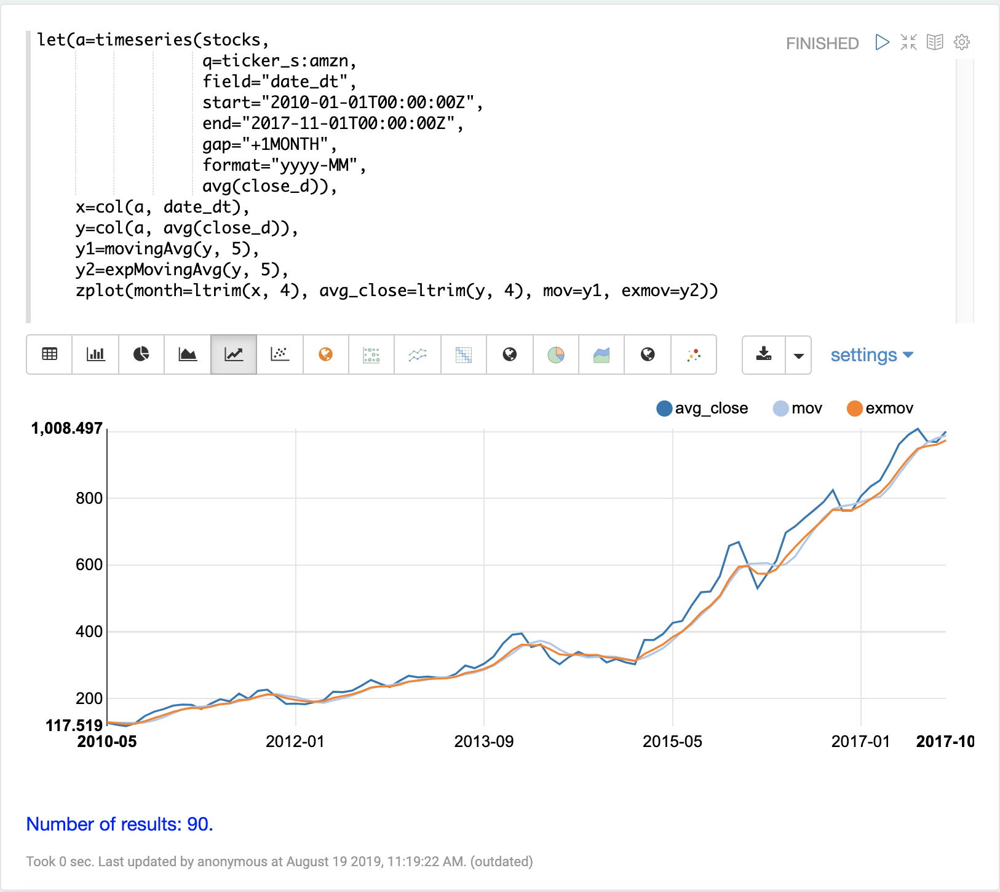

=== Moving Median

The `movingMedian` function uses the median of the sliding window rather than the average.
In many cases the moving median will be more *robust* to outliers than moving averages.

Below is an example computing the moving median:

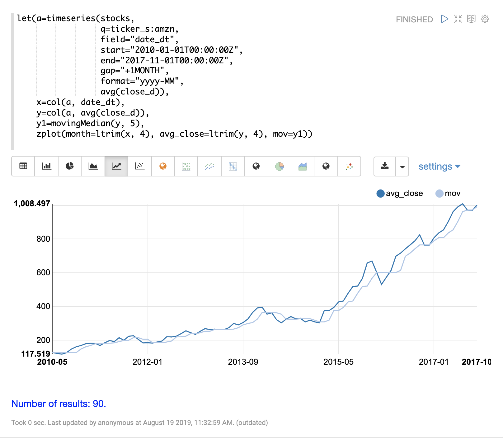

== Differencing

Differencing can be used to make
a time series stationary by removing the trend or seasonality from the series.

=== First Difference

The technique used in differencing is to use the difference between values rather than the
original values. The *first difference* takes the difference between a value and the value
that came directly before it. The first difference is often used to remove the trend
from a time series.

The examples below uses the first difference to make two time series stationary so they can be compared
without the trend.

In this example we'll be comparing the average monthly closing price for two stocks: Amazon and Google.
The image below plots both time series before differencing is applied.

image::images/math-expressions/timecompare.png[]

In the next example the `diff` function is applied to both time series inside the `zplot` function.
The `diff` can be applied inside the `zplot` function or like any other function inside of the `let`
function.

Notice that both time series now have the trend removed and the monthly movements of the stock price
can be studied without being influenced by the trend.

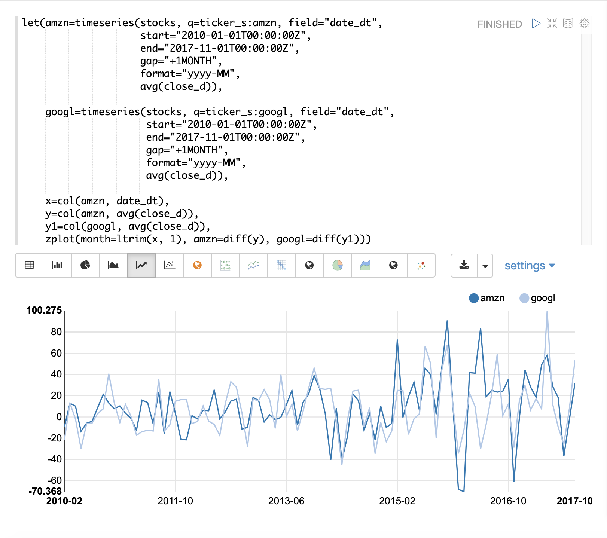

In the next example the `zoom` function of the time series visualization is used to zoom into a specific
range of months. This allows for closer inspection of the data. With closer inspection of the data there appears
to be some correlation between the monthly movements of the two stocks.

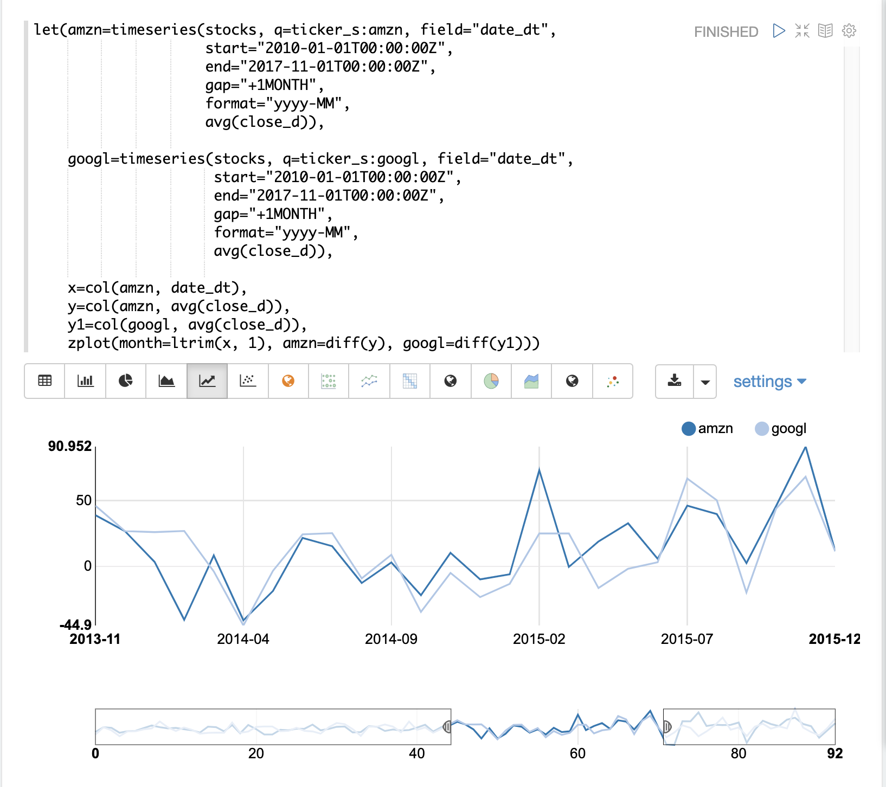

In the final example the differenced time series are correlated with the `corr` function.

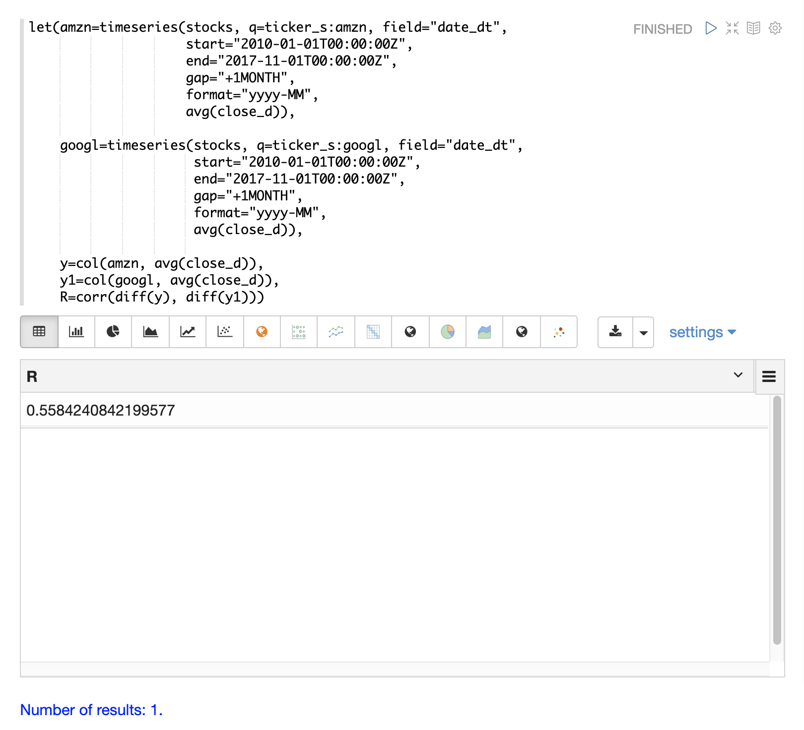

=== Lagged Differences

The `diff` function has an optional second parameter to specify a lag in the difference.
If a lag is specified the difference is taken between a value and the value at a specified
lag in the past. Lagged differences are often used to remove seasonality from a time series.

The simple example below demonstrates how lagged differencing works.
Notice that the array in the example follows a simple repeated pattern. This type of pattern
is often displayed with seasonality.

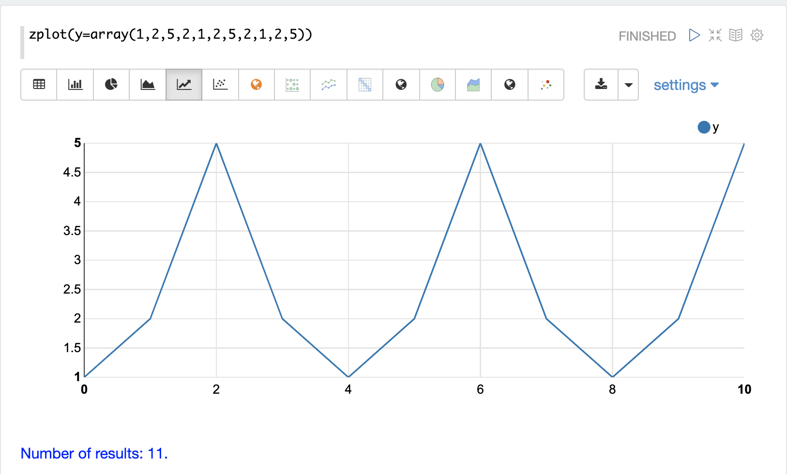

In this example we remove this pattern using
the `diff` function with a lag of 4. This will subtract the value lagging four indexes
behind the current index. Notice that the result set size is the original array size minus the lag.
This is because the `diff` function only returns results for values where the lag of 4
is possible to compute.

image::images/math-expressions/seasondiff.png[]

== Anomaly Detection

The `movingMAD` (moving mean absolute deviation) function can be used to surface anomalies
in a time series by measuring dispersion (deviation from the mean) within a sliding window.

The `movingMAD` function operates in a similar manner as a moving average, except it
measures the mean absolute deviation within the window rather than the average. By
looking for unusually high or low dispersion we can find anomalies in the time
series.

For this example we'll be working with daily stock prices for Amazon over a two year
period. The daily stock data will provide a larger data set to study.

In the example below the `search` expression is used to return the daily closing price
for the ticker *AMZN* over a two year period.

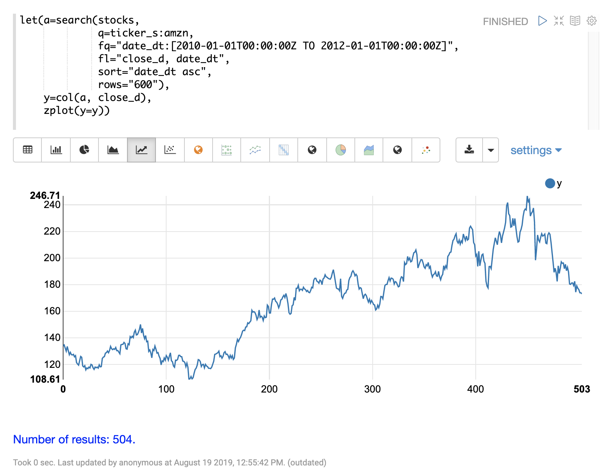

The next step is to apply the `movingMAD` function to the data to calculate
the moving mean absolute deviation over a 10 day window. The example below shows the function being
applied and visualized.

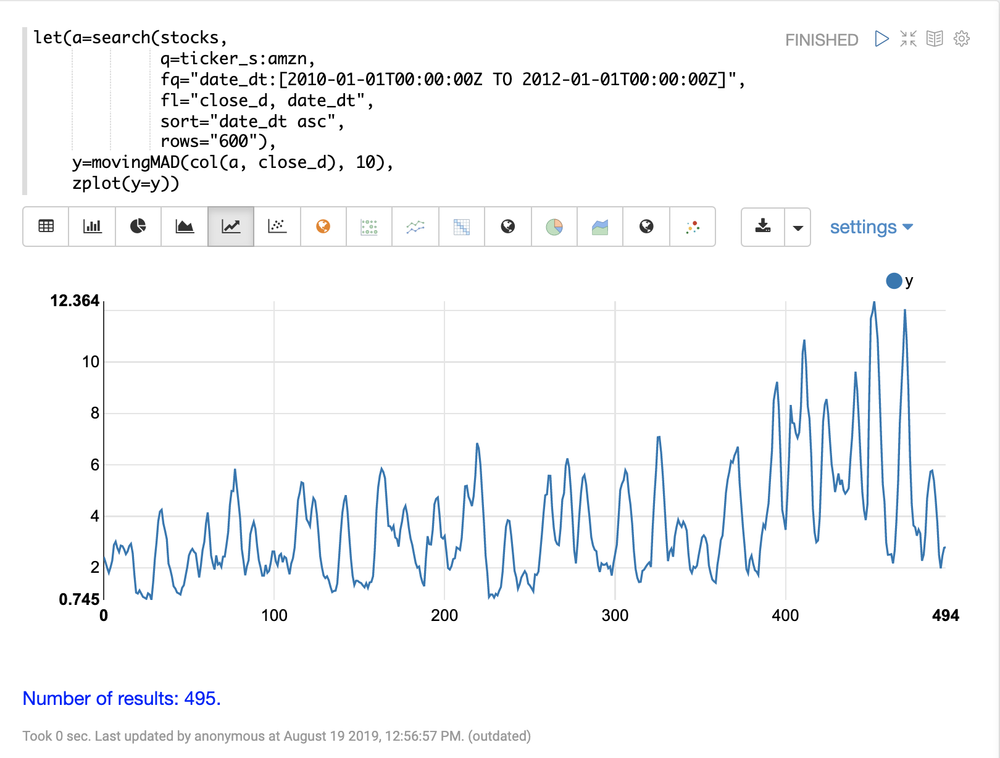

Once the moving MAD has been calculated we can visualize the distribution of dispersion
with the `empiricalDistribution` function. The example below plots the empirical
distribution with 10 bins, creating a 10 bin histogram of the dispersion of the
time series.

This visualization shows that most of the mean absolute deviations fall between 0 and
9.2 with the mean of the final bin at 11.94.

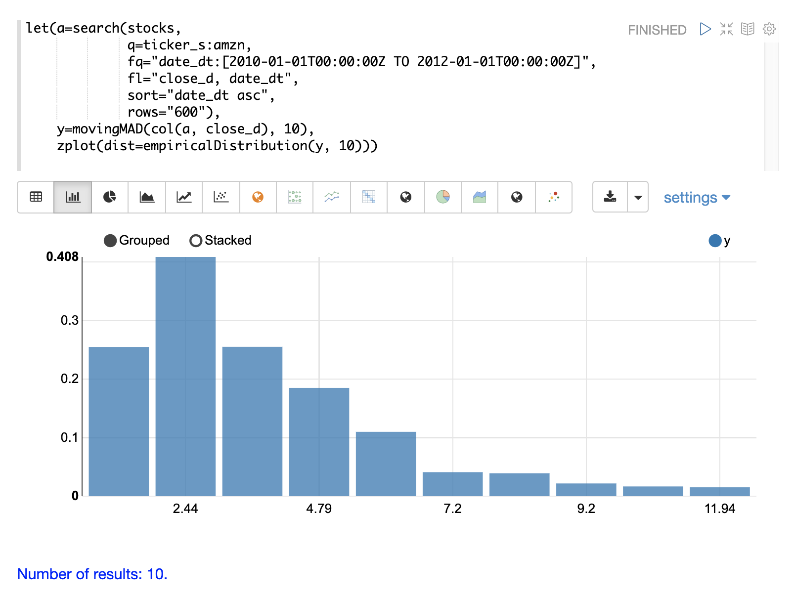

The final step is to detect outliers in the series using the `outliers` function.
The `outliers` function uses a probability distribution to find outliers in a numeric vector.
The `outliers` function takes four parameters:

* Probability distribution
* Numeric vector
* Low probability threshold
* High probability threshold
* List of results that the numeric vector was selected from

The `outliers` function iterates the numeric vector and uses the probability
distribution to calculate the cumulative probability of each value. If the cumulative
probability is below the low probability threshold or above the high threshold it considers
the value an outlier. When the `outliers` function encounters an outlier it returns
the corresponding result from the list of results provided by the fifth parameter.
It also includes the cumulative probability and the value of the outlier.

The example below shows the `outliers` function applied to the Amazon stock
price data set. The empirical distribution of the moving mean absolute deviation is
the first parameter. The vector containing the moving mean absolute
deviations is the second parameter. `-1` is the low and `.99` is the high probability
thresholds. `-1` means that low outliers will not be considered. The final parameter
is the original result set containing the `close_d` and `date_dt` fields.

The output of the `outliers` function contains the results where an outlier was detected.
In this case 5 results above the .99 probability threshold were detected.

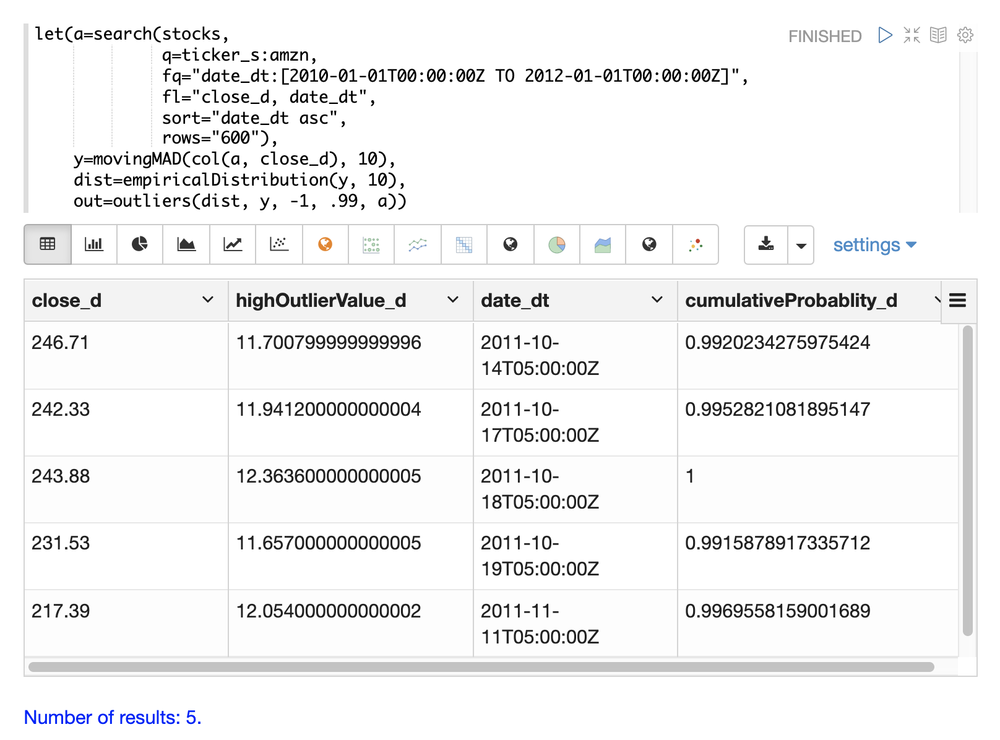

== Modeling

Math expressions support in Solr includes a number of functions that can be used to model a time series.
These functions include linear regression, polynomial and harmonic curve fitting, loess regression, and KNN regression.

Each of these functions can model a time series and be used for
interpolation (predicting values within the dataset) and several
can be used for extrapolation (predicting values beyond the data set).

The various regression functions are covered in detail in the Linear Regression, Curve
Fitting and Machine Learning sections of the user guide.

The example below uses the `polyfit` function (polynomial regression) to
fit a non-linear model to a time series. The data set being used is the
monthly average closing price for Amazon over an eight year period.

In this example the `polyfit` function returns a fitted model for the *y*
axis, which is the average monthly closing prices, using a 4 degree polynomial.
The degree of the polynomial determines the number of curves in the
model. The fitted model is set to the variable `y1`. The fitted model
is then directly plotted with `zplot` along with the original `y`
values.

The visualization shows the smooth line fit through the average closing
price data.

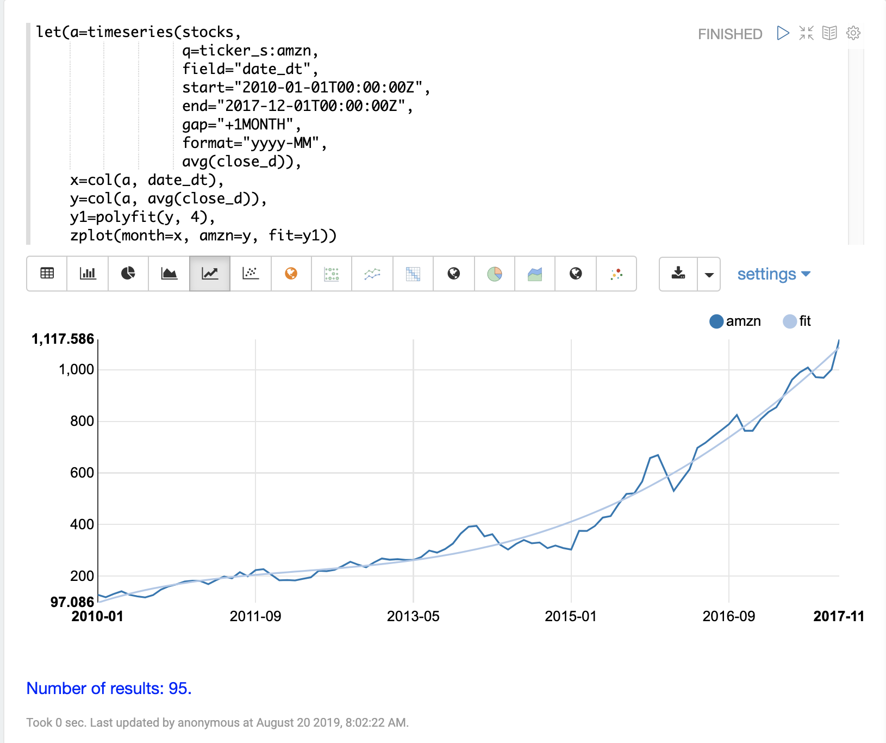

== Forecasting

The `polyfit` function can also be used to extrapolate a time series to forecast
future stock prices. The example below demonstrates a 10 month forecast.

In the example the `polyfit` function fits a model to the y-axis and the model
is set to the variable *`m`*.
Then to create a forecast 10 zeros are appended
to the y-axis to create new vector called `y10`.
Then a new x-axis is created using
the `natural` function which returns a sequence of whole numbers 0 to the length of `y10`.
The new x-axis is stored in the variable `x10`.

The `predict` function uses the fitted model to predict values for the new x-axis stored in
variable `x10`.

The `zplot` function is then used to plot the `x10` vector on the x-axis and the `y10` vector and extrapolated
model on the y-axis. Notice that the `y10` vector drops to zero where the observed data
ends, but the forecast continues along the fitted curve
of the model.

image::images/math-expressions/forecast.png[]
