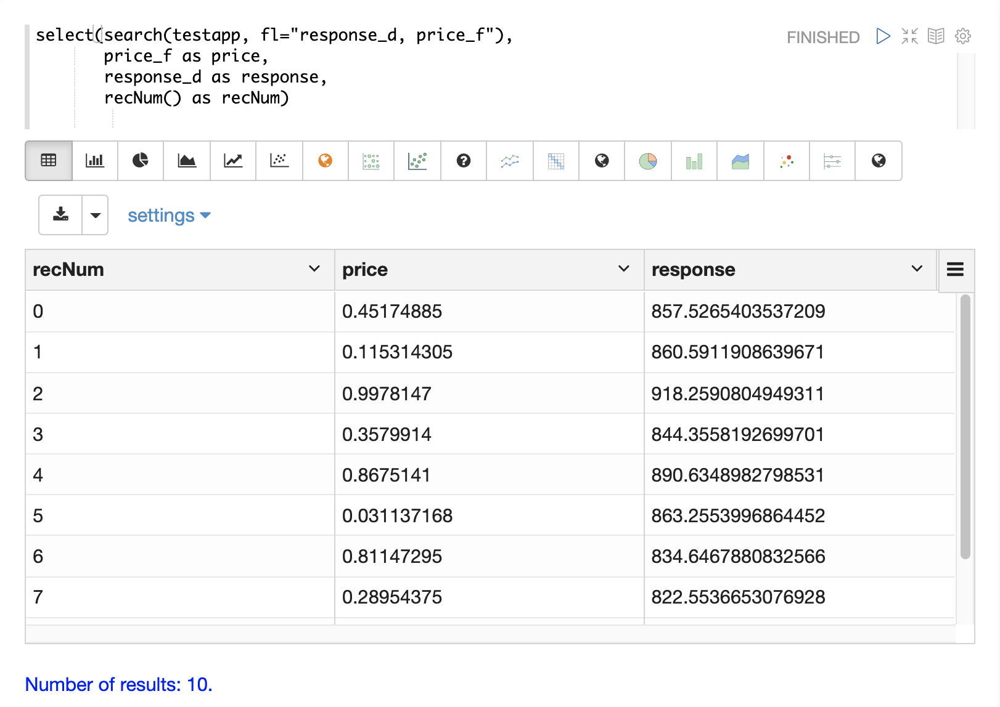
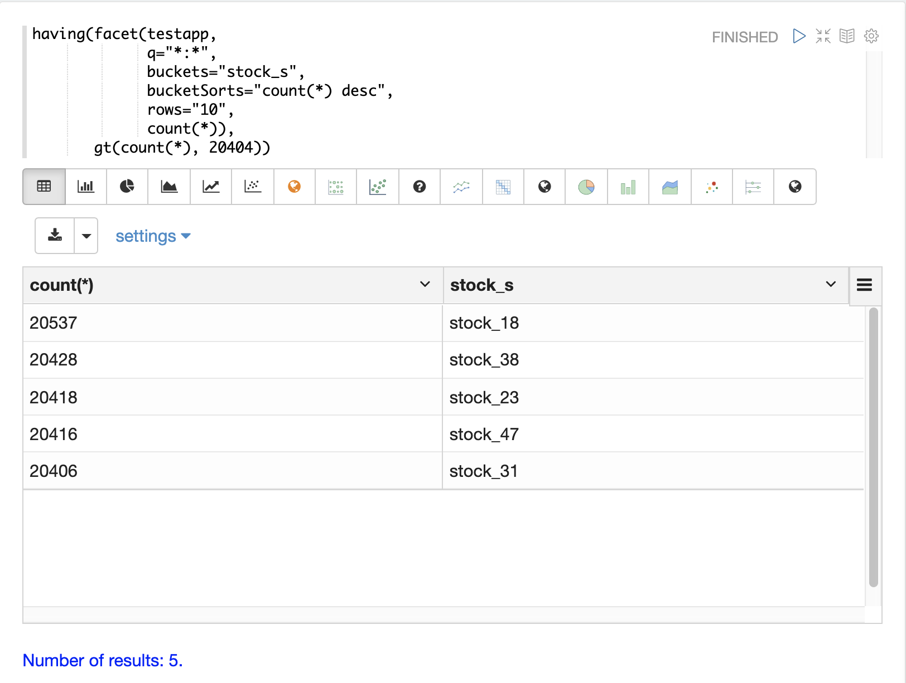
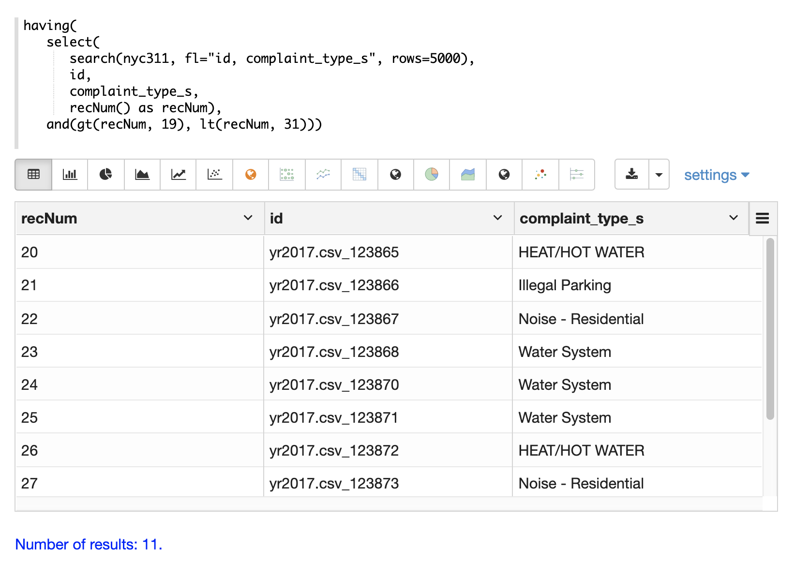
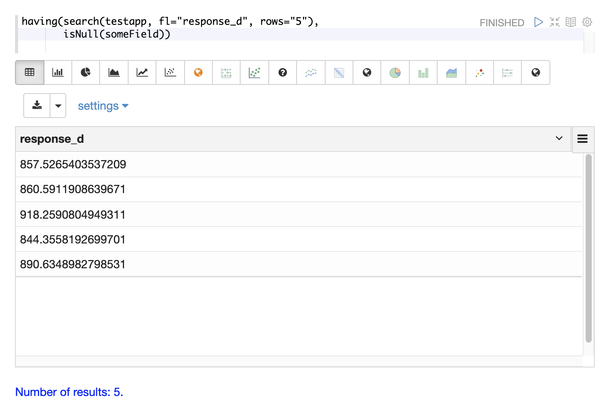
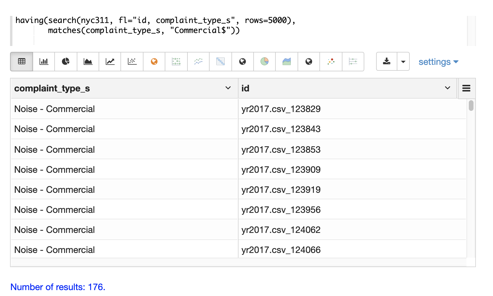
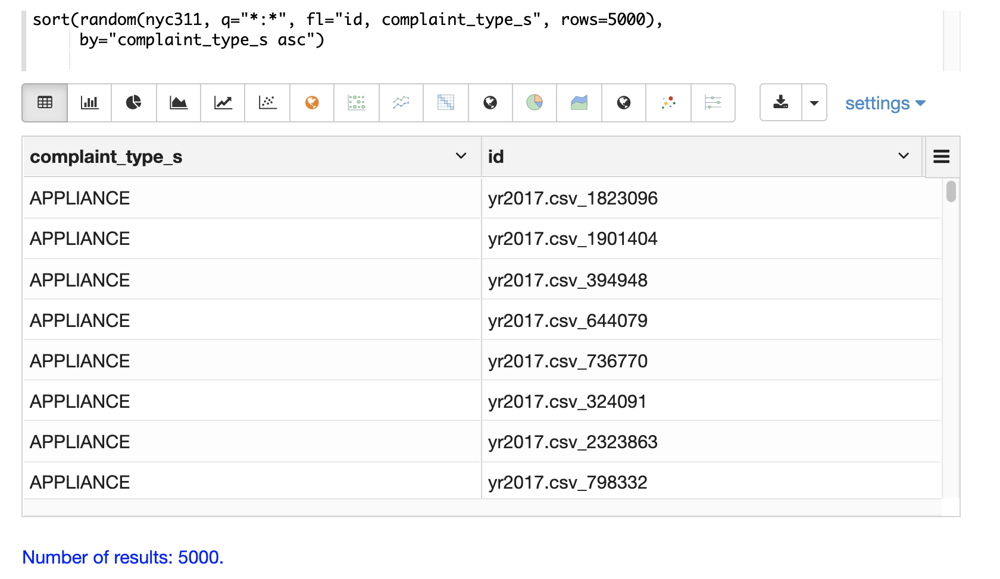
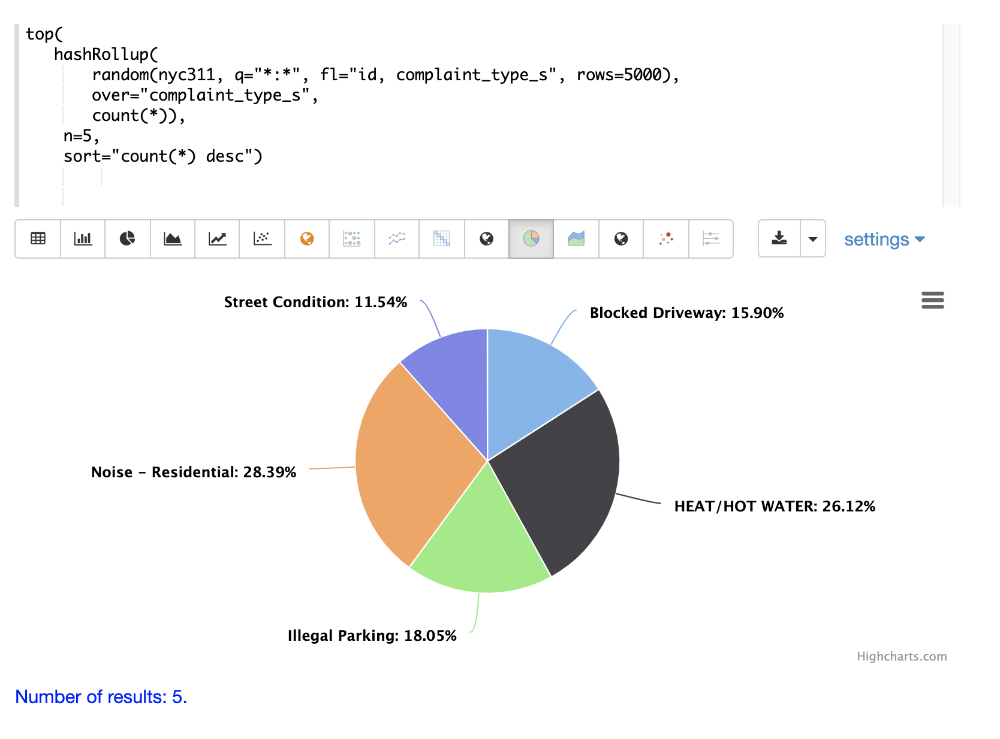

= Transforming Data
// Licensed to the Apache Software Foundation (ASF) under one
// or more contributor license agreements.  See the NOTICE file
// distributed with this work for additional information
// regarding copyright ownership.  The ASF licenses this file
// to you under the Apache License, Version 2.0 (the
// "License"); you may not use this file except in compliance
// with the License.  You may obtain a copy of the License at
//
//   http://www.apache.org/licenses/LICENSE-2.0
//
// Unless required by applicable law or agreed to in writing,
// software distributed under the License is distributed on an
// "AS IS" BASIS, WITHOUT WARRANTIES OR CONDITIONS OF ANY
// KIND, either express or implied.  See the License for the
// specific language governing permissions and limitations
// under the License.

Streaming Expressions provides a powerful set of functions for transforming result sets. This section
of the user guide provides an overview of some useful transformations applied to result sets.

== Selecting and Adding Fields

The `select` function wraps another streaming expression and can select a
subset of fields, map fields to new
names and/or add new fields to each tuple in the stream.

Below is an example showing the `select` function wrapping a `search` function
and mapping fields to new field names. The `recNum` function is a math expression
which the `select` expression calls on each tuple. More examples of this type
of streaming math will be shown later in the userguide.

== Filtering Tuples

The `having` function can be used to filter tuples in the stream based
boolean logic.

In the example below the `having` function is filtering the output of the
`facet` function to only emit tuples that have `count(*)` greater then 20404.

== Paging

The *record number*, added with the `recNum` function
can, be filtered on to support paging.

In the example below the `and` function with nested `lt` and `gt` functions are
used to select records within a specific record number range:

== Handling Nulls

The `notNull` and `isNull` function can be used to either replace null values with different values,
or to filter out tuples with null values.

The example below is using the `isNull` function inside of `select` function
to replace null values with -1. The `if` function takes 3 parameters. The first
is a boolean expression, in this case `isNull`. The `if` function returns
the secopnd parameter if the boolean function returns true, and the third
parameter if it returns false. In this case `isNull` is always true because its
check for a field in the tuples that is not included in the result set.

image::images/math-expressions/select2.png[]

`notNull` and `isNull` can also be used with the `having` function to filter out
tuples with null values.

The example below emits all the documents because it is evaluating `isNull` for
and field that is not in the result set, which always returns true.

The example below emits zero documents because it is evaluating `notNull` for
and field that is not in the result set, which always returns false.

== Regex Matching and Filtering

The `matches` function can be used inside of a `having` function
to test if a field in the record matches a specific
regular expression. This allows for sophisticated regex matching over search results.

The example below uses the `matches` function to return all records where
the *complaint_type_s* field ends with *Commercial*.

== Sorting

The `sort` and `top` function can be used to resort a result set in memory. The `sort` function
sorts and returns the entire result set based on the sort criteria. The `top` function
can be used to return the top N values in a result set based on the sort criteria.

== Rollups

The `rollup` and `hashRollup` functions can be used to perform aggregations over result sets. This
is different then the `facet`, `facet2D` and `timeseries` aggregation functions which push the aggregations
into the search engine using.

The `rollup` function performs map-reduce style rollups, which requires the result stream to be sorted by the
the grouping fields. This allows for aggregations over very high cardinality fields. The `hashRollup` function
performs rollups keeping all buckets in an in-memory hashmap. This requires enough memory to store all the
distinct group by fields in memory, but does not require that the underlying stream be sorted.

The example below shows a visualization of the top 5 complaint types
from a random sample from the `nyc311` complaint database. The `top`
function is used to select the top 5 complaint types based on
the `count(*)` field output by the `hashRollup`.

