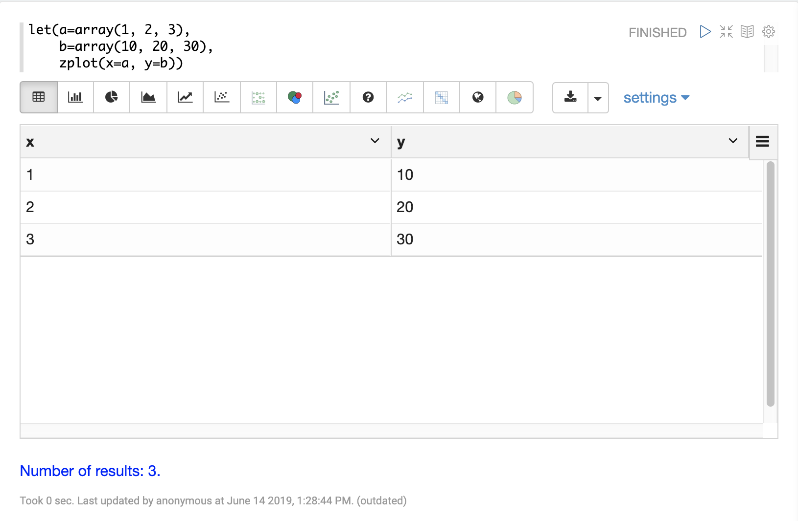
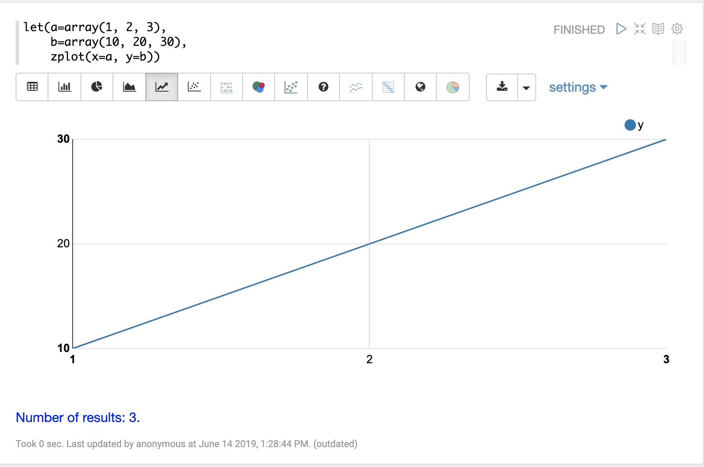

= Variables
// Licensed to the Apache Software Foundation (ASF) under one
// or more contributor license agreements.  See the NOTICE file
// distributed with this work for additional information
// regarding copyright ownership.  The ASF licenses this file
// to you under the Apache License, Version 2.0 (the
// "License"); you may not use this file except in compliance
// with the License.  You may obtain a copy of the License at
//
//   http://www.apache.org/licenses/LICENSE-2.0
//
// Unless required by applicable law or agreed to in writing,
// software distributed under the License is distributed on an
// "AS IS" BASIS, WITHOUT WARRANTIES OR CONDITIONS OF ANY
// KIND, either express or implied.  See the License for the
// specific language governing permissions and limitations
// under the License.

This section of the user guide describes how to assign and visualize
variables with math expressions.

== The Let Expression

The `let` expression sets variables and returns
the value of the last variable by default. The output of any streaming expression or math expression can be set to a variable.

Below is a simple example setting three variables `a`, `b`,
and `c`. Variables `a` and `b` are set to arrays. The variable `c` is set
to the output of the `ebeAdd` function which performs element-by-element
addition of the two arrays.

[source,text]
----
let(a=array(1, 2, 3),
    b=array(10, 20, 30),
    c=ebeAdd(a, b))
----

In the response, notice that the last variable, `c`, is returned:

[source,json]
----
{
  "result-set": {
    "docs": [
      {
        "c": [
          11,
          22,
          33
        ]
      },
      {
        "EOF": true,
        "RESPONSE_TIME": 4
      }
    ]
  }
}
----

== Echoing Variables

All variables can be output by setting the `echo` variable to `true`.

[source,text]
----
let(echo=true,
    a=array(1, 2, 3),
    b=array(10, 20, 30),
    c=ebeAdd(a, b))
----

When this expression is sent to the `/stream` handler it
responds with:

[source,json]
----
{
  "result-set": {
    "docs": [
      {
        "a": [
          1,
          2,
          3
        ],
        "b": [
          10,
          20,
          30
        ],
        "c": [
          11,
          22,
          33
        ]
      },
      {
        "EOF": true,
        "RESPONSE_TIME": 0
      }
    ]
  }
}
----

A specific set of variables can be echoed by providing a comma-delimited list of variables to the `echo` parameter.
Because variables have been provided, the `true` value is assumed.

[source,text]
----
let(echo="a,b",
    a=array(1, 2, 3),
    b=array(10, 20, 30),
    c=ebeAdd(a, b))
----

When this expression is sent to the `/stream` handler it responds with:

[source,json]
----
{
  "result-set": {
    "docs": [
      {
        "a": [
          1,
          2,
          3
        ],
        "b": [
          10,
          20,
          30
        ]
      },
      {
        "EOF": true,
        "RESPONSE_TIME": 0
      }
    ]
  }
}
----

== Visualizing Variables

The `let` expression can also include a `zplot` expression that can be used to visualize the
variables.

In the example below the variables `a` and `b` are set to arrays. The `zplot` function
outputs the variables as `x` and `y` fields in the output.

[source,text]
----
let(a=array(1, 2, 3),
    b=array(10, 20, 30),
    zplot(x=a, y=b))
----

When this expression is sent to the `/stream` handler it responds with:

[source,json]
----
{
  "result-set": {
    "docs": [
      {
        "x": 1,
        "y": 10
      },
      {
        "x": 2,
        "y": 20
      },
      {
        "x": 3,
        "y": 30
      },
      {
        "EOF": true,
        "RESPONSE_TIME": 0
      }
    ]
  }
}
----

Using this approach variables can by visualized using Zeppelin-Solr. In the example below
the arrays are shown in table format.

Once in table format we can plot the variables using one of the plotting or charting
visualizations. The example below shows variables plotted on a line chart:

== Caching Variables

Variables can be cached in-memory on the Solr node where the math expression
was run. A cached variable can then be used in future expressions. Any object
that can be set to a variable, including data structures and mathematical models, can
be cached in-memory for future use.

The `putCache` function adds a variable to the cache.

In the example below an array is cached in the workspace `workspace1`
and bound to the key `key1`.
The workspace allows different users to cache objects in their own workspace.
The `putCache` function returns the variable that was added to the cache.

[source,text]
----
let(a=array(1, 2, 3),
    b=array(10, 20, 30),
    c=ebeAdd(a, b),
    d=putCache(workspace1, key1, c))
----

When this expression is sent to the `/stream` handler it responds with:

[source,json]
----
{
  "result-set": {
    "docs": [
      {
        "d": [
          11,
          22,
          33
        ]
      },
      {
        "EOF": true,
        "RESPONSE_TIME": 11
      }
    ]
  }
}
----

The `getCache` function retrieves an object from the cache by its workspace and key.

In the example below the `getCache` function retrieves the array that was cached above and assigns it to variable `a`.

[source,text]
----
let(a=getCache(workspace1, key1))
----

When this expression is sent to the `/stream` handler it responds with:

[source,json]
----
{
  "result-set": {
    "docs": [
      {
        "a": [
          11,
          22,
          33
        ]
      },
      {
        "EOF": true,
        "RESPONSE_TIME": 11
      }
    ]
  }
}
----

The `listCache` function can be used to list the workspaces or the keys in a specific workspace.

In the example below `listCache` returns all the workspaces in the cache as an array of strings.

[source,text]
----
let(a=listCache())
----

When this expression is sent to the `/stream` handler it responds with:

[source,json]
----
{
  "result-set": {
    "docs": [
      {
        "a": [
          "workspace1"
        ]
      },
      {
        "EOF": true,
        "RESPONSE_TIME": 0
      }
    ]
  }
}
----

In the example below all the keys in a specific workspace are listed:

[source,text]
----
let(a=listCache(workspace1))
----

When this expression is sent to the `/stream` handler it responds with:

[source,json]
----
{
  "result-set": {
    "docs": [
      {
        "a": [
          "key1"
        ]
      },
      {
        "EOF": true,
        "RESPONSE_TIME": 0
      }
    ]
  }
}
----

The `removeCache` function can be used to remove a key from a specific
workspace. The `removeCache` function removes the key from the cache
and returns the object that was removed.

In the example below the array that was cached above is removed from the cache.

[source,text]
----
let(a=removeCache(workspace1, key1))
----

When this expression is sent to the `/stream` handler it responds with:

[source,json]
----
{
  "result-set": {
    "docs": [
      {
        "a": [
          11,
          22,
          33
        ]
      },
      {
        "EOF": true,
        "RESPONSE_TIME": 0
      }
    ]
  }
}
----
