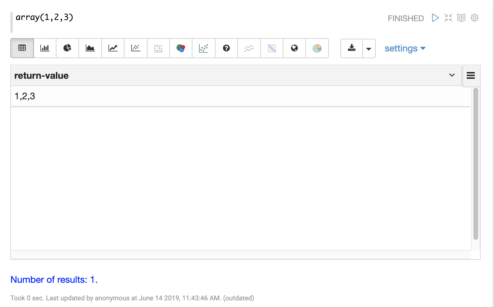
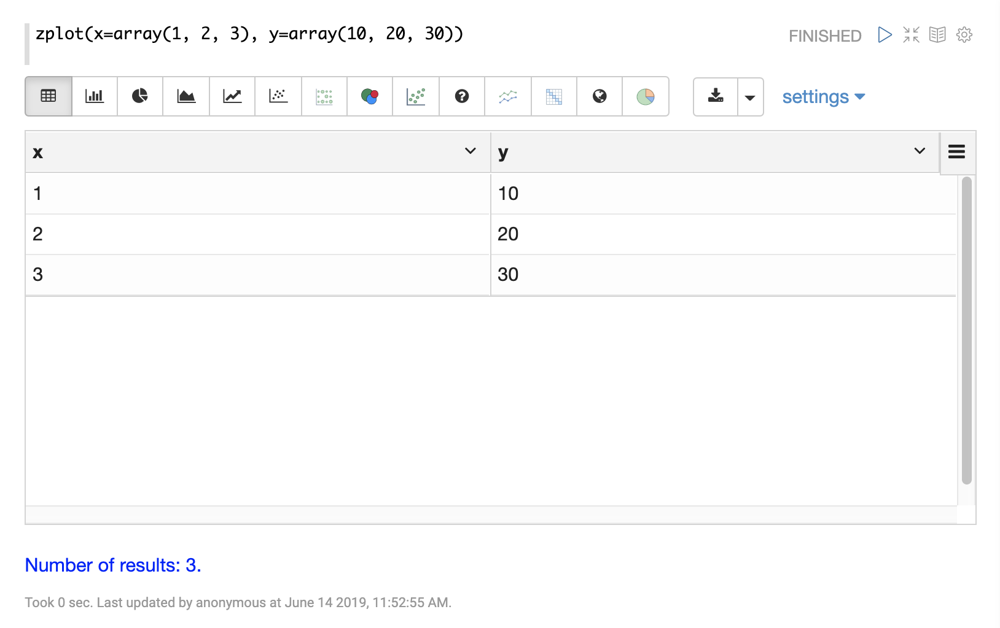
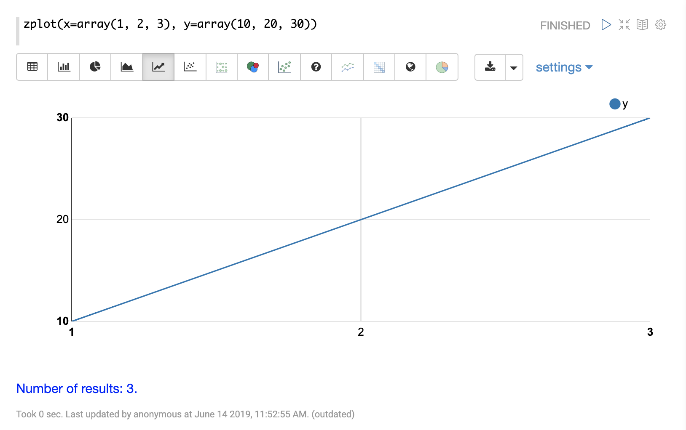

= Vector Math
// Licensed to the Apache Software Foundation (ASF) under one
// or more contributor license agreements.  See the NOTICE file
// distributed with this work for additional information
// regarding copyright ownership.  The ASF licenses this file
// to you under the Apache License, Version 2.0 (the
// "License"); you may not use this file except in compliance
// with the License.  You may obtain a copy of the License at
//
//   http://www.apache.org/licenses/LICENSE-2.0
//
// Unless required by applicable law or agreed to in writing,
// software distributed under the License is distributed on an
// "AS IS" BASIS, WITHOUT WARRANTIES OR CONDITIONS OF ANY
// KIND, either express or implied.  See the License for the
// specific language governing permissions and limitations
// under the License.

This section covers vector math and vector manipulation functions.

== Arrays

Arrays can be created with the `array` function.

For example, the expression below creates a numeric array with three elements:

[source,text]
----
array(1, 2, 3)
----

When this expression is sent to the `/stream` handler it responds with a JSON array:

[source,json]
----
{
  "result-set": {
    "docs": [
      {
        "return-value": [
          1,
          2,
          3
        ]
      },
      {
        "EOF": true,
        "RESPONSE_TIME": 0
      }
    ]
  }
}
----

== Visualization

The `zplot` function can be used to visualize vectors using Zeppelin-Solr.

Let's first see what happens when we visualize the array function as a table.

It appears as one row with a comma-delimited list of values. You'll find that you can't visualize this output
using any of the plotting tools.

To plot the array you need the `zplot` function. Let's first look at how `zplot` output looks like in JSON format.

[source,text]
----
zplot(x=array(1, 2, 3))
----

When this expression is sent to the `/stream` handler it responds with a JSON array:

[source,json]
----
{
  "result-set": {
    "docs": [
      {
        "x": 1
      },
      {
        "x": 2
      },
      {
        "x": 3
      },
      {
        "EOF": true,
        "RESPONSE_TIME": 0
      }
    ]
  }
}
----

`zplot` has turned the array into three tuples with the field `x`.

Let's add another array:

[source,text]
----
zplot(x=array(1, 2, 3), y=array(10, 20, 30))
----

When this expression is sent to the `/stream` handler it responds with a JSON array:

[source,json]
----
{
  "result-set": {
    "docs": [
      {
        "x": 1,
        "y": 10
      },
      {
        "x": 2,
        "y": 20
      },
      {
        "x": 3,
        "y": 30
      },
      {
        "EOF": true,
        "RESPONSE_TIME": 0
      }
    ]
  }
}
----

Now we have three tuples with `x` and `y` fields.

Let's see how Zeppelin-Solr handles this output in table format:

Now that we have `x` and `y` columns defined we can simply switch to one of the line charts
and plugin the fields to plot using the chart settings:

Each chart has settings which can be explored by clicking on *settings*.

You can switch between chart types for different types of visualizations. Below is an example of
a bar chart:

image::images/math-expressions/bar.png[]

== Array Operations

Arrays can be passed as parameters to functions that operate on arrays.

For example, an array can be reversed with the `rev` function:

[source,text]
----
rev(array(1, 2, 3))
----

When this expression is sent to the `/stream` handler it responds with:

[source,json]
----
{
  "result-set": {
    "docs": [
      {
        "return-value": [
          3,
          2,
          1
        ]
      },
      {
        "EOF": true,
        "RESPONSE_TIME": 0
      }
    ]
  }
}
----

Another example is the `length` function, which returns the length of an array:

[source,text]
----
length(array(1, 2, 3))
----

When this expression is sent to the `/stream` handler it responds with:

[source,json]
----
{
  "result-set": {
    "docs": [
      {
        "return-value": 3
      },
      {
        "EOF": true,
        "RESPONSE_TIME": 0
      }
    ]
  }
}
----

A slice of an array can be taken with the `copyOfRange` function, which
copies elements of an array from a start and end range.

[source,text]
----
copyOfRange(array(1,2,3,4,5,6), 1, 4)
----

When this expression is sent to the `/stream` handler it responds with:

[source,json]
----
{
  "result-set": {
    "docs": [
      {
        "return-value": [
          2,
          3,
          4
        ]
      },
      {
        "EOF": true,
        "RESPONSE_TIME": 0
      }
    ]
  }
}
----

Elements of an array can be trimmed using the `ltrim` (left trim) and `rtrim` (right trim) functions.
The `ltrim` and `rtrim` functions remove a specific number of elements from the left or right of an array.

The example below shows the `lrtim` function trimming the first 2 elements of an array:

[source,text]
----
ltrim(array(0,1,2,3,4,5,6), 2)
----

When this expression is sent to the `/stream` handler it responds with:

[source,json]
----
{
  "result-set": {
    "docs": [
      {
        "return-value": [
          2,
          3,
          4,
          5,
          6,
        ]
      },
      {
        "EOF": true,
        "RESPONSE_TIME": 1
      }
    ]
  }
}
----

== Getting Values By Index

Values from a vector can be retrieved by index with the `valueAt` function.

[source,text]
----
valueAt(array(0,1,2,3,4,5,6), 2)
----

When this expression is sent to the `/stream` handler it responds with:

[source,json]
----
{
  "result-set": {
    "docs": [
      {
        "return-value": 2
      },
      {
        "EOF": true,
        "RESPONSE_TIME": 0
      }
    ]
  }
}
----

== Sequences

The `sequence` function can be used to generate a sequence of numbers as an array.
The example below returns a sequence of 10 numbers, starting from 0, with a stride of 2.

[source,text]
----
sequence(10, 0, 2)
----

When this expression is sent to the `/stream` handler it responds with:

[source,json]
----
{
  "result-set": {
    "docs": [
      {
        "return-value": [
          0,
          2,
          4,
          6,
          8,
          10,
          12,
          14,
          16,
          18
        ]
      },
      {
        "EOF": true,
        "RESPONSE_TIME": 7
      }
    ]
  }
}
----

The `natural` function can be used to create a sequence of *natural* numbers starting from zero.
Natural numbers are positive integers.

The example below creates a sequence starting at zero with all natural numbers up to, but not including
10.

[source,text]
----
natural(10)
----

When this expression is sent to the `/stream` handler it responds with:

[source,json]
----
{
  "result-set": {
    "docs": [
      {
        "return-value": [
          0,
          1,
          2,
          3,
          4,
          5,
          6,
          7,
          8,
          9
        ]
      },
      {
        "EOF": true,
        "RESPONSE_TIME": 0
      }
    ]
  }
}
----

== Vector Sorting

An array can be sorted in natural ascending order with the `asc` function.

The example below shows the `asc` function sorting an array:

[source,text]
----
asc(array(10,1,2,3,4,5,6))
----

When this expression is sent to the `/stream` handler it responds with:

[source,json]
----
{
  "result-set": {
    "docs": [
      {
        "return-value": [
          1,
          2,
          3,
          4,
          5,
          6,
          10
        ]
      },
      {
        "EOF": true,
        "RESPONSE_TIME": 1
      }
    ]
  }
}
----

== Vector Summarizations and Norms

There are a set of functions that perform summarizations and return norms of arrays. These functions
operate over an array and return a single value. The following vector summarizations and norm functions are available:
`mult`, `add`, `sumSq`, `mean`, `l1norm`, `l2norm`, `linfnorm`.

The example below shows the `mult` function, which multiples all the values of an array.

[source,text]
----
mult(array(2,4,8))
----

When this expression is sent to the `/stream` handler it responds with:

[source,json]
----
{
  "result-set": {
    "docs": [
      {
        "return-value": 64
      },
      {
        "EOF": true,
        "RESPONSE_TIME": 0
      }
    ]
  }
}
----

The vector norm functions provide different formulas for calculating vector magnitude.

The example below calculates the `l2norm` of an array.

[source,text]
----
l2norm(array(2,4,8))
----

When this expression is sent to the `/stream` handler it responds with:

[source,json]
----
{
  "result-set": {
    "docs": [
      {
        "return-value": 9.16515138991168
      },
      {
        "EOF": true,
        "RESPONSE_TIME": 0
      }
    ]
  }
}
----

== Scalar Vector Math

Scalar vector math functions add, subtract, multiply, or divide a scalar value with every value in a vector.
The following functions perform these operations: `scalarAdd`, `scalarSubtract`, `scalarMultiply`,
and `scalarDivide`.

Below is an example of the `scalarMultiply` function, which multiplies the scalar value `3` with
every value of an array.

[source,text]
----
scalarMultiply(3, array(1,2,3))
----

When this expression is sent to the `/stream` handler it responds with:

[source,json]
----
{
  "result-set": {
    "docs": [
      {
        "return-value": [
          3,
          6,
          9
        ]
      },
      {
        "EOF": true,
        "RESPONSE_TIME": 0
      }
    ]
  }
}
----

== Element-By-Element Vector Math

Two vectors can be added, subtracted, multiplied and divided using element-by-element
vector math functions. The available element-by-element vector math functions are:
`ebeAdd`, `ebeSubtract`, `ebeMultiply`, `ebeDivide`.

The expression below performs the element-by-element subtraction of two arrays.

[source,text]
----
ebeSubtract(array(10, 15, 20), array(1,2,3))
----

When this expression is sent to the `/stream` handler it responds with:

[source,json]
----
{
  "result-set": {
    "docs": [
      {
        "return-value": [
          9,
          13,
          17
        ]
      },
      {
        "EOF": true,
        "RESPONSE_TIME": 5
      }
    ]
  }
}
----

== Dot Product and Cosine Similarity

The `dotProduct` and `cosineSimilarity` functions are often used as similarity measures between two
sparse vectors. The `dotProduct` is a measure of both angle and magnitude while `cosineSimilarity`
is a measure only of angle.

Below is an example of the `dotProduct` function:

[source,text]
----
dotProduct(array(2,3,0,0,0,1), array(2,0,1,0,0,3))
----

When this expression is sent to the `/stream` handler it responds with:

[source,json]
----
{
  "result-set": {
    "docs": [
      {
        "return-value": 7
      },
      {
        "EOF": true,
        "RESPONSE_TIME": 15
      }
    ]
  }
}
----

Below is an example of the `cosineSimilarity` function:

[source,text]
----
cosineSimilarity(array(2,3,0,0,0,1), array(2,0,1,0,0,3))
----

When this expression is sent to the `/stream` handler it responds with:

[source,json]
----
{
  "result-set": {
    "docs": [
      {
        "return-value": 0.5
      },
      {
        "EOF": true,
        "RESPONSE_TIME": 7
      }
    ]
  }
}
----
