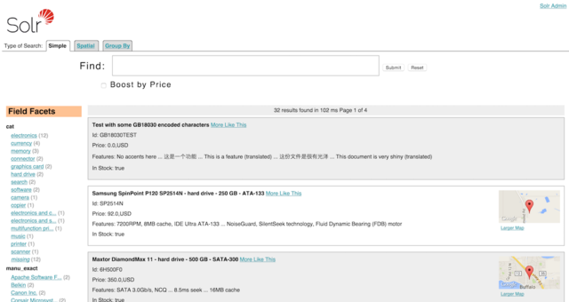

= Velocity Search UI
// Licensed to the Apache Software Foundation (ASF) under one
// or more contributor license agreements.  See the NOTICE file
// distributed with this work for additional information
// regarding copyright ownership.  The ASF licenses this file
// to you under the Apache License, Version 2.0 (the
// "License"); you may not use this file except in compliance
// with the License.  You may obtain a copy of the License at
//
//   http://www.apache.org/licenses/LICENSE-2.0
//
// Unless required by applicable law or agreed to in writing,
// software distributed under the License is distributed on an
// "AS IS" BASIS, WITHOUT WARRANTIES OR CONDITIONS OF ANY
// KIND, either express or implied.  See the License for the
// specific language governing permissions and limitations
// under the License.

Solr includes a sample search UI based on the <<response-writers.adoc#velocity-writer,VelocityResponseWriter>> (also known as Solritas) that demonstrates several useful features, such as searching, faceting, highlighting, autocomplete, and geospatial searching.

[WARNING]
====
The VelocityResponseWriter and associated /browse UI is deprecated and will be removed in 9.0.

The functionality has been replaced by a 3rd party plugin available at https://github.com/erikhatcher/solritas.
====

When using the `sample_techproducts_configs` configset, you can access the Velocity sample Search UI: `\http://localhost:8983/solr/techproducts/browse`

.The Velocity Search UI

For more information about the Velocity Response Writer, see the <<response-writers.adoc#velocity-writer,Response Writer page>>.
