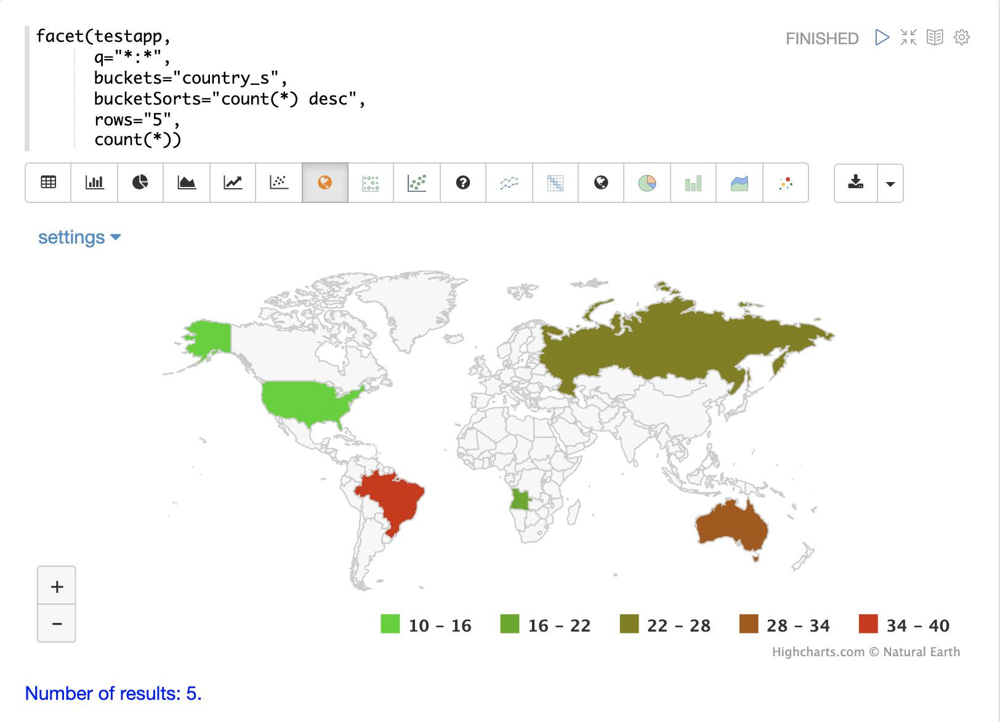
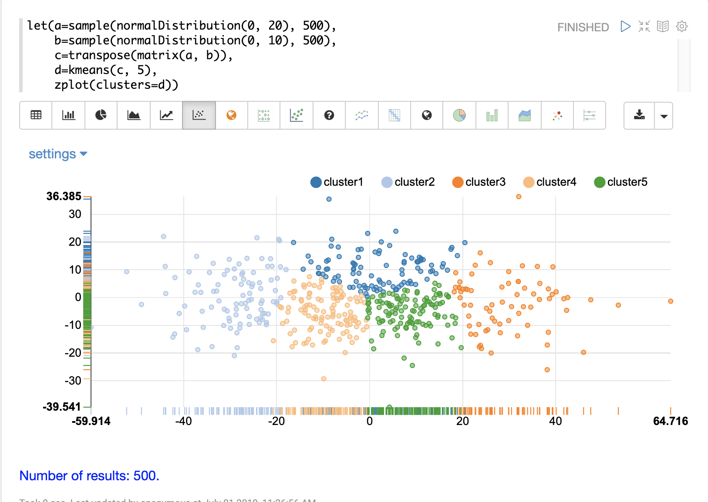
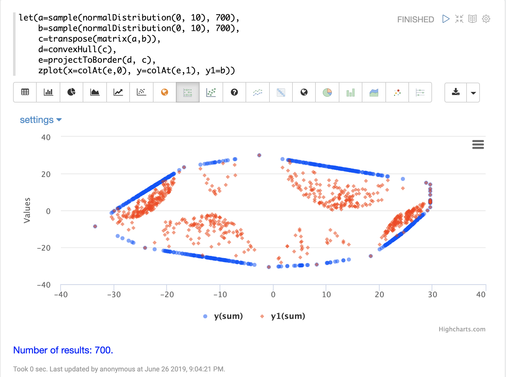

= Visualization
// Licensed to the Apache Software Foundation (ASF) under one
// or more contributor license agreements.  See the NOTICE file
// distributed with this work for additional information
// regarding copyright ownership.  The ASF licenses this file
// to you under the Apache License, Version 2.0 (the
// "License"); you may not use this file except in compliance
// with the License.  You may obtain a copy of the License at
//
//   http://www.apache.org/licenses/LICENSE-2.0
//
// Unless required by applicable law or agreed to in writing,
// software distributed under the License is distributed on an
// "AS IS" BASIS, WITHOUT WARRANTIES OR CONDITIONS OF ANY
// KIND, either express or implied.  See the License for the
// specific language governing permissions and limitations
// under the License.

== Gallery

=== Numbers

image::images/math-expressions/number.png[]

=== Tables

image::images/math-expressions/table.png[]

=== Random Sampling & Scatter Plots

image::images/math-expressions/xyscatter.png[]

=== Probability Distributions

image::images/math-expressions/dist.png[]

=== Monte Carlo Simulations

image::images/math-expressions/monte-carlo.png[]

=== Quantile Plots

image::images/math-expressions/quantiles.png[]

=== Time Series

image::images/math-expressions/timeseries1.png[]

=== Time Series With Moving Average

image::images/math-expressions/movingavg.png[]

=== Time Series With Non-Linear Trend Line

image::images/math-expressions/timemodel.png[]

=== Multiple Time Lines

image::images/math-expressions/timecompare.png[]

=== Geospatial Search and Mapping

image::images/math-expressions/map.png[]

=== Cartograms

=== Significant Terms

image::images/math-expressions/sterms.png[]

=== Phrase Aggregation

image::images/math-expressions/text-analytics.png[]

=== Clustering

=== Convex Hulls

=== SQL Aggregations

image::images/math-expressions/sqlagg.png[]

=== Visualizing CSV Files

image::images/math-expressions/csv.png[]

=== Matrices and Heat Maps

image::images/math-expressions/heat.png[]

=== Linear Regression

image::images/math-expressions/linear.png[]

=== Knn Regression

image::images/math-expressions/knnRegress.png[]

=== Residuals Plot

image::images/math-expressions/residual-plot.png[]

=== Curve Fitting

image::images/math-expressions/hfit.png[]

=== Interpolation

image::images/math-expressions/interpolate1.png[]

=== Sine Waves and Derivatives

image::images/math-expressions/sined.png[]

=== Autocorrelation

image::images/math-expressions/autocorr.png[]

=== Fourier Transform

image::images/math-expressions/fft.png[]

== Apache Zeppelin / Zeppelin-Solr Interpreter
