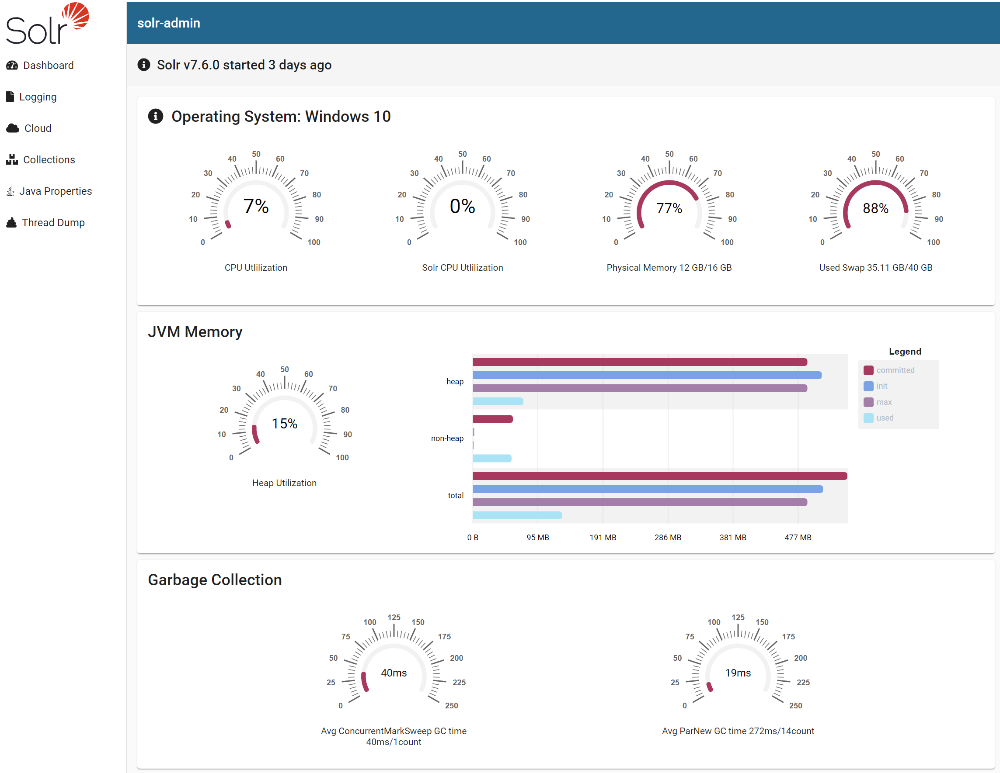

# SolrAdmin

This project was generated with [Angular CLI](https://github.com/angular/angular-cli) version 7.2.2.  

This is being developed as a drop-in replacement for the Solr Admin UI included with Solr.  
I'm actively looking for assistance in design and development. Props to Jeremy Bernham for taking initiative and getting us very far.

Until there is a new query interface (in progress), and we settle on how best to visualize a cluster, this project will need to run along side the legacy Admin UI. 

A list of tasks that need to happen before this can become the defacto UI include:

#More tests, everywhere.
#Sytem propertieies in the dashboard component.
#Improved typing in some places.
#Improved styling.
#Improved login experience.
#Packaging into Gradle build as a plugin.
#Collection browsing and alias setting.
#Query interface.
#Cluster visualization improvements.

## Development server

Run `npm start` for a dev server. Navigate to `http://localhost:4200/`. The app will automatically reload if you change any of the source files.  
The proxy server will route '/solr/**' requests to `http://localhost:8983/solr  
So you'll need a local instance of Solr running to have an interactive testing environment.  

## Code scaffolding

Run `ng generate component component-name` to generate a new component. You can also use `ng generate directive|pipe|service|class|guard|interface|enum|module`.

## Build

Run `ng build` to build the project. The build artifacts will be stored in the `dist/` directory. Use the `--prod` flag for a production build.

## Running unit tests

Run `ng test` to execute the unit tests via [Karma](https://karma-runner.github.io).

## Running end-to-end tests

Run `ng e2e` to execute the end-to-end tests via [Protractor](http://www.protractortest.org/).

## Further help

To get more help on the Angular CLI use `ng help` or go check out the [Angular CLI README](https://github.com/angular/angular-cli/blob/master/README.md).
